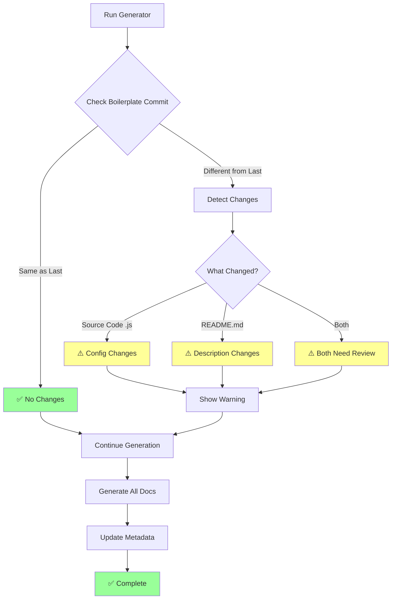
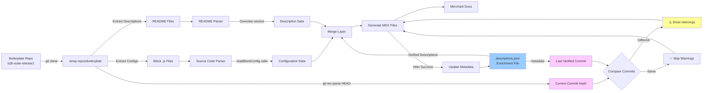
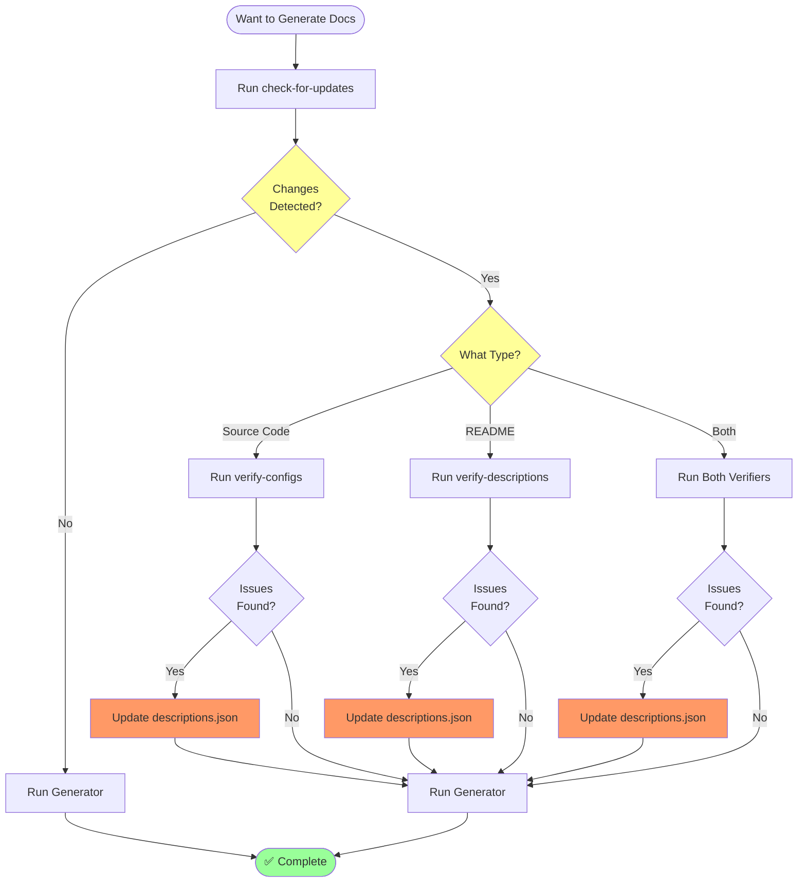
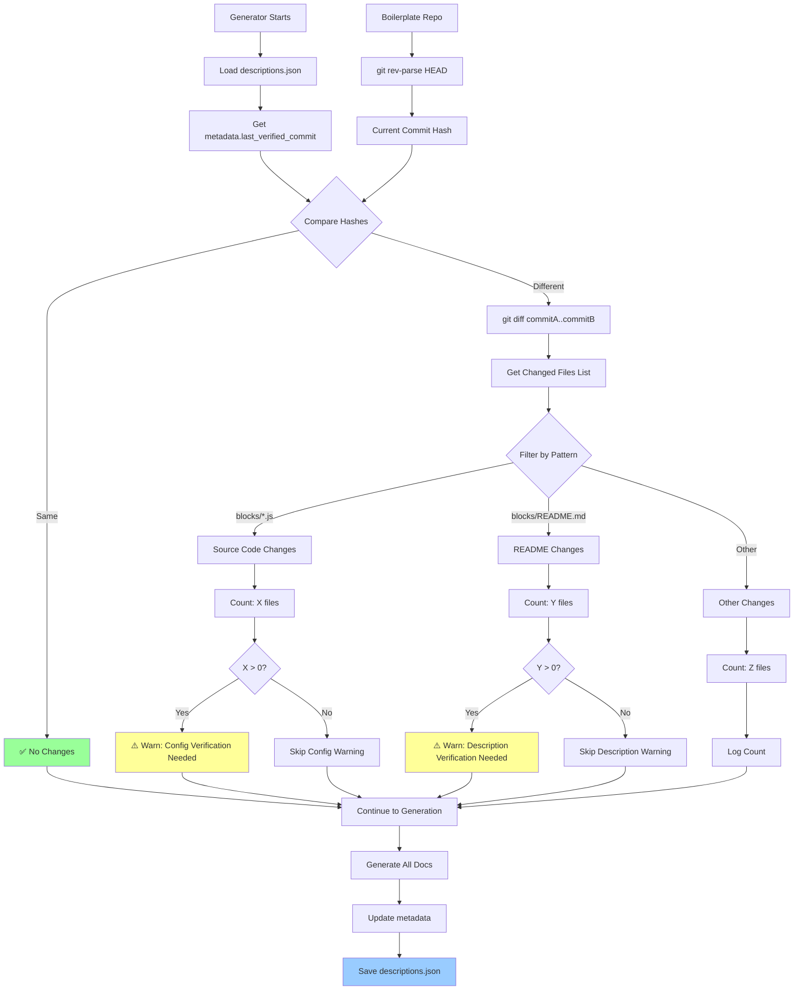
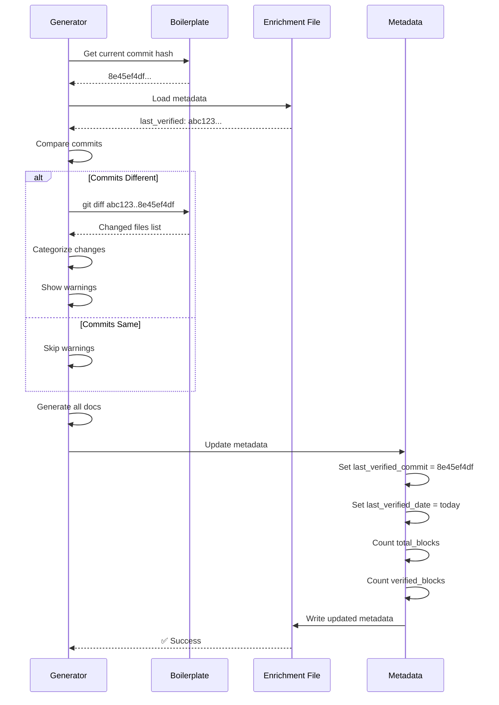
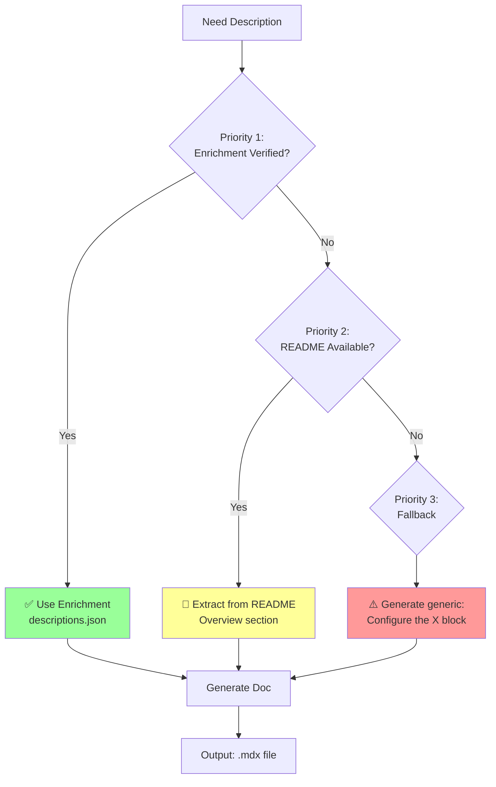

# Automated Update Detection System - Visual Guide

## System Flow Diagram



## Data Flow Diagram



## File Relationship Diagram

```mermaid
graph TD
    A[descriptions.json] -->|Metadata| B[last_verified_commit]
    A -->|Block Data| C[Block Descriptions]
    
    D[Boilerplate Repo] -->|Current| E[8e45ef4df...]
    
    B -->|Compare| F{Same?}
    E -->|Compare| F
    
    F -->|No| G[Run Verification]
    F -->|Yes| H[Skip Verification]
    
    G --> I[@verify-block-configs-source-code.js]
    G --> J[@verify-merchant-block-descriptions.js]
    
    I -->|Finds| K[Config Mismatches]
    J -->|Finds| L[Description Changes]
    
    K --> M[Update descriptions.json]
    L --> M
    
    M --> N[@generate-merchant-block-docs.js]
    
    N --> O[Generate All .mdx Files]
    O --> P[Update Metadata]
    P --> A
    
    style A fill:#9cf
    style E fill:#fcf
    style G fill:#ff9
    style M fill:#f96
```

## Workflow Decision Tree



## Change Detection Logic



## Metadata Update Flow



## Command Hierarchy

```mermaid
graph TD
    A[npm Commands] --> B[check-for-updates]
    A --> C[verify-merchant-configs]
    A --> D[verify-merchant-descriptions]
    A --> E[generate-merchant-docs]
    
    B --> F[@check-for-updates.js]
    C --> G[@verify-block-configs-source-code.js]
    D --> H[@verify-merchant-block-descriptions.js]
    E --> I[@generate-merchant-block-docs.js]
    
    F --> J[Read descriptions.json]
    G --> J
    H --> J
    I --> J
    
    F --> K[Read Boilerplate]
    G --> K
    H --> K
    I --> K
    
    F --> L[Generate Report]
    G --> M[Show Mismatches]
    H --> N[Show Changes]
    I --> O[Generate Docs]
    
    O --> P[Update Metadata]
    P --> J
    
    style B fill:#9cf
    style C fill:#9cf
    style D fill:#9cf
    style E fill:#f96
    style P fill:#9f9
```

## Three-Tier Priority System



---

**These diagrams show the complete automated update detection system from multiple perspectives.**

