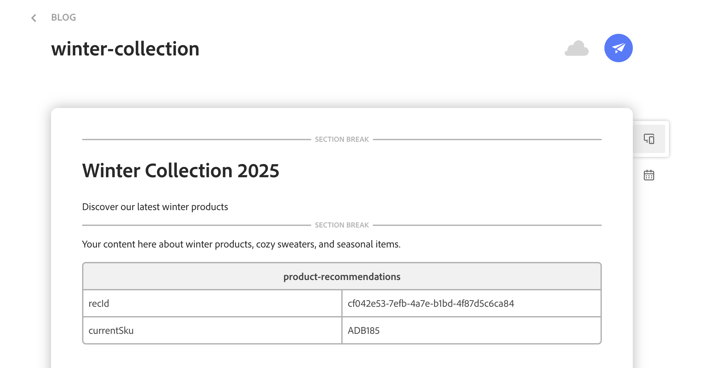
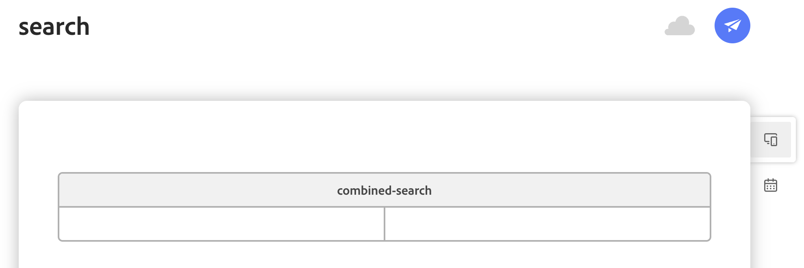

import { Aside, Code, LinkCard } from '@astrojs/starlight/components';

A common requirement for storefronts is to provide a unified search experience that returns both content (blog posts, articles, pages) and commerce (products) results from a single search input. This tutorial shows you how to implement a federated search approach that performs parallel searches against a content index and the Adobe Commerce GraphQL API.

In this tutorial, you'll learn how to create a combined search experience that displays results from content and commerce in a single view, providing shoppers with comprehensive search results across your entire site.

## What You'll Build

By the end of this tutorial, you'll have:

- A content index configuration that indexes your site's pages, blogs, and content
- A custom search block that performs parallel searches against content and commerce
- A tabbed interface displaying separate results for content and products
- A fully functional federated search experience

## Prerequisites

Before starting this tutorial, make sure you have:

- A working [Commerce storefront](/get-started/create-storefront/) on Edge Delivery Services
- Basic understanding of JavaScript and asynchronous operations
- Familiarity with [customizing blocks](/boilerplate/customizing-blocks/) in your code repository
- Access to your site's Helix Admin configuration (for creating the content index)
- Adobe Commerce backend configured with product catalog

## Overview

Developing this federated search solution involves:

1. Creating an index for your site's pages and content
2. Building a custom search block that fetches both content and commerce data
3. Implementing a tabbed UI to display results separately
4. Processing search queries in parallel for optimal performance

This method keeps content and commerce searches distinct while delivering a unified experience to the user.

<Aside type="tip" title="When to use this strategy">
This federated search strategy is ideal for scenarios where you need quick implementation, have straightforward search requirements, or want to maintain separate control over content and commerce search logic.
</Aside>

## Tutorial Steps

### Step 1: Create the Content Index Configuration

Start by setting up a content index to crawl and index your site’s pages. This is accomplished by creating a query.yaml configuration file.

   Create the configuration by making a POST request to your site's admin config endpoint:

   ```bash
   POST https://admin.hlx.page/config/[owner]/sites/[repo]/content/query.yaml
   ```

   Replace `[owner]` and `[repo]` with your site's GitHub details.

   Here's a sample `query.yaml` configuration that indexes blog content:

   ```yaml title="query.yaml"
   indices:
     content:
       target: /content-index.json
       exclude:
         - '/blog/index'
       include:
         - /blog/**
         - /pages/**
       properties:
         title:
           select: head > meta[property="og:title"]
           value: |
             attribute(el, 'content')
         description:
           select: head > meta[name="description"]
           value: |
             attribute(el, 'content')
         lastModified:
           select: none
           value: |
             parseTimestamp(headers['last-modified'], 'ddd, DD MMM YYYY hh:mm:ss GMT')
         content:
           select: main
           value: |
             textContent(el)
   ```

   <Aside type="note">
   **Configuration details:**
   - `target`: The URL path where the index JSON file will be published
   - `include`: Glob patterns for pages to include in the index
   - `exclude`: Paths to exclude from indexing
   - `properties`: Metadata fields to extract from each page. See the [AEM indexing documentation](https://www.aem.live/developer/indexing) for more details.
   </Aside>

   After creating this configuration, the system automatically generates a content index at `https://[your-domain]/content-index.json` whenever you publish pages.

**Expected result:** After you publish pages, you can access your content index at the configured target URL and see a JSON array of indexed pages.

### Step 2: Create Sample Content Pages

To validate your federated search setup, publish content pages that can be indexed. For example, create and publish blog posts in a `/blog` directory:

   Create a few pages like:
   - `/blog/winter-collection`
   - `/blog/summer-sale`
   - `/blog/holiday-shopping-guide`

   Here's an example of what your content page might look like:

   

<Aside type="tip" title="Content tip">
Include relevant keywords in your content that shoppers might search for. Since the content index stores the full text of your pages, well-written and relevant descriptions can significantly improve search results.
</Aside>

### Step 3: Create the Combined Search Block

Next, create a custom block to perform the federated search. This block processes both the content and commerce searches.

Create a new directory: `blocks/combined-search/`

Create `blocks/combined-search/combined-search.js`:

<Aside type="note" title="Full implementation">
The code below shows the key concepts. For a complete working example with full rendering logic, see the [reference implementation](https://gist.github.com/sirugh/6690b7ded67868f3b17d3c1b5a29dc76).
</Aside>

```javascript title="blocks/combined-search/combined-search.js"
/**
 * Combined Search Block
 * Performs parallel searches against content index and commerce search API
 */

// Import the search function from the product discovery dropin
import { search } from '@dropins/storefront-product-discovery/api.js';

let contentIndex = null;

/**
 * 1. Fetch and cache the content index
 */
async function getContentIndex() {
  if (contentIndex) return contentIndex;

  const response = await fetch('/content-index.json');
  const data = await response.json();
  contentIndex = data.data;
  return contentIndex;
}

/**
 * 2. Search the content index (client-side filtering)
 */
function searchContent(query, index) {
  const searchTerm = query.toLowerCase();
  return index.filter((item) => {
    return item.title?.toLowerCase().includes(searchTerm)
      || item.description?.toLowerCase().includes(searchTerm)
      || item.content?.toLowerCase().includes(searchTerm);
  });
}

/**
 * 3. Search commerce products using the search dropin
 */
async function searchProducts(query) {
  try {
    const results = await search({
      phrase: query || '',
      currentPage: 1,
      pageSize: 12,
      filter: [
        { attribute: 'visibility', in: ['Search', 'Catalog, Search'] }
      ]
    });

    return results?.items || [];
  } catch (error) {
    console.error('Error searching for products:', error);
    return [];
  }
}

/**
 * 4. Perform parallel searches and render results
 */
async function performSearch(query, block) {
  // Perform both searches in parallel for optimal performance
  const [contentIndex, products] = await Promise.all([
    getContentIndex(),
    searchProducts(query)
  ]);

  // Filter content results client-side
  const contentResults = searchContent(query, contentIndex);

  // Render results (implementation details omitted - see reference link)
  renderContentResults(contentResults, block.querySelector('.content-results'));
  renderProductResults(products, block.querySelector('.product-results'));
}

/**
 * 5. Initialize the block
 */
export default async function decorate(block) {
  // Get search query from URL
  const urlParams = new URLSearchParams(window.location.search);
  const query = urlParams.get('q') || '';

  // Build the UI with tabs for Products and Content
  block.innerHTML = `
    <div class="combined-search-container">
      <div class="search-input-wrapper">
        <input type="text" class="search-input" />
        <button class="search-button">🔍</button>
      </div>

      <div class="tabs">
        <button class="tab-button active" data-tab="products">Products</button>
        <button class="tab-button" data-tab="content">Content</button>
      </div>

      <div class="tab-content">
        <div class="tab-pane active" data-tab="products">
          <div class="product-results"></div>
        </div>
        <div class="tab-pane" data-tab="content">
          <div class="content-results"></div>
        </div>
      </div>
    </div>
  `;

  // Safely set the search input value to prevent XSS
  const searchInput = block.querySelector('.search-input');
  searchInput.value = query;

  // Setup event listeners for search and tabs (implementation details omitted)
  setupSearchHandlers(block, performSearch);
  setupTabs(block);

  // Pre-fetch content index for faster subsequent searches
  getContentIndex();

  // If there's a query in URL, perform the search
  if (query) {
    performSearch(query, block);
  }
}

// Helper functions: renderContentResults(), renderProductResults(), setupTabs(), setupSearchHandlers()
// See reference implementation for complete rendering and UI logic
```

**Key concepts explained:**

1. **Content index caching** (`getContentIndex`): The content index is fetched once and cached in memory for subsequent searches, improving performance.

2. **Client-side content search** (`searchContent`): Since the content index is a JSON file, we can filter it client-side using JavaScript's `filter()` method. This is fast and doesn't require additional API calls.

3. **Product search** (`searchProducts`): Products are searched using the Commerce `search()` function from the Product Discovery dropin, which handles the GraphQL query to Adobe Commerce. The `visibility` filter ensures only searchable products are returned.

4. **Parallel execution** (`performSearch`): Both searches execute in parallel using `Promise.all()`, ensuring that the slower query doesn’t delay the faster one.

5. **Tabbed UI**: Results are organized in separate tabs (Products and Content) for a clean user experience.

<Aside type="tip" title="Customize search behavior">
- Add additional filters (like category or price range)
- Adjust pagination with `pageSize`
- Add sorting options
- Customize the content search algorithm in `searchContent()`
- Modify the UI structure to display results differently (for example, in a single list instead of tabs).
</Aside>

### Step 4: Add Styling for the Search Block

Create `blocks/combined-search/combined-search.css` and add the styles from the [reference implementation](https://gist.github.com/sirugh/6690b7ded67868f3b17d3c1b5a29dc76).

### Step 5: Create the Search Results Page

Create a dedicated page in your project to host the combined search block. Using your content authoring tool (for example, DA.live, Google Docs, SharePoint), add a new page at `/search`.



This addition creates a page that uses your `combined-search` block.

### Step 6: Test Your Federated Search

Now, let's verify everything is working correctly:

1. **Test the content index:**
    - Navigate to `https://[your-site-domain]/content-index.json`
    - Verify that your content pages are indexed with proper metadata

2. **Test product search:**
    - Navigate to `/search?q=shirt` (or any product in your catalog)
    - Verify products appear in the Products tab
    - Check that images, titles, and prices display correctly

3. **Test content search:**
    - Navigate to `/search?q=blog` (or keywords from your content)
    - Switch to the Content tab
    - Verify content results appear with titles and descriptions

4. **Test search interaction:**
    - Type a query in the search input
    - Press Enter or click the search button
    - Verify the URL updates with the query parameter
    - Verify both tabs update with new results

5. **Test edge cases:**
    - Search for a term with no results
    - Search with special characters
    - Search with very short queries (1-2 characters)

## Complete Example

Here's a complete example of how the federated search works in practice:

**User Journey:**

1. Shopper types "winter" in the search box
2. System performs parallel searches:
   - Content search finds blog posts about "Winter Collection 2024"
   - Product search finds products tagged with "winter"
3. Results display in separate tabs:
   - **Products Tab**: Displays winter jackets, boots, accessories
   - **Content Tab**: Displays blog posts, buying guides, seasonal content

## Performance Considerations

<Aside type="tip" title="Optimization tips">
- The content index is fetched once and cached in memory
- Both searches run in parallel using `Promise.all()` for optimal speed
- Consider implementing debouncing for search-as-you-type functionality
- For large content indexes (>1MB), consider pagination or lazy loading
</Aside>

## Troubleshooting

### Common Issues

* **Content index returns 404 error**

  > Verify that you've correctly configured the `query.yaml` file and that you've published pages that match your include patterns. The index is only generated after the configuration is in place and pages are published.

* **No products appear in search results**

  > Check that your GraphQL endpoint is correctly configured. In the browser console, verify that the GraphQL query is executing without errors. Ensure your Adobe Commerce instance has products with the searched terms.

* **Content search returns too many irrelevant results**

  > Improve the search algorithm in the `searchContent()` function. Consider implementing:
  > - Ranking by relevance (title matches weighted higher than content matches)
  > - Fuzzy matching for better results
  > - Filtering out pages with `robots: noindex`

* **Search is slow or times out**

  > - Check the size of your content index (should be under 5MB for good performance)
  > - Ensure you're caching the content index properly (see `getContentIndex()` function)
  > - Consider using a CDN to cache the content-index.json file

### Getting Help

If you encounter issues not covered here:

- Check the [FAQ section](/troubleshooting/faq/) for common storefront issues
- Review the [Blocks Reference](/boilerplate/blocks-reference/) for block development patterns
- Consult the [Adobe Commerce GraphQL documentation](https://developer.adobe.com/commerce/webapi/graphql/) for query troubleshooting

## Summary

In this tutorial, you learned how to:

- ✅ Configure a content index using `query.yaml` to index your site's pages
- ✅ Create a custom combined search block that queries both content and commerce
- ✅ Implement parallel async searches for optimal performance
- ✅ Build a tabbed interface to organize and display federated search results
- ✅ Handle edge cases and provide a smooth user experience

You now have a fully functional federated search solution that combines content and commerce search in your storefront. This approach provides a simple yet effective way to help shoppers discover both products and content across your entire site.

The implementation is maintainable, performant, and can be extended with additional features like filtering, sorting, and advanced ranking algorithms as your requirements grow.
