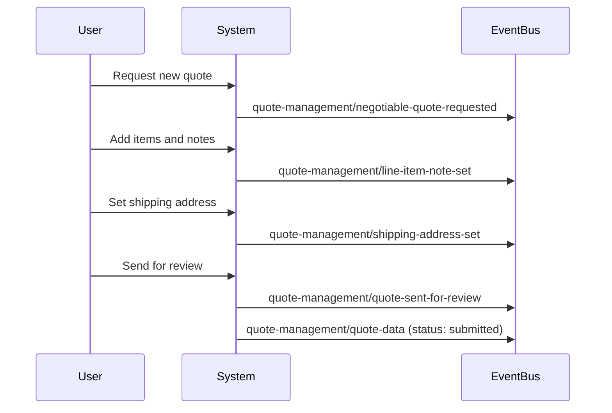
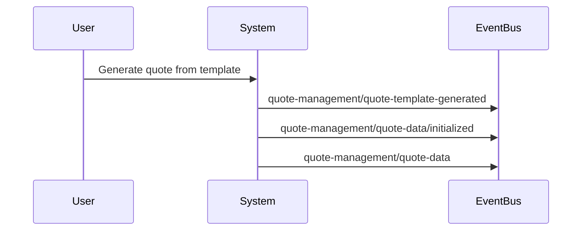

import { Aside } from '@astrojs/starlight/components';
import TableWrapper from '@components/TableWrapper.astro';

The Quote Management drop-in emits **19 events** to the event bus, providing comprehensive tracking of quote and quote template operations throughout their lifecycle.

<div style="background-color: var(--sl-color-blue-low); border-left: 4px solid var(--sl-color-blue); padding: 0.75rem 1rem; border-radius: 0.25rem; margin: 1rem 0;">
<strong>Version: 1.0.0-beta1</strong>
</div>

## Available events

<TableWrapper nowrap={[0]}>

| Event Name | Description |
|------------|-------------|
| [`quote-management/initialized`](#quote-managementinitialized) | Drop-in initialization complete |
| [`quote-management/line-item-note-set`](#quote-managementline-item-note-set) | Line item note was set |
| [`quote-management/negotiable-quote-closed`](#quote-managementnegotiable-quote-closed) | Quote was closed |
| [`quote-management/negotiable-quote-deleted`](#quote-managementnegotiable-quote-deleted) | Quote was deleted |
| [`quote-management/negotiable-quote-requested`](#quote-managementnegotiable-quote-requested) | New quote requested |
| [`quote-management/permissions`](#quote-managementpermissions) | Permissions updated |
| [`quote-management/quantities-updated`](#quote-managementquantities-updated) | Item quantities updated |
| [`quote-management/quote-data`](#quote-managementquote-data) | Quote data changed |
| [`quote-management/quote-data/initialized`](#quote-managementquote-datainitialized) | Quote data initialized |
| [`quote-management/quote-duplicated`](#quote-managementquote-duplicated) | Quote was duplicated |
| [`quote-management/quote-items-removed`](#quote-managementquote-items-removed) | Items removed from quote |
| [`quote-management/quote-renamed`](#quote-managementquote-renamed) | Quote was renamed |
| [`quote-management/quote-sent-for-review`](#quote-managementquote-sent-for-review) | Quote sent for review |
| [`quote-management/quote-template-data`](#quote-managementquote-template-data) | Template data changed |
| [`quote-management/quote-template-deleted`](#quote-managementquote-template-deleted) | Template was deleted |
| [`quote-management/quote-template-generated`](#quote-managementquote-template-generated) | Quote generated from template |
| [`quote-management/quote-templates-data`](#quote-managementquote-templates-data) | Templates list data changed |
| [`quote-management/shipping-address-set`](#quote-managementshipping-address-set) | Shipping address was set |

</TableWrapper>

## Event details

### quote-management/initialized

Emitted when the Quote Management drop-in completes initialization.

#### Event payload

```typescript
{
  eventType: 'quote-management/initialized'
}
```

#### When triggered

- After `initialize()` function completes
- On drop-in first load

#### Example

```js
import { events } from '@dropins/tools/event-bus.js';

events.on('quote-management/initialized', () => {
  console.log('Quote Management ready');
  loadQuotesList();
});
```

---

### quote-management/line-item-note-set

Emitted when a note is set on a quote line item.

#### Event payload

```typescript
{
  eventType: 'quote-management/line-item-note-set',
  data: {
    quoteId: string,
    itemId: string,
    note: string
  }
}
```

#### When triggered

- After calling `setLineItemNote()`
- When merchant or buyer adds/updates item notes

#### Example

```js
events.on('quote-management/line-item-note-set', (payload) => {
  console.log(`Note set on item ${payload.data.itemId}:`, payload.data.note);
  refreshQuoteItemsList();
});
```

---

### quote-management/negotiable-quote-closed

Emitted when a negotiable quote is closed.

#### Event payload

```typescript
{
  eventType: 'quote-management/negotiable-quote-closed',
  data: {
    quoteId: string,
    status: string
  }
}
```

#### When triggered

- After calling `closeNegotiableQuote()`
- When quote reaches final state

#### Example

```js
events.on('quote-management/negotiable-quote-closed', (payload) => {
  console.log(`Quote ${payload.data.quoteId} closed`);
  redirectToQuotesList();
});
```

---

### quote-management/negotiable-quote-deleted

Emitted when a negotiable quote is deleted.

#### Event payload

```typescript
{
  eventType: 'quote-management/negotiable-quote-deleted',
  data: {
    quoteId: string
  }
}
```

#### When triggered

- After calling `deleteQuote()`
- After successful quote deletion

#### Example

```js
events.on('quote-management/negotiable-quote-deleted', (payload) => {
  console.log(`Quote ${payload.data.quoteId} deleted`);
  removeQuoteFromList(payload.data.quoteId);
});
```

---

### quote-management/negotiable-quote-requested

Emitted when a new negotiable quote is requested.

#### Event payload

```typescript
{
  eventType: 'quote-management/negotiable-quote-requested',
  data: {
    quoteId: string,
    quoteName: string
  }
}
```

#### When triggered

- After calling `requestNegotiableQuote()`
- When buyer submits quote request

#### Example

```js
events.on('quote-management/negotiable-quote-requested', (payload) => {
  console.log(`Quote ${payload.data.quoteName} requested`);
  showSuccessMessage('Quote request submitted');
  redirectToQuoteDetails(payload.data.quoteId);
});
```

---

### quote-management/permissions

Emitted when quote-related permissions are updated.

#### Event payload

```typescript
{
  eventType: 'quote-management/permissions',
  data: {
    permissions: string[]
  }
}
```

#### When triggered

- After permission changes
- On user role updates
- After company context switches

#### Example

```js
events.on('quote-management/permissions', (payload) => {
  const canRequestQuote = payload.data.permissions.includes('request_quote');
  updateQuoteActions(canRequestQuote);
});
```

---

### quote-management/quantities-updated

Emitted when item quantities in a quote are updated.

#### Event payload

```typescript
{
  eventType: 'quote-management/quantities-updated',
  data: {
    quoteId: string,
    items: Array<{ itemId: string, quantity: number }>
  }
}
```

#### When triggered

- After calling `updateQuantities()`
- When buyer or merchant updates quantities

#### Example

```js
events.on('quote-management/quantities-updated', (payload) => {
  console.log(`Quantities updated for quote ${payload.data.quoteId}`);
  refreshQuoteTotals();
});
```

---

### quote-management/quote-data

Emitted when quote data changes or is loaded.

#### Event payload

```typescript
{
  eventType: 'quote-management/quote-data',
  data: NegotiableQuoteModel
}
```

#### When triggered

- After loading quote details
- After any quote modification
- After status changes

#### Example

```js
events.on('quote-management/quote-data', (payload) => {
  console.log('Quote data updated:', payload.data);
  updateQuoteDisplay(payload.data);
});
```

---

### quote-management/quote-data/initialized

Emitted when quote data is first initialized and loaded.

#### Event payload

```typescript
{
  eventType: 'quote-management/quote-data/initialized',
  data: NegotiableQuoteModel
}
```

#### When triggered

- On first load of quote details
- After quote context is established

#### Example

```js
events.on('quote-management/quote-data/initialized', (payload) => {
  console.log('Quote initialized:', payload.data.number);
  setupQuoteWorkflow(payload.data);
});
```

---

### quote-management/quote-duplicated

Emitted when a quote is duplicated.

#### Event payload

```typescript
{
  eventType: 'quote-management/quote-duplicated',
  data: {
    originalQuoteId: string,
    newQuoteId: string
  }
}
```

#### When triggered

- After calling `duplicateQuote()`
- When creating copy of existing quote

#### Example

```js
events.on('quote-management/quote-duplicated', (payload) => {
  console.log(`Quote duplicated: ${payload.data.originalQuoteId} -> ${payload.data.newQuoteId}`);
  redirectToQuote(payload.data.newQuoteId);
});
```

---

### quote-management/quote-items-removed

Emitted when items are removed from a quote.

#### Event payload

```typescript
{
  eventType: 'quote-management/quote-items-removed',
  data: {
    quoteId: string,
    removedItemIds: string[]
  }
}
```

#### When triggered

- After calling `removeNegotiableQuoteItems()`
- When items are deleted from quote

#### Example

```js
events.on('quote-management/quote-items-removed', (payload) => {
  console.log(`Removed ${payload.data.removedItemIds.length} items`);
  refreshQuoteItemsList();
});
```

---

### quote-management/quote-renamed

Emitted when a quote is renamed.

#### Event payload

```typescript
{
  eventType: 'quote-management/quote-renamed',
  data: {
    quoteId: string,
    newName: string
  }
}
```

#### When triggered

- After calling `renameNegotiableQuote()`
- When quote name is updated

#### Example

```js
events.on('quote-management/quote-renamed', (payload) => {
  console.log(`Quote renamed to: ${payload.data.newName}`);
  updateQuoteHeader(payload.data.newName);
});
```

---

### quote-management/quote-sent-for-review

Emitted when a quote is sent for merchant review.

#### Event payload

```typescript
{
  eventType: 'quote-management/quote-sent-for-review',
  data: {
    quoteId: string,
    comment: string
  }
}
```

#### When triggered

- After calling `sendForReview()`
- When buyer submits quote for negotiation

#### Example

```js
events.on('quote-management/quote-sent-for-review', (payload) => {
  console.log(`Quote ${payload.data.quoteId} sent for review`);
  showSuccessMessage('Quote submitted for merchant review');
  updateQuoteStatus('pending');
});
```

---

### quote-management/quote-template-data

Emitted when quote template data changes or is loaded.

#### Event payload

```typescript
{
  eventType: 'quote-management/quote-template-data',
  data: QuoteTemplateModel
}
```

#### When triggered

- After loading template details
- After template modifications
- After template status changes

#### Example

```js
events.on('quote-management/quote-template-data', (payload) => {
  console.log('Template data updated:', payload.data);
  updateTemplateDisplay(payload.data);
});
```

---

### quote-management/quote-template-deleted

Emitted when a quote template is deleted.

#### Event payload

```typescript
{
  eventType: 'quote-management/quote-template-deleted',
  data: {
    templateId: string
  }
}
```

#### When triggered

- After calling `deleteQuoteTemplate()`
- After successful template deletion

#### Example

```js
events.on('quote-management/quote-template-deleted', (payload) => {
  console.log(`Template ${payload.data.templateId} deleted`);
  removeTemplateFromList(payload.data.templateId);
});
```

---

### quote-management/quote-template-generated

Emitted when a new quote is generated from a template.

#### Event payload

```typescript
{
  eventType: 'quote-management/quote-template-generated',
  data: {
    templateId: string,
    quoteId: string
  }
}
```

#### When triggered

- After calling `generateQuoteFromTemplate()`
- When creating quote from template

#### Example 1: Basic template generation

```js
events.on('quote-management/quote-template-generated', (payload) => {
  console.log(`Quote ${payload.data.quoteId} generated from template ${payload.data.templateId}`);
  redirectToQuote(payload.data.quoteId);
});
```

#### Example 2: Template catalog with quick-quote generation

```js
import { events } from '@dropins/tools/event-bus.js';
import { generateQuoteFromTemplate, getQuoteTemplates } from '@dropins/storefront-quote-management/api.js';

class QuoteTemplateCatalog {
  constructor(containerElement) {
    this.container = containerElement;
    this.templates = [];
    
    // Listen for template generation
    events.on('quote-management/quote-template-generated', this.handleQuoteGenerated.bind(this));
    
    this.init();
  }
  
  async init() {
    try {
      // Load all available templates
      const response = await getQuoteTemplates({
        currentPage: 1,
        pageSize: 50,
        sort: { field: 'name', direction: 'ASC' }
      });
      
      this.templates = response.items;
      this.render();
      
    } catch (error) {
      this.showError('Failed to load quote templates');
      console.error(error);
    }
  }
  
  render() {
    this.container.innerHTML = `
      <div class="template-catalog">
        <h2>Quote Templates</h2>
        <div class="template-grid">
          ${this.templates.map(template => this.renderTemplateCard(template)).join('')}
        </div>
      </div>
    `;
    
    // Attach event listeners
    this.container.querySelectorAll('.generate-quote-btn').forEach(btn => {
      btn.addEventListener('click', (e) => {
        const templateUid = e.target.dataset.templateUid;
        this.generateQuote(templateUid);
      });
    });
  }
  
  renderTemplateCard(template) {
    return `
      <div class="template-card" data-template-uid="${template.uid}">
        <div class="template-header">
          <h3>${template.name}</h3>
          <span class="item-count">${template.items.length} items</span>
        </div>
        <div class="template-meta">
          <span class="total">Total: $${template.prices.grandTotal.value}</span>
          <span class="date">Created: ${formatDate(template.createdAt)}</span>
        </div>
        <div class="template-actions">
          <button 
            class="generate-quote-btn" 
            data-template-uid="${template.uid}">
            Generate Quote
          </button>
          <button 
            class="view-template-btn" 
            onclick="viewTemplate('${template.uid}')">
            View Details
          </button>
        </div>
      </div>
    `;
  }
  
  async generateQuote(templateUid) {
    const template = this.templates.find(t => t.uid === templateUid);
    if (!template) return;
    
    try {
      // Show loading state
      this.showLoadingOverlay(`Generating quote from "${template.name}"...`);
      
      // Generate quote from template
      await generateQuoteFromTemplate(templateUid);
      
      // Event handler will redirect when complete
      
    } catch (error) {
      this.hideLoadingOverlay();
      this.showError('Failed to generate quote: ' + error.message);
      console.error(error);
    }
  }
  
  handleQuoteGenerated(payload) {
    const { templateId, quoteId } = payload.data;
    
    this.hideLoadingOverlay();
    
    // Get template name for notification
    const template = this.templates.find(t => t.uid === templateId);
    const templateName = template ? template.name : 'template';
    
    // Show success notification
    this.showSuccess(`Quote generated from "${templateName}"`);
    
    // Track analytics
    trackAnalytics('quote_generated_from_template', {
      templateId,
      quoteId,
      templateName
    });
    
    // Redirect to the new quote for editing
    setTimeout(() => {
      window.location.href = `/quotes/${quoteId}`;
    }, 1500);
  }
  
  showLoadingOverlay(message) {
    const overlay = document.createElement('div');
    overlay.id = 'loading-overlay';
    overlay.innerHTML = `
      <div class="loading-spinner"></div>
      <div class="loading-message">${message}</div>
    `;
    document.body.appendChild(overlay);
  }
  
  hideLoadingOverlay() {
    const overlay = document.getElementById('loading-overlay');
    if (overlay) overlay.remove();
  }
  
  showSuccess(message) {
    this.showToast(message, 'success');
  }
  
  showError(message) {
    this.showToast(message, 'error');
  }
  
  showToast(message, type) {
    const toast = document.createElement('div');
    toast.className = `toast toast-${type}`;
    toast.textContent = message;
    document.body.appendChild(toast);
    setTimeout(() => toast.remove(), 3000);
  }
}

// Initialize template catalog
const catalog = new QuoteTemplateCatalog(document.querySelector('#template-catalog'));
```

#### Example 3: Recurring order workflow using templates

```js
import { events } from '@dropins/tools/event-bus.js';
import { generateQuoteFromTemplate, submitNegotiableQuote } from '@dropins/storefront-quote-management/api.js';

/**
 * Automated recurring order system using quote templates
 * Useful for customers who regularly order the same items
 */
class RecurringOrderManager {
  constructor() {
    this.activeOrders = [];
    
    events.on('quote-management/quote-template-generated', this.handleGeneration.bind(this));
    events.on('quote-management/quote-sent-for-review', this.handleSubmission.bind(this));
  }
  
  /**
   * Set up a recurring order schedule
   */
  async scheduleRecurringOrder(templateUid, schedule) {
    const recurringOrder = {
      templateUid,
      schedule, // e.g., { frequency: 'monthly', dayOfMonth: 1 }
      status: 'active',
      lastGenerated: null,
      nextGeneration: this.calculateNextDate(schedule)
    };
    
    // Save to user preferences
    await this.saveRecurringOrder(recurringOrder);
    
    // Set up next execution
    this.scheduleNextGeneration(recurringOrder);
    
    return recurringOrder;
  }
  
  /**
   * Generate quote from template on schedule
   */
  async generateScheduledQuote(templateUid, autoSubmit = true) {
    try {
      console.log(`Generating scheduled quote from template ${templateUid}`);
      
      // Generate the quote
      await generateQuoteFromTemplate(templateUid);
      
      // Store auto-submit preference
      if (autoSubmit) {
        this.pendingAutoSubmits.add(templateUid);
      }
      
    } catch (error) {
      console.error('Failed to generate scheduled quote:', error);
      
      // Notify user of failure
      this.notifyGenerationFailure(templateUid, error);
    }
  }
  
  /**
   * Handle successful quote generation
   */
  async handleGeneration(payload) {
    const { templateId, quoteId } = payload.data;
    
    console.log(`Quote ${quoteId} generated from template ${templateId}`);
    
    // Check if this was an automated generation
    if (this.pendingAutoSubmits.has(templateId)) {
      // Automatically submit for review
      try {
        await submitNegotiableQuote(quoteId);
        console.log(`Auto-submitted quote ${quoteId} for review`);
        
        this.pendingAutoSubmits.delete(templateId);
        
      } catch (error) {
        console.error('Failed to auto-submit quote:', error);
        
        // Notify user to manually submit
        this.notifyManualSubmissionNeeded(quoteId);
      }
    }
    
    // Update recurring order record
    await this.updateRecurringOrderHistory(templateId, quoteId);
  }
  
  /**
   * Handle quote submission
   */
  handleSubmission(payload) {
    const { quoteId } = payload.data;
    
    // Send confirmation email
    this.sendSubmissionConfirmation(quoteId);
    
    // Update dashboard
    this.updateDashboard();
  }
  
  calculateNextDate(schedule) {
    const now = new Date();
    switch (schedule.frequency) {
      case 'weekly':
        return new Date(now.setDate(now.getDate() + 7));
      case 'monthly':
        return new Date(now.setMonth(now.getMonth() + 1, schedule.dayOfMonth));
      case 'quarterly':
        return new Date(now.setMonth(now.getMonth() + 3, schedule.dayOfMonth));
      default:
        return null;
    }
  }
  
  scheduleNextGeneration(recurringOrder) {
    const delay = recurringOrder.nextGeneration - new Date();
    setTimeout(() => {
      this.generateScheduledQuote(recurringOrder.templateUid, true);
    }, delay);
  }
  
  // Helper methods
  pendingAutoSubmits = new Set();
  
  async saveRecurringOrder(order) { /* Save to backend */ }
  async updateRecurringOrderHistory(templateId, quoteId) { /* Update history */ }
  notifyGenerationFailure(templateId, error) { /* Send notification */ }
  notifyManualSubmissionNeeded(quoteId) { /* Send notification */ }
  sendSubmissionConfirmation(quoteId) { /* Send email */ }
  updateDashboard() { /* Refresh UI */ }
}

// Initialize recurring order system
const recurringOrders = new RecurringOrderManager();

// Example: Set up monthly recurring order
recurringOrders.scheduleRecurringOrder('template-uid-123', {
  frequency: 'monthly',
  dayOfMonth: 1
});
```

#### Usage scenarios

- One-click quote generation from commonly used templates
- Streamline repeat ordering workflows for regular customers
- Implement recurring order systems based on templates
- Quick quote creation for standard product bundles
- Template-based ordering for seasonal or periodic purchases
- Automated quote generation for subscription-like B2B orders

---

### quote-management/quote-templates-data

Emitted when the list of quote templates changes or is loaded.

#### Event payload

```typescript
{
  eventType: 'quote-management/quote-templates-data',
  data: {
    templates: QuoteTemplateModel[],
    totalCount: number
  }
}
```

#### When triggered

- After loading templates list
- After template creation/deletion
- After template status changes

#### Example

```js
events.on('quote-management/quote-templates-data', (payload) => {
  console.log(`${payload.data.totalCount} templates loaded`);
  updateTemplatesList(payload.data.templates);
});
```

---

### quote-management/shipping-address-set

Emitted when a shipping address is set on a quote.

#### Event payload

```typescript
{
  eventType: 'quote-management/shipping-address-set',
  data: {
    quoteId: string,
    address: AddressModel
  }
}
```

#### When triggered

- After calling `setShippingAddress()`
- When shipping address is updated

#### Example

```js
events.on('quote-management/shipping-address-set', (payload) => {
  console.log('Shipping address set:', payload.data.address);
  refreshShippingMethods();
  recalculateQuoteTotals();
});
```

---

## Listening to events

All Quote Management events are emitted through the centralized event bus:

```js
import { events } from '@dropins/tools/event-bus.js';

// Listen to quote lifecycle events
events.on('quote-management/negotiable-quote-requested', handleQuoteRequest);
events.on('quote-management/quote-sent-for-review', handleQuoteReview);
events.on('quote-management/quote-duplicated', handleQuoteDuplicate);

// Listen to quote data changes
events.on('quote-management/quote-data', handleQuoteUpdate);
events.on('quote-management/quantities-updated', handleQuantityChange);

// Listen to template events
events.on('quote-management/quote-template-generated', handleTemplateGeneration);
events.on('quote-management/quote-templates-data', handleTemplatesLoad);

// Clean up listeners
events.off('quote-management/quote-data', handleQuoteUpdate);
```

<Aside type="tip">
The `quote-management/quote-data` event is frequently emitted during quote modifications. Consider debouncing your handlers if they perform expensive operations like re-rendering large components.
</Aside>

<Aside type="note">
Template events (`quote-template-*`) are separate from quote events. A template can generate multiple quotes, and each generated quote will emit its own set of quote-specific events.
</Aside>

## Event flow examples

### Creating and submitting a new quote



### Generating quote from template



## Related documentation

- [Functions](/dropins-b2b/quote-management/functions/) - API functions that emit these events
- [Containers](/dropins-b2b/quote-management/containers/) - UI components that respond to events
- [Event bus documentation](/dropins/all/extending/#event-bus) - Learn more about the event system

{/* This documentation is manually curated based on: https://github.com/adobe-commerce/storefront-quote-management */}
