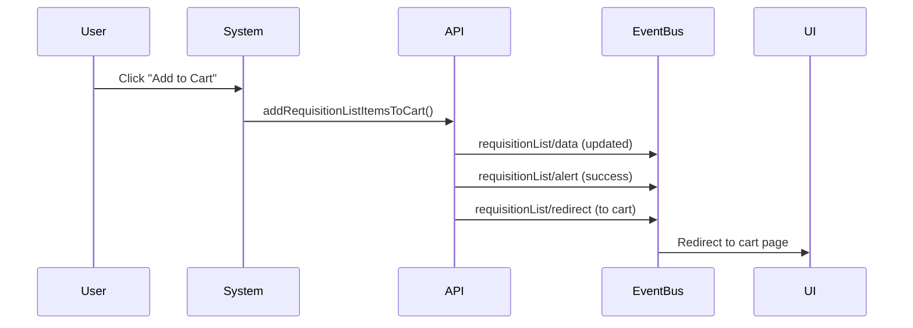
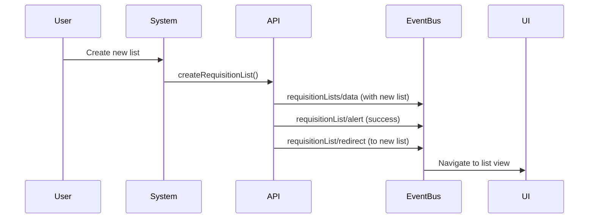

import { Aside } from '@astrojs/starlight/components';
import TableWrapper from '@components/TableWrapper.astro';

The Requisition List drop-in emits **5 events** to the event bus, allowing you to track and respond to requisition list operations, data changes, and user interactions.

<div style="background-color: var(--sl-color-blue-low); border-left: 4px solid var(--sl-color-blue); padding: 0.75rem 1rem; border-radius: 0.25rem; margin: 1rem 0;">
<strong>Version: 0.8.0-beta</strong>
</div>

## Available events

<TableWrapper nowrap={[0]}>

| Event Name | Description |
|------------|-------------|
| [`requisitionList/alert`](#requisitionlistalert) | Alert message to display to the user |
| [`requisitionList/data`](#requisitionlistdata) | Requisition list data changed |
| [`requisitionList/initialized`](#requisitionlistinitialized) | Drop-in initialization complete |
| [`requisitionList/redirect`](#requisitionlistredirect) | Request to redirect to another page |
| [`requisitionLists/data`](#requisitionlistsdata) | Lists collection data changed |

</TableWrapper>

## Event details

### requisitionList/alert

Emitted when an alert message should be displayed to the user, such as success confirmations, warnings, or error messages.

#### Event payload

```typescript
{
  eventType: 'requisitionList/alert',
  data: {
    type: 'success' | 'error' | 'warning' | 'info',
    message: string
  }
}
```

#### When triggered

- After successful list operations (create, update, delete)
- After adding items to cart from a list
- After item operations (add, update, remove)
- On operation errors or validation failures

#### Example

```js
import { events } from '@dropins/tools/event-bus.js';

events.on('requisitionList/alert', (payload) => {
  const { type, message } = payload.data;
  
  // Display alert using your notification system
  showNotification({
    type,
    message,
    duration: type === 'error' ? 5000 : 3000
  });
  
  console.log(`${type.toUpperCase()}: ${message}`);
});
```

#### Usage scenarios

- Display toast notifications
- Show inline error messages
- Log user actions for analytics
- Trigger accessibility announcements
- Update status indicators

---

### requisitionList/data

Emitted when data for a single requisition list changes or is loaded.

#### Event payload

```typescript
{
  eventType: 'requisitionList/data',
  data: RequisitionListModel // Complete list data including items
}
```

#### When triggered

- After loading a requisition list
- After adding items to the list
- After removing items from the list
- After updating item quantities
- After updating list details (name, description)

#### Example 1: Basic list data handler

```js
import { events } from '@dropins/tools/event-bus.js';

events.on('requisitionList/data', (payload) => {
  const list = payload.data;
  
  console.log(`List "${list.name}" updated`);
  console.log(`Total items: ${list.items.length}`);
  
  // Update the UI
  updateListDisplay(list);
  
  // Update item count badge
  updateItemCount(list.items.length);
  
  // Refresh totals
  calculateListTotals(list.items);
});
```

#### Example 2: Add entire requisition list to cart

```js
import { events } from '@dropins/tools/event-bus.js';
import { addRequisitionListItemsToCart } from '@dropins/storefront-requisition-list/api.js';

class QuickCartIntegration {
  constructor() {
    events.on('requisitionList/data', this.handleListData.bind(this));
    events.on('cart/updated', this.handleCartUpdated.bind(this));
  }
  
  handleListData(payload) {
    const list = payload.data;
    
    // Add quick-add button to UI
    this.renderQuickAddButton(list);
  }
  
  renderQuickAddButton(list) {
    const button = document.createElement('button');
    button.className = 'quick-add-to-cart';
    button.textContent = `Add all ${list.items.length} items to cart`;
    button.onclick = () => this.addAllToCart(list);
    
    document.querySelector('#list-actions').appendChild(button);
  }
  
  async addAllToCart(list) {
    try {
      showLoadingOverlay('Adding items to cart...');
      
      // Add all items from requisition list to cart
      await addRequisitionListItemsToCart({
        requisitionListUid: list.uid,
        requisitionListItems: list.items.map(item => ({
          uid: item.uid,
          quantity: item.quantity
        }))
      });
      
      hideLoadingOverlay();
      showSuccessNotification(`Added ${list.items.length} items to cart`);
      
      // Redirect to cart
      setTimeout(() => window.location.href = '/cart', 1500);
      
    } catch (error) {
      hideLoadingOverlay();
      showErrorNotification('Failed to add items: ' + error.message);
    }
  }
  
  handleCartUpdated(payload) {
    // Update cart badge
    document.querySelector('.cart-count').textContent = payload.data.itemCount;
  }
}

const quickCart = new QuickCartIntegration();
```

#### Example 3: Selective cart integration with inventory check

```js
import { events } from '@dropins/tools/event-bus.js';
import { addToCart } from '@dropins/storefront-cart/api.js';

class SelectiveCartManager {
  constructor() {
    this.selectedItems = new Set();
    
    events.on('requisitionList/data', this.handleListData.bind(this));
  }
  
  handleListData(payload) {
    const list = payload.data;
    
    // Render list with selection checkboxes
    this.renderSelectableList(list);
  }
  
  renderSelectableList(list) {
    const container = document.querySelector('#list-items');
    
    container.innerHTML = list.items.map(item => `
      <div class="list-item ${item.available ? '' : 'out-of-stock'}">
        <input 
          type="checkbox" 
          data-sku="${item.sku}"
          ${item.available ? '' : 'disabled'}
          onchange="window.cartManager.toggleItem('${item.sku}', this.checked)"
        />
        <div class="item-info">
          <h4>${item.name}</h4>
          <p>SKU: ${item.sku} | Qty: ${item.quantity}</p>
          ${!item.available ? '<span class="badge">Out of Stock</span>' : ''}
        </div>
      </div>
    `).join('');
    
    // Add bulk action button
    this.addBulkActionButton();
  }
  
  toggleItem(sku, checked) {
    if (checked) {
      this.selectedItems.add(sku);
    } else {
      this.selectedItems.delete(sku);
    }
    this.updateBulkButton();
  }
  
  addBulkActionButton() {
    const button = document.createElement('button');
    button.id = 'add-selected';
    button.textContent = 'Add selected to cart';
    button.disabled = true;
    button.onclick = () => this.addSelectedToCart();
    
    document.querySelector('#bulk-actions').appendChild(button);
  }
  
  updateBulkButton() {
    const button = document.querySelector('#add-selected');
    const count = this.selectedItems.size;
    
    button.disabled = count === 0;
    button.textContent = count > 0 
      ? `Add ${count} selected items to cart`
      : 'Select items to add';
  }
  
  async addSelectedToCart() {
    const items = Array.from(this.selectedItems);
    
    try {
      showLoadingOverlay(`Adding ${items.length} items...`);
      
      for (const sku of items) {
        const item = this.findItemBySku(sku);
        await addToCart({
          sku: item.sku,
          quantity: item.quantity,
          selectedOptions: item.selectedOptions
        });
      }
      
      hideLoadingOverlay();
      showSuccessNotification(`Added ${items.length} items to cart`);
      
      // Clear selection
      this.selectedItems.clear();
      this.updateBulkButton();
      
      // Redirect
      window.location.href = '/cart';
      
    } catch (error) {
      hideLoadingOverlay();
      showErrorNotification('Failed to add items: ' + error.message);
    }
  }
  
  findItemBySku(sku) {
    // Helper to find item data
    return this.currentList.items.find(item => item.sku === sku);
  }
}

// Make globally accessible
window.cartManager = new SelectiveCartManager();
```

#### Usage scenarios

- Refresh list details view after changes
- Update item count displays and badges
- Recalculate list totals and pricing
- Update caching or local storage
- Enable/disable action buttons based on list state
- Add entire requisition lists to cart with one click
- Implement selective item-to-cart workflows
- Handle inventory availability in real-time
- Track cart conversions from requisition lists
- Show progress during bulk add operations

---

### requisitionList/initialized

Emitted when the Requisition List drop-in completes initialization.

#### Event payload

```typescript
{
  eventType: 'requisitionList/initialized'
}
```

#### When triggered

- After `initialize()` function completes
- On drop-in first load
- After configuration is applied

#### Example

```js
import { events } from '@dropins/tools/event-bus.js';

events.on('requisitionList/initialized', () => {
  console.log('Requisition List drop-in ready');
  
  // Load initial data
  loadRequisitionLists();
  
  // Enable UI interactions
  enableRequisitionListFeatures();
  
  // Track analytics
  trackRequisitionListEnabled();
});
```

#### Usage scenarios

- Load initial requisition lists
- Enable feature-specific UI elements
- Initialize dependent components
- Track feature availability
- Set up additional event listeners

---

### requisitionList/redirect

Emitted to request a redirect to another page, typically after completing an operation.

#### Event payload

```typescript
{
  eventType: 'requisitionList/redirect',
  data: {
    url: string,
    type?: 'list-view' | 'lists-overview' | 'cart' | 'external'
  }
}
```

#### When triggered

- After creating a new requisition list
- After adding items to cart from a list
- After deleting a list
- On navigation between list views
- After successful operations requiring page change

#### Example

```js
import { events } from '@dropins/tools/event-bus.js';

events.on('requisitionList/redirect', (payload) => {
  const { url, type } = payload.data;
  
  console.log(`Redirect request: ${type} -> ${url}`);
  
  // Handle different redirect types
  switch (type) {
    case 'cart':
      // Navigate to cart page
      window.location.href = url;
      break;
    case 'list-view':
      // Navigate to specific list
      navigateToList(url);
      break;
    case 'lists-overview':
      // Navigate to lists overview
      navigateToListsOverview(url);
      break;
    default:
      // Standard navigation
      window.location.href = url;
  }
});
```

#### Usage scenarios

- Navigate after list creation
- Redirect to cart after adding items
- Return to lists overview after deletion
- Handle post-operation navigation
- Implement custom routing logic

---

### requisitionLists/data

Emitted when the collection of requisition lists changes or is loaded.

#### Event payload

```typescript
{
  eventType: 'requisitionLists/data',
  data: {
    items: RequisitionListModel[], // Array of lists
    totalCount: number,
    currentPage?: number,
    pageSize?: number
  }
}
```

#### When triggered

- After loading requisition lists
- After creating a new list
- After deleting a list
- After list collection changes
- On pagination or filtering

#### Example

```js
import { events } from '@dropins/tools/event-bus.js';

events.on('requisitionLists/data', (payload) => {
  const { items, totalCount } = payload.data;
  
  console.log(`${totalCount} requisition lists loaded`);
  
  // Update lists display
  renderRequisitionLists(items);
  
  // Update pagination
  updatePagination({
    total: totalCount,
    current: payload.data.currentPage,
    pageSize: payload.data.pageSize
  });
  
  // Update empty state
  if (items.length === 0) {
    showEmptyState();
  } else {
    hideEmptyState();
  }
});
```

#### Usage scenarios

- Render lists grid or table
- Update list count displays
- Handle pagination
- Show/hide empty states
- Update filters and sorting
- Cache lists data

---

## Listening to events

All Requisition List events are emitted through the centralized event bus:

```js
import { events } from '@dropins/tools/event-bus.js';

// Listen to list data events
events.on('requisitionList/data', handleListUpdate);
events.on('requisitionLists/data', handleListsUpdate);

// Listen to UI events
events.on('requisitionList/alert', handleAlert);
events.on('requisitionList/redirect', handleRedirect);

// Listen to initialization
events.on('requisitionList/initialized', handleInit);

// Clean up listeners when done
events.off('requisitionList/data', handleListUpdate);
events.off('requisitionList/alert', handleAlert);
```

<Aside type="tip">
The `requisitionList/alert` event provides a standardized way to display feedback to users. Consider implementing a global alert handler rather than handling alerts in individual components.
</Aside>

<Aside type="note">
The `requisitionList/redirect` event is advisory - your application controls whether to honor the redirect request. This allows you to implement custom routing logic or prevent navigation in certain scenarios.
</Aside>

## Event flow examples

### Adding items to cart



### Creating a new list



## Related documentation

- [Functions](/dropins-b2b/requisition-list/functions/) - API functions that emit these events
- [Containers](/dropins-b2b/requisition-list/containers/) - UI components that respond to events
- [Event bus documentation](/dropins/all/extending/#event-bus) - Learn more about the event system

{/* This documentation is manually curated based on: https://github.com/adobe-commerce/storefront-requisition-list */}
