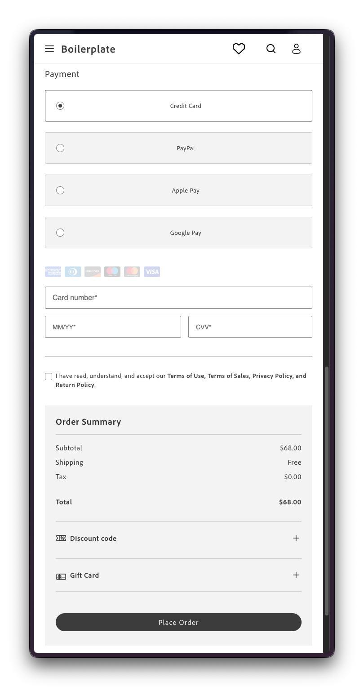
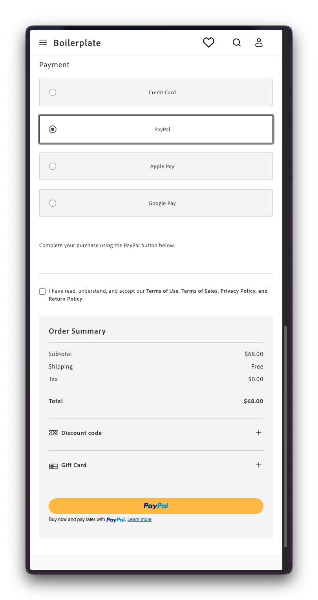
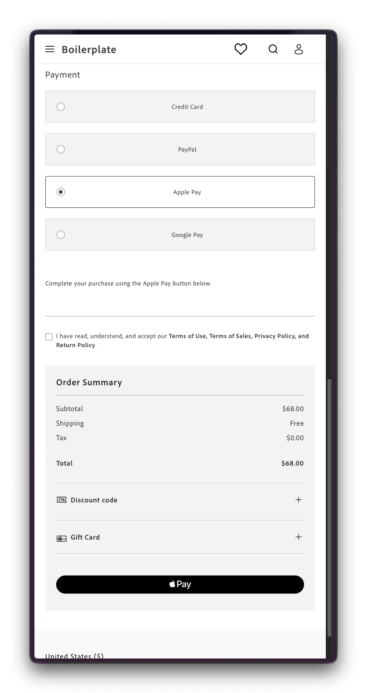
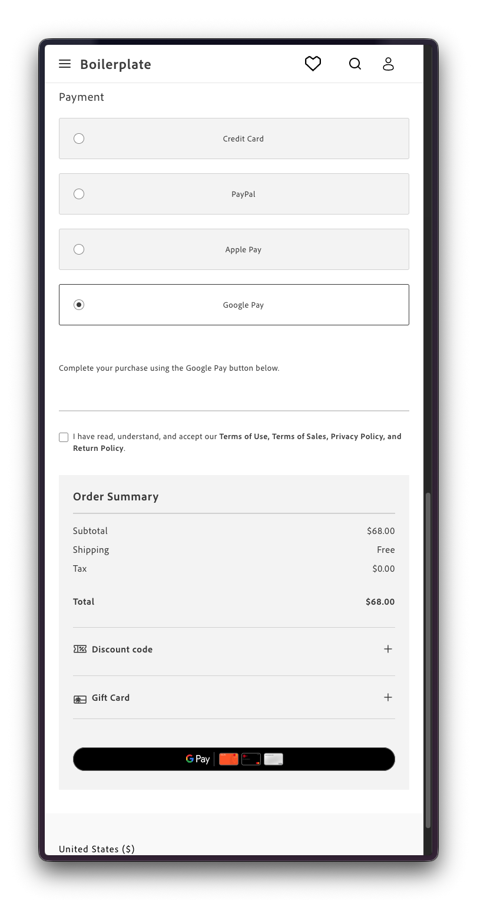

import { Steps } from '@astrojs/starlight/components';
import Aside from '@components/Aside.astro';
import Tasks from '@components/Tasks.astro';
import Task from '@components/Task.astro';
import CardGrid from '@components/CardGrid.astro';
import Card from '@components/Card.astro';
import Link from '@components/Link.astro';

The Commerce boilerplate's checkout page already includes the Payment Services credit card form, so shoppers can pay by card out of the box. To let them pay with PayPal, Apple Pay, or Google Pay, additional frontend code is required to render those buttons on the checkout page. This tutorial shows you how.

## What you'll build

By the end of this tutorial, you'll have updated the `commerce-checkout` block so that selecting PayPal, Apple Pay, or Google Pay as a payment method:
- Shows a short instructional notice, for example, "Complete your purchase using the PayPal button below."
- Replaces the "Place order" button at the bottom of the page with the matching branded button.

Here's the result for each payment method:

<CardGrid>
  <Card title="Credit Card">
    
  </Card>
  <Card title="PayPal">
    
  </Card>
  <Card title="Apple Pay">
    
  </Card>
  <Card title="Google Pay">
    
  </Card>
</CardGrid>

<style>{`
  .card {
    padding: 0;
    gap: 0;
  }

  .card .title {
    padding: 1rem 1rem 0 1rem;
    margin: 0;
  }
`}
</style>

## Prerequisites

Before you begin, make sure you have:

- A working [Commerce storefront](/get-started/create-storefront/) on Edge Delivery Services
- Familiarity with [customizing blocks](/boilerplate/customizing-blocks/) in your code repository
- Completed the onboarding steps described in [Payment Services installation](/dropins/payment-services/installation)
- [@dropins/storefront-payment-services](https://www.npmjs.com/package/@dropins/storefront-payment-services) at version [4.2.1](https://www.npmjs.com/package/@dropins/storefront-payment-services/v/4.2.1) or higher in `package.json`

## Step-by-step

The following steps describe how to add PayPal, Apple Pay, and Google Pay buttons to the `commerce-checkout` block.

<Tasks>
<Task>
### Prepare "place order" action slot

In the boilerplate's default checkout, the "Place order" button sits at the bottom of the page, the last action after shipping, payment, billing, terms and conditions, and promo codes on mobile. When a shopper selects PayPal, Apple Pay, or Google Pay, that same spot needs to hold the branded button instead, so both buttons need to share one dynamic slot.

<Aside type="note" title="Why not render it inline?">
An alternative would be to render the selected method's branded button below the payment options (in the same spot where the credit card form appears), hiding the default "Place order" button while that payment method stays selected.

On smaller mobile screens, everything that follows (the billing address form, terms and conditions, and promo code inputs) can push the branded payment button out of view, leaving shoppers with no visible way to continue. Rendering the button in the same slot as "Place order" keeps the final action at the bottom, visible no matter what renders above it.
</Aside>

To add that shared slot, adapt your `blocks/commerce-checkout` block as follows:

<Steps>
1. Navigate to the `blocks/commerce-checkout/containers.js` file and find the `renderPlaceOrder` function.
    ```js
    /**
     * Renders place order button with handler functions - follows multi-step pattern
     * @param {HTMLElement} container - DOM element to render the place order button in
     * @param {Object} options - Configuration object with handler functions
     * @param {Function} options.handleValidation - Validation handler function
     * @param {Function} options.handlePlaceOrder - Place order handler function
     * @returns {Promise<Object>} - The rendered place order component
     */
    export const renderPlaceOrder = async (container, options = {}) => renderContainer(
      CONTAINERS.PLACE_ORDER_BUTTON,
      async () => CheckoutProvider.render(PlaceOrder, {
        handleValidation: options.handleValidation,
        handlePlaceOrder: options.handlePlaceOrder,
      })(container),
    );
    ```

1. Replace it with the code below.

    ```js
    // Serializes every mount/unmount of the Place Order slot's occupant, so a new occupant is
    // never rendered while the previous one is still being removed
    let placeOrderSlotQueue = Promise.resolve();
    let placeOrderSlotMount = null; // Promise<RenderAPI> | null

    /**
     * Mounts a new occupant into the Place Order slot, unmounting the previous one, if there is any.
     * @param {(container: HTMLElement) => Promise<void>} mount - Starts the dropin render.
     * @param {HTMLElement} container - The Place Order slot container element.
     * @returns {Promise<void>}
     */
    const mountPlaceOrderSlot = (mount, container) => {
      placeOrderSlotQueue = unmountPlaceOrderSlot().then(async () => {
        try {
          placeOrderSlotMount = mount(container);
          await placeOrderSlotMount;
        } catch (error) {
          console.error('Failed to mount Place Order slot occupant:', error);
          placeOrderSlotMount = null;
        }
      });
      return placeOrderSlotQueue;
    };

    /**
    * Unmounts whatever currently occupies the Place Order slot, if anything.
    * @returns {Promise<void>}
    */
    const unmountPlaceOrderSlot = () => {
      placeOrderSlotQueue = placeOrderSlotQueue.then(async () => {
        if (placeOrderSlotMount) {
          try {
            const api = await placeOrderSlotMount;
            api.remove();
          } catch (error) {
            console.error('Failed to unmount Place Order slot occupant:', error);
          } finally {
            placeOrderSlotMount = null;
          }
        }
      });
      return placeOrderSlotQueue;
    };

    /**
     * Renders place order button with handler functions - follows multi-step pattern
     * @param {HTMLElement} container - DOM element to render the place order button in
     * @param {Object} options - Configuration object with handler functions
     * @param {Function} options.handleValidation - Validation handler function
     * @param {Function} options.handlePlaceOrder - Place order handler function
     * @returns {Promise<void>}
     */
    export const renderPlaceOrder = async (container, options = {}) => mountPlaceOrderSlot(
      (el) => CheckoutProvider.render(PlaceOrder, {
        handleValidation: options.handleValidation,
        handlePlaceOrder: options.handlePlaceOrder,
      })(el),
      container,
    );

    /**
     * Checks whether the standard Place Order button currently occupies the Place Order slot,
     * as opposed to an express payment method's own button (or nothing, if unmounted).
     * @param {HTMLElement} container - The Place Order slot element.
     * @returns {boolean}
     */
    export const isPlaceOrderRendered = (container) => (
      !!container.querySelector('.checkout-place-order')
    );
    ```

1. In `blocks/commerce-checkout/commerce-checkout.css`, find the `.checkout__place-order` rule inside the mobile media query block:

    ```css
    @media only screen and (min-width: 320px) and (max-width: 768px) {
        /* ...your other existing rules */

        .checkout__place-order {
            order: 4;
        }
    }
    ```

1. Replace it with the following, keeping it inside that same media query:

    ```css
    @media only screen and (min-width: 320px) and (max-width: 768px) {
        /* ...your other existing rules */

        /* Style place order slot so it applies to both the place order button and the payment buttons. */
        .checkout__place-order {
            order: 4;
            background-color: var(--color-neutral-200);
            padding: 0 var(--spacing-medium) var(--spacing-big) var(--spacing-medium);
        }

        /* Neutralize the checkout dropin's own background/padding so it doesn't stack with the rule above */
        .checkout__place-order .checkout-place-order {
            background-color: transparent;
            padding: 0;
        }
    }
    ```

</Steps>
</Task>
<Task>
### Render payment buttons in "place order" slot

This step adds PayPal, Apple Pay, and Google Pay support to `renderPaymentMethods`, each rendering its branded button into the "place order" slot added in the previous step.

<Steps>
1. Navigate to the `blocks/commerce-checkout/containers.js` file and make sure you have the following imports.

    ```js
    // Payment Services Dropin
    import { PaymentMethodCode, PaymentLocation } from '@dropins/storefront-payment-services/api.js';
    import ApplePay from '@dropins/storefront-payment-services/containers/ApplePay.js';
    import CreditCard from '@dropins/storefront-payment-services/containers/CreditCard.js';
    import GooglePay from '@dropins/storefront-payment-services/containers/GooglePay.js';
    import PayPalButtons from '@dropins/storefront-payment-services/containers/PayPalButtons.js';
    import { render as PaymentServices } from '@dropins/storefront-payment-services/render.js';

    // Order Dropin
    import * as orderApi from '@dropins/storefront-order/api.js';
    ```

1. In the same file, find the `renderPaymentMethods` function.

    ```js
    /**
     * Renders payment methods with credit card integration - original regular checkout functionality
     * @param {HTMLElement} container - DOM element to render payment methods in
     * @returns {Promise<Object>} - The rendered payment methods component
     */
    export const renderPaymentMethods = async (container) => renderContainer(
      CONTAINERS.PAYMENT_METHODS,
      async () => CheckoutProvider.render(PaymentMethods, {
        slots: {
          Methods: {
            [PaymentMethodCode.CREDIT_CARD]: {
              render: (ctx) => {
                const $creditCard = document.createElement('div');

                PaymentServices.render(CreditCard)($creditCard);

                ctx.replaceHTML($creditCard);
              },
            },
            [PaymentMethodCode.SMART_BUTTONS]: {
              enabled: false,
            },
            [PaymentMethodCode.APPLE_PAY]: {
              enabled: false,
            },
            [PaymentMethodCode.APM]: {
              enabled: false,
            },
            [PaymentMethodCode.GOOGLE_PAY]: {
              enabled: false,
            },
            [PaymentMethodCode.VAULT]: {
              enabled: false,
            },
            [PaymentMethodCode.FASTLANE]: {
              enabled: false,
            },
          },
        },
      })(container),
    );
    ```

1. Replace it with the code below, which adds PayPal, Apple Pay, and Google Pay. Don't need all three? Leave any you don't need as `enabled: false` and skip its render handler.

    ```js
    /**
     * Resolves with the payment method codes Payment Services has confirmed are available
     * for checkout, waiting for its initialization event if it hasn't fired yet.
     * @returns {Promise<string[]>}
     */
    const getAvailablePaymentServicesMethods = () => new Promise((resolve) => {
      const subscription = events.on('payment-services/initialized/checkout', ({ availablePaymentMethods }) => {
        subscription?.off();
        resolve(availablePaymentMethods);
      }, { eager: true });
    });

    /**
     * Creates a short notice explaining that the given express payment method's button renders in
     * the Place Order slot instead of inline in the Payment section.
     * @param {string} label - Display label of the express payment method (e.g. "Apple Pay")
     * @returns {HTMLElement} - The notice element
     */
    const createExpressPaymentNotice = (label) => {
      const $notice = document.createElement('p');
      $notice.textContent = `Complete your purchase using the ${label} button below.`;
      return $notice;
    };

    /**
     * Renders payment method options, showing a credit card form inline, and PayPal, Apple Pay,
     * and Google Pay as branded checkout buttons in the Place Order slot.
     * @param {HTMLElement} paymentMethodsContainer - DOM element to render payment methods in
     * @param {HTMLElement} placeOrderButtonContainer - DOM element express payment buttons mount into,
     *   in place of the standard Place Order button
     * @param {Function} validateCheckoutForms - Function that returns true if all Checkout forms are valid
     * @returns {Promise<Object>} - The rendered payment methods component
     */
    export const renderPaymentMethods = async (
      paymentMethodsContainer,
      placeOrderButtonContainer,
      validateCheckoutForms,
    ) => renderContainer(
      CONTAINERS.PAYMENT_METHODS,
      async () => {
        const availablePaymentServicesMethods = await getAvailablePaymentServicesMethods();

        return CheckoutProvider.render(PaymentMethods, {
          slots: {
            Methods: {
              [PaymentMethodCode.CREDIT_CARD]: {
                render: (ctx) => {
                  const $creditCard = document.createElement('div');

                  PaymentServices.render(CreditCard)($creditCard);

                  ctx.replaceHTML($creditCard);
                },
                enabled: availablePaymentServicesMethods.includes(PaymentMethodCode.CREDIT_CARD),
              },
              [PaymentMethodCode.FASTLANE]: {
                enabled: false,
              },
              [PaymentMethodCode.PAYPAL_BUTTONS]: {
                render: (ctx) => {
                  mountPlaceOrderSlot((el) => PaymentServices.render(PayPalButtons, {
                    onButtonClick: (showPaymentSheet) => {
                      if (validateCheckoutForms()) {
                        showPaymentSheet();
                      }
                    },
                    onSuccess: ({ cartId }) => {
                      orderApi.placeOrder(cartId);
                    },
                    onError: (localizedError) => {
                      events.emit('checkout/error', {
                        message: localizedError.message,
                      });
                    },
                  })(el), placeOrderButtonContainer);

                  ctx.replaceHTML(createExpressPaymentNotice('PayPal'));
                },
                enabled: availablePaymentServicesMethods.includes(PaymentMethodCode.PAYPAL_BUTTONS),
              },
              [PaymentMethodCode.APPLE_PAY]: {
                render: (ctx) => {
                  const checkoutData = events.lastPayload('checkout/updated')
                    || events.lastPayload('checkout/initialized')
                    || null;

                  if (checkoutData === null) {
                    console.error('Cannot render apple pay button without checkout data.');
                    unmountPlaceOrderSlot();
                    ctx.replaceHTML(document.createElement('div'));
                    return;
                  }

                  mountPlaceOrderSlot((el) => PaymentServices.render(ApplePay, {
                    location: PaymentLocation.CHECKOUT,
                    getCartId: () => ctx.cartId,
                    isVirtualCart: checkoutData.isVirtual,
                    onButtonClick: (showPaymentSheet) => {
                      if (validateCheckoutForms()) {
                        showPaymentSheet();
                      }
                    },
                    onSuccess: ({ cartId }) => orderApi.placeOrder(cartId),
                    onError: (localizedError) => {
                      events.emit('checkout/error', {
                        message: localizedError.message,
                      });
                    },
                  })(el), placeOrderButtonContainer);

                  ctx.replaceHTML(createExpressPaymentNotice('Apple Pay'));
                },
                enabled: availablePaymentServicesMethods.includes(PaymentMethodCode.APPLE_PAY),
              },
              [PaymentMethodCode.APM]: {
                enabled: false,
              },
              [PaymentMethodCode.GOOGLE_PAY]: {
                render: (ctx) => {
                  mountPlaceOrderSlot((el) => PaymentServices.render(GooglePay, {
                    onButtonClick: (showPaymentSheet) => {
                      if (validateCheckoutForms()) {
                        showPaymentSheet();
                      }
                    },
                    onSuccess: ({ cartId }) => orderApi.placeOrder(cartId),
                    onError: (localizedError) => {
                      events.emit('checkout/error', {
                        message: localizedError.message,
                      });
                    },
                  })(el), placeOrderButtonContainer);

                  ctx.replaceHTML(createExpressPaymentNotice('Google Pay'));
                },
                enabled: availablePaymentServicesMethods.includes(PaymentMethodCode.GOOGLE_PAY),
              },
              [PaymentMethodCode.VAULT]: {
                enabled: false,
              },
              [PaymentMethodCode.FASTLANE]: {
                enabled: false,
              },
            },
          },
        })(paymentMethodsContainer);
      },
    );
    ```

1. In `blocks/commerce-checkout/commerce-checkout.js`, find the call to `renderPaymentMethods` and add the `$placeOrder` and `handleValidation` arguments.

    <Aside type="caution" title="Method not showing up?">
      Each method's `enabled` flag depends on `availablePaymentServicesMethods`, which reflects whether that method is configured to show on the checkout page in the Payment Services configuration in Commerce Admin — one toggle per method:
      - Credit Card: "Show on checkout page"
      - Apple Pay: "Show Apple Pay on checkout page"
      - Google Pay: "Show Google Pay on checkout page"
      - PayPal buttons: "Show buttons on checkout page"

      If a method doesn't appear even after adding this code, check its toggle first — see <Link href="https://experienceleague.adobe.com/en/docs/commerce/payment-services/configure/configure-admin" text="Configure Payment Services" /> for where to find each one.
    </Aside>

    ```js
    renderPaymentMethods($paymentMethods, $placeOrder, handleValidation),
    ```

1. In the same file, find the `trySubmitPaymentServicesCreditCard` function.
    ```js
    const trySubmitPaymentServicesCreditCard = async () => {
      try {
        await paymentsApi.submitCreditCard();
        return true;
      } catch (error) {
        switch (error.code) {
          case 'payment-services/credit-card-form-not-rendered':
            console.error('Credit card form not rendered.');
            return false;
          case 'payment-services/credit-card-form-invalid':
            // Credit card form invalid; abort order placement
            return false;
          default:
            throw error;
        }
      }
    };
    ```

1. Replace it with the code below so credit card errors go through the same error-messaging path as the new payment buttons.

    ```js
    const trySubmitPaymentServicesCreditCard = async () => {
      try {
        await paymentsApi.submitCreditCard();
        return true;
      } catch (error) {
        if (error.localized) {
          events.emit('checkout/error', {
            message: error.message,
          });
          return false;
        }
        switch (error.code) {
          case 'payment-services/credit-card-form-not-rendered':
            console.error('Credit card form not rendered.');
            return false;
          case 'payment-services/credit-card-form-invalid':
            // Credit card form invalid; abort order placement
            return false;
          default:
            throw error;
        }
      }
    };
    ```
</Steps>
</Task>
<Task>
### Restore place order button on method switch

This step restores the "Place order" button whenever a shopper switches from an express payment method back to one without a branded button. The check lives in `initializeCheckout` which, despite the name, runs on every checkout update, not just once at load.

<Steps>
1. Navigate to the `blocks/commerce-checkout/commerce-checkout.js` file and import the new `isPlaceOrderRendered` function added to `containers.js` in the first step.

    ```js
    import {
      isPlaceOrderRendered, // new
      // ...your other existing container imports
    } from './containers.js';
    ```

1. In the same file, find the `initializeCheckout` function.

    ```js
    async function initializeCheckout(data) {
      await initReCaptcha(0);
      if (data.isGuest) await displayGuestAddressForms(data);
      else {
        removeOverlaySpinner(loaderRef, $loader, $loaderStatus);
        await displayCustomerAddressForms(data);
      }
    }
    ```

1. Replace it with the following code.

    ```js
    const EXPRESS_PAYMENT_METHODS = [
      paymentsApi.PaymentMethodCode.PAYPAL_BUTTONS,
      paymentsApi.PaymentMethodCode.APPLE_PAY,
      paymentsApi.PaymentMethodCode.GOOGLE_PAY,
    ];

    const isExpressPaymentMethod = (method) => (
      method && EXPRESS_PAYMENT_METHODS.includes(method.code)
    );

    async function initializeCheckout(data) {
      await initReCaptcha(0);
      if (data.isGuest) await displayGuestAddressForms(data);
      else {
        removeOverlaySpinner(loaderRef, $loader, $loaderStatus);
        await displayCustomerAddressForms(data);
      }
      // Express payment methods replace the place order button; restore it for non-express methods
      if (data.selectedPaymentMethod?.code
        && !isExpressPaymentMethod(data.selectedPaymentMethod)
        && !isPlaceOrderRendered($placeOrder)) {
        await renderPlaceOrder($placeOrder, { handleValidation, handlePlaceOrder });
      }
    }
    ```
</Steps>
</Task>
</Tasks>


## Example

See <Link href={"https://github.com/hlxsites/aem-boilerplate-commerce/tree/payment-services/blocks/commerce-checkout"} text={"blocks/commerce-checkout"} /> in the `payment-services` branch of the boilerplate repository for a reference implementation of the PayPal, Apple Pay, and Google Pay integration. This branch may also include other Payment Services features, such as stored cards, covered in a separate tutorial.
