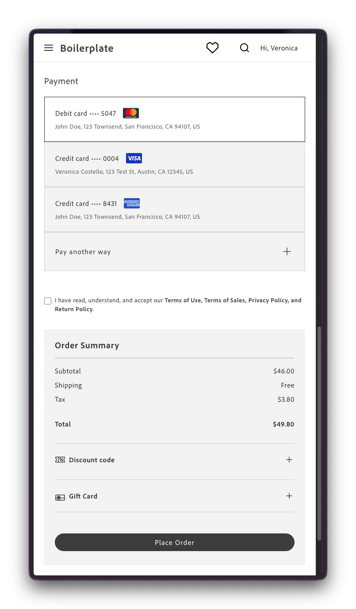
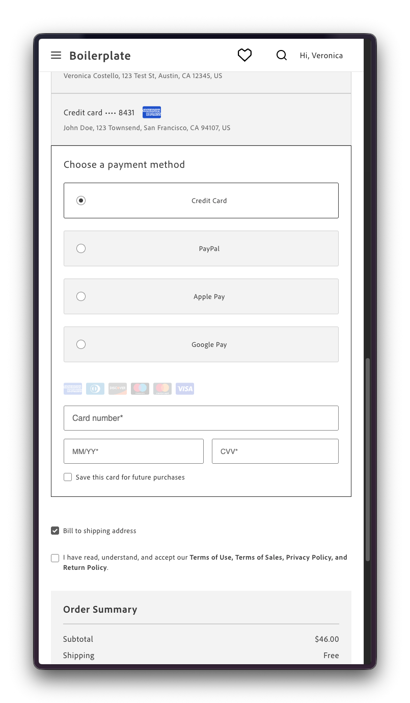

import { Steps } from '@astrojs/starlight/components';
import Aside from '@components/Aside.astro';
import Tasks from '@components/Tasks.astro';
import Task from '@components/Task.astro';
import CardGrid from '@components/CardGrid.astro';
import Card from '@components/Card.astro';
import Link from '@components/Link.astro';

This tutorial shows how to let shoppers vault a card during checkout and pay with it during a later purchase. Vaulting comes for free after upgrading the Payment Services drop-in. Reusing a saved card requires modifying your `commerce-checkout` block.

<Aside type="caution" title="Depends on pre-release drop-in versions">
This tutorial requires installing pre-release versions of `@dropins/storefront-checkout` and `@dropins/storefront-payment-services`, not the default dependencies that the boilerplate ships with today.
</Aside>

## What you'll build

By the end of this tutorial, you'll have updated the `commerce-checkout` block so that shoppers can check out using a card they've already saved.

<CardGrid>
  <Card title="Pay with vaulted card">
    
  </Card>
  <Card title="Pay with fresh card">
    
  </Card>
</CardGrid>

<style>{`
  .card {
    padding: 0;
    gap: 0;
  }

  .card .title {
    padding: 1rem 1rem 0 1rem;
    margin: 0;
  }
`}
</style>

## Prerequisites

Before you begin, make sure you have:

- A working [Commerce storefront](/get-started/create-storefront/) on Edge Delivery Services
- Familiarity with [customizing blocks](/boilerplate/customizing-blocks/) in your code repository
- Completed the onboarding steps described in [Payment Services installation](/dropins/payment-services/installation)
- [@dropins/storefront-checkout](https://www.npmjs.com/package/@dropins/storefront-checkout) at version [3.3.2-alpha-20260818085815](https://www.npmjs.com/package/@dropins/storefront-checkout/v/3.3.2-alpha-20260818085815) in `package.json`
- [@dropins/storefront-payment-services](https://www.npmjs.com/package/@dropins/storefront-payment-services) at version [4.3.0-beta2](https://www.npmjs.com/package/@dropins/storefront-payment-services/v/4.3.0-beta2) in `package.json`

## Step-by-step

The following steps describe how to update the `commerce-checkout` block so shoppers can pay with a vaulted card.

<Tasks>
<Task>
### Render vaulted card options

This step adds a `StoredMethods` slot to `renderPaymentMethods`, rendering each saved card as its own selectable option.

<Steps>
1. Navigate to the `blocks/commerce-checkout/containers.js` file and import the `VaultedCreditCard` container from the Payment Services drop-in.

    ```js
    import VaultedCreditCard from '@dropins/storefront-payment-services/containers/VaultedCreditCard.js';
    ```

1. In the same file, find the `PaymentMethods` container rendered in the `renderPaymentMethods` function.

    ```js
    CheckoutProvider.render(PaymentMethods, {
      slots: {
        Methods: {
          // ...your existing entries
        },
      },
    })
    ```

1. Add a `StoredMethods` slot as a sibling of `Methods`, which renders each saved card.

    <Aside type="note" title="Vaulted cards not showing up?">
    If no saved cards appear after this step, check that "Vault Enabled" is set to Yes in the Payment Services configuration in Commerce Admin. See <Link href="https://experienceleague.adobe.com/en/docs/commerce/payment-services/configure/configure-admin#configuration-options-1" text="Configuration Options" /> for where to find it.
    </Aside>

    ```js
    CheckoutProvider.render(PaymentMethods, {
      slots: {
        Methods: {
          // ...your existing entries
        },
        StoredMethods: {
          [PaymentMethodCode.VAULT]: {
            tokenCode: PaymentMethodCode.CREDIT_CARD,
            render: (ctx) => {
              const $storedOption = document.createElement('div');

              PaymentServices.render(VaultedCreditCard, {
                tokenDetails: ctx.details,
              })($storedOption);

              ctx.replaceHTML($storedOption);
            },
          },
        },
      },
    })
    ```

1. Remove the following entry from `Methods`, if you have one. `StoredMethods` already excludes registered codes from the live method list, making the explicit `enabled: false` now redundant.

    ```js
    [PaymentMethodCode.VAULT]: {
      enabled: false,
    },
    ```
</Steps>
</Task>
<Task>
### Place order with vaulted card

This step updates `handlePlaceOrder` so an order can actually be placed with a vaulted card.

<Steps>
1. Navigate to the `blocks/commerce-checkout/commerce-checkout.js` file and find the `handlePlaceOrder` function.

    ```js
    const handlePlaceOrder = async ({ cartId, code }) => {
      await displayOverlaySpinner(loaderRef, $loader, $loaderStatus);
      try {
        // Payment Services credit card
        if (code === paymentsApi.PaymentMethodCode.CREDIT_CARD) {
          const success = await trySubmitPaymentServicesCreditCard();
          if (!success) {
            return;
          }
        }
        await orderApi.placeOrder(cartId);
      } catch (error) {
        console.error(error);
        throw error;
      } finally {
        removeOverlaySpinner(loaderRef, $loader, $loaderStatus);
      }
    };
    ```

1. Extend the `if` condition that guards the call to `trySubmitPaymentServicesCreditCard()` so it also matches vaulted cards.

    ```js
    const handlePlaceOrder = async ({ cartId, code }) => {
      await displayOverlaySpinner(loaderRef, $loader, $loaderStatus);
      try {
        // Payment Services credit card
        if (code === paymentsApi.PaymentMethodCode.CREDIT_CARD
          || code === paymentsApi.PaymentMethodCode.VAULT) {
          const success = await trySubmitPaymentServicesCreditCard();
          if (!success) {
            return;
          }
        }
        await orderApi.placeOrder(cartId);
      } catch (error) {
        console.error(error);
        throw error;
      } finally {
        removeOverlaySpinner(loaderRef, $loader, $loaderStatus);
      }
    };
    ```
</Steps>
</Task>
<Task>
### Adjust billing address options

The boilerplate's default checkout layout locates the "Bill to shipping" checkbox above the payment options and the billing address form below them. Since a stored card's billing address is fixed to the card and already rendered inline with it, the checkbox and the form need to be hidden while one is selected. Also, the checkbox needs to move below the payment options, so shoppers are guaranteed to see it on their way to "Place order" if they switch to a method with customizable billing.

<Aside type="caution" title="Already rendering Apple Pay, Google Pay, or PayPal buttons?">
If you're rendering them inline in the payment section instead of in the "Place order" slot, follow <Link href="/dropins/payment-services/tutorials/add-buttons-to-checkout/" text="Add buttons to checkout" /> first. Rendering them inline usually requires moving the billing address form above the payment section, which conflicts with placing it below in this task.
</Aside>

To make these changes, adapt your `blocks/commerce-checkout` block as follows:

<Steps>
1. Navigate to the `blocks/commerce-checkout/commerce-checkout.js` file and locate the `handleCheckoutValues` function.

    ```js
    function handleCheckoutValues(payload) {
      const { isBillToShipping } = payload;
      $billingForm.style.display = isBillToShipping ? 'none' : 'block';
    }
    ```

1. Replace it with the following code to dynamically hide the billing checkbox and form while a stored card is selected.

    ```js
    function handleCheckoutValues(payload) {
      const { isBillToShipping, selectedPaymentMethod } = payload;
      const isStoredPaymentMethodSelected = !!selectedPaymentMethod?.additionalData?.publicHash;

      $billToShipping.style.display = isStoredPaymentMethodSelected ? 'none' : 'block';
      $billingForm.style.display = (isBillToShipping || isStoredPaymentMethodSelected) ? 'none' : 'block';
    }
    ```

1. In `blocks/commerce-checkout/fragments.js`, find the `createCheckoutFragment` function and ensure both `checkout__bill-to-shipping` and `checkout__billing-form` render after `checkout__payment-methods`, adjusting your layout if needed. In the default layout, only the checkbox needs to move.

    <Aside type="note" title="Why relocate the bill-to-shipping checkbox?">
    Left in its default position above payment options, the checkbox could reappear out of view if a shopper switches from a stored card to a fresh card. By then they've already scrolled down to payment options and may never scroll back up to see it. Moving it below payment guarantees it spawns in their path to "Place order" instead.
    </Aside>

    ```html
    <div class="checkout__main">
      <!-- ...other sections -->
      <div class="checkout__payment-methods ${CHECKOUT_BLOCK}"></div>
      <div class="checkout__bill-to-shipping ${CHECKOUT_BLOCK}"></div>
      <div class="checkout__billing-form ${CHECKOUT_BLOCK}"></div>
      <div class="checkout__terms-and-conditions ${CHECKOUT_BLOCK}"></div>
      <div class="checkout__place-order ${CHECKOUT_BLOCK}"></div>
    </div>
    ```

1. Finally, add the following style rule to `blocks/commerce-checkout/commerce-checkout.css` to hide the horizontal divisor when the shopper has stored cards.

    <Aside type="note" title="Why hide the divisor?">
    When a shopper has stored cards, they render inside their own bordered box, so the section's own divisor becomes a redundant second horizontal line right below it.
    </Aside>

    ```css
    /* No billing section divisor needed when payment methods shown inside separate box */
    .checkout__payment-methods:has(.checkout-payment-methods__stored-methods) {
      padding-bottom: 0;
      border-bottom: none;
    }
    ```

</Steps>
</Task>
</Tasks>

## Example

See <Link href={"https://github.com/hlxsites/aem-boilerplate-commerce/tree/payment-services/blocks/commerce-checkout"} text={"blocks/commerce-checkout"} /> in the `payment-services` branch of the boilerplate repository for a reference implementation of the vaulted cards integration. This branch also includes the PayPal, Apple Pay, and Google Pay integration covered in a separate tutorial.
