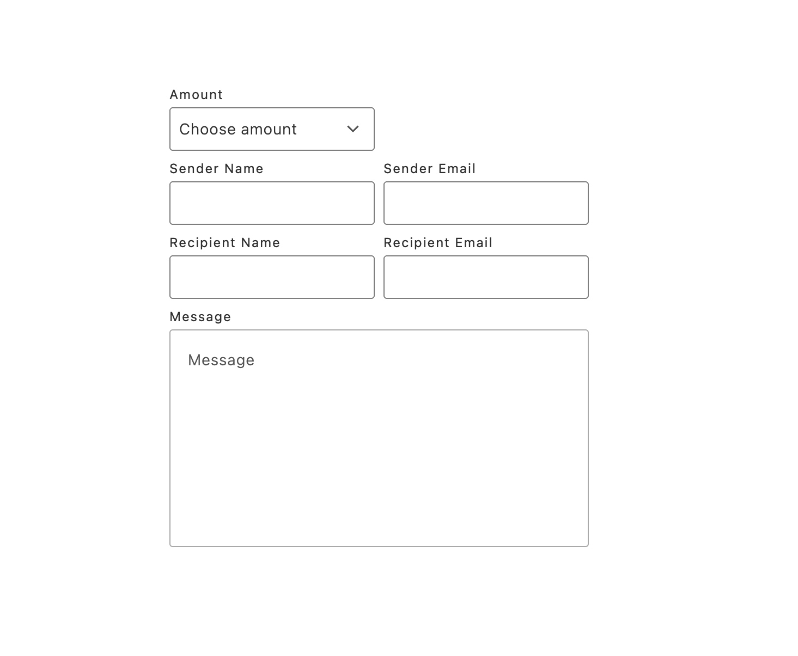

import OptionsTable from '@components/OptionsTable.astro';
import Diagram from '@components/Diagram.astro';

The `ProductGiftCardOptions` container manages and displays gift card-specific options on the product details page.

The container receives initial product data during [initialization](/dropins/product-details/initialization/) to preload the component. Once loaded, it operates in an event-driven manner, updating with data emitted to `pdp/data` within the event scope. Additionally, it listens to `pdp/values` to keep its displayed state in sync with the currently selected configuration. As shoppers interact with the gift card fields, the container updates the global PDP configuration values and validity.

:::note
- Rendering is conditional. The container renders only when the product includes the `ac_giftcard` attribute containing a JSON string with the shape `{ "options": Option[] }` that defines the UI fields.
- User interactions are tracked. As shoppers edit fields, the container writes selected values to the PDP configuration (`enteredOptions`) and updates validity to enable actions like **Add to Cart**.
- Additionally, the container passes the currency of the product to the `GiftCardOptions` component so it can format and display the currency correctly.
:::

## Container rendering

<Diagram caption="ProductGiftCardOptions container">
  
</Diagram>

## ProductGiftCardOptions configurations

The `ProductGiftCardOptions` container provides the following configuration options:

<OptionsTable
  compact
  options={[
    ['Option', 'Type', 'Req?', 'Description'],
    ['scope', 'string', 'No', 'Unique identifier for the PDP context. Only containers rendered with this scope will respond to product events.'],
    ['className', 'string', 'No', 'Additional CSS class applied to the container wrapper.'],
  ]}
/>

## Example

The following example demonstrates how to configure and render the `ProductGiftCardOptions` container:

```js
return productRenderer.render(ProductGiftCardOptions, {
  scope: 'modal', // optional
  className: 'pdp-gift-card-options--custom',
});
```

## Slots

The `ProductGiftCardOptions` container does not provide any slots. It renders the gift card options UI directly based on the `ac_giftcard` attribute data. To customize the styling, use CSS classes or pass a custom `className` via props.