import { Tabs, TabItem, Code, Steps } from '@astrojs/starlight/components';
import Prerequisites from '@components/Prerequisites.astro';
import Summary from '@components/Summary.astro';
import Diagram from '@components/Diagram.astro';
import CodeImport from '@components/CodeImport.astro';
import CodeExample from '@components/CodeExample.astro';
import Icon from '@components/overrides/Icon.astro';
import base from './base.css?raw';
import Tutorial from '@components/Tutorial.astro';
import Concepts from '@components/Concepts.astro';
import inlineStyles from './inlineStyles.html?raw';
import styles from './styles.css?raw';

This section teaches you how to override the **Commerce design token values** to match your brand colors, typography, spacing, shapes, and layouts. But first, let's define the vocabulary and concepts required to understand this process.

## Concepts

<Concepts>

### design tokens

CSS variables with default values. Our design tokens provide a standard set of CSS properties and default values for colors, typography, spacing, shapes, and layouts. We use them in all of our component CSS classes to avoid hard-coded values that cannot be easily changed. With this strategy, you can restyle our dropins to match your brand simply by changing the default token values.

<CodeImport code={base} title="All default design tokens" lang="css" frame="none" />

### library components

Basic components (like `Button`, `Checkbox`, and `Carousel`) used to build dropins. Design tokens are embedded in the CSS classes of these components to ensure fast, flexible styling to match your brand.

### Adobe Commerce design system

The collection of design tokens, library components, and conventions we use to style our dropins.

### brand

To override the built-in design token default values to match your brand's colors, typography, spacing, shapes, and layouts.

### style

To change existing dropin CSS classes or add new CSS classes to the dropin elements. Styling provides a deeper level of customization than branding.

</Concepts>

## How to brand dropins

The following diagram shows a small branding change. When we override the default value of a single shape token, we override the default border-radius of the `Button` library component, which changes the look and feel of dropins that use it.

<Diagram caption="How to override the dropin-design tokens.">
  
</Diagram>

## Branding examples

<Tabs>
  <TabItem value="Boilerplate" label="Boilerplate">
    This example shows six design tokens with new values for three color and three shape tokens from the boilerplate's `styles/styles.css` file.
    <Code code={styles} lang="css" title="styles/styles.css" />
  </TabItem>

  <TabItem value="Vanilla" label="Vanilla">
    This example shows two ways you can override the default token values: Add the tokens to a CSS file (`styles/styles.css`) and link it in the `<head>` (as in the EDS boilerplate), or add the tokens directly to the `<head>` using the `<style>` block:
    <Code code={inlineStyles} lang="html" title="index.html" />
  </TabItem>
</Tabs>
