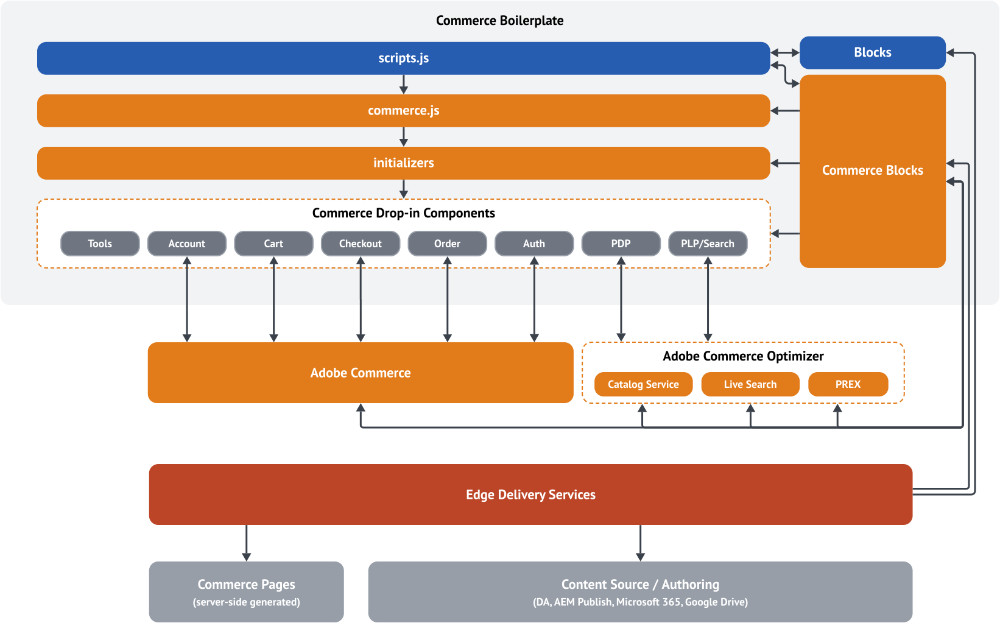

import Aside from '@components/Aside.astro';
import Diagram from '@components/Diagram.astro';
import Link from '@components/Link.astro';
import { Steps } from '@astrojs/starlight/components';

Headless Adobe Commerce storefronts on Edge Delivery Services use [drop-in components](/dropins/all/introduction/) that connect through APIs and integrate with the <Link href="https://github.com/hlxsites/aem-boilerplate-commerce" text="Commerce boilerplate" />.

## Big picture

Headless Adobe Commerce storefronts on Edge Delivery Services are built using a composable architecture with domain-driven commerce components called drop-in components. This architecture allows you to build and deploy a storefront that is composed of multiple Adobe services, each with its own responsibility. Drop-in components are connected through APIs and can be developed, tested, and deployed independently for faster development cycles.

Drop-in components use Adobe Commerce APIs to provide data and functionality. These components are reusable across projects and integrate out-of-the-box with Edge Delivery Services through the <Link href="https://github.com/hlxsites/aem-boilerplate-commerce" text="Commerce boilerplate" />. Adobe Commerce storefronts on Edge Delivery Services support doc-based authoring, enabling business users to manage content without developer help.

The following diagram illustrates the composable architecture of a headless Adobe Commerce storefront on Edge Delivery Services:

## Architecture overview

<Diagram type="mermaid" code={`
%%{init: {
  'theme': 'base',
  'fontFamily': 'Helvetica, Arial, sans-serif',
  'themeVariables': {
    'primaryColor': '#d4e8f4',
    'primaryBorderColor': '#a8cce0',
    'primaryTextColor': '#2d4a5e',
    'lineColor': '#b8b8c0',
    'secondaryColor': '#f8f8f5',
    'tertiaryColor': '#fcfcfc',
    'clusterBkg': '#f8f8f6',
    'clusterBorder': '#d8d8d4',
    'titleColor': '#3d3d45',
    'edgeLabelBackground': '#fcfcfc',
    'fontSize': '14px',
    'fontFamily': 'Helvetica, Arial, sans-serif'
  },
  'flowchart': {
    'subGraphTitleMargin': {'top': 10, 'bottom': 20},
    'wrappingWidth': 560,
    'curve': 'basis',
    'padding': 12,
    'nodeSpacing': 40,
    'rankSpacing': 35,
    'useMaxWidth': true
  }
}}%%
graph TB
    EDS["<b>Edge Delivery Services</b> <small>Hosting & CDN</small>"]
    subgraph Storefront["<b>Storefront</b> (Commerce Boilerplate)"]
        direction LR
        Blocks["<b>Content Blocks</b> <small>Cards, Columns, Headers</small>"]
        CommerceBlocks["<b>Commerce Blocks</b> <small>Cart, Checkout, PDP</small>"]
        Boilerplate["<b>Boilerplate</b> <small>scripts.js, commerce.js</small>"]
        B2CGroup["<b>B2C Drop-ins</b>"]
        B2BGroup["<b>B2B Drop-ins</b>"]
        Blocks --> Boilerplate
        CommerceBlocks --> B2CGroup
        CommerceBlocks --> B2BGroup
        B2CGroup --> Boilerplate
        B2BGroup --> Boilerplate
    end
    BackendChoice{Backend}
    subgraph Services["Commerce Services"]
        direction LR
        CS["Catalog Service"]
        LS["Live Search"]
        PR["Product Recommendations"]
        GraphQL["Core GraphQL"]
    end
    EDS --> Storefront
    Boilerplate --> BackendChoice
    BackendChoice -->|"API Keys"| PaaS["<b>Commerce PaaS</b>"]
    BackendChoice -->|"No API Keys"| CloudService["<b>Adobe Commerce as a Cloud Service</b>"]
    BackendChoice -->|"Optimizer"| Optimizer["<b>Adobe Commerce Optimizer</b>"]
    PaaS -.-> Services
    CloudService -.-> Services
    Optimizer -.-> Services
    classDef eds fill:#d4e8f4,stroke:#a8cce0,color:#2d4a5e
    classDef storefront fill:#d8ece0,stroke:#a8d4bc,color:#2d4a3e
    classDef choice fill:#f2e8dc,stroke:#e0d4c4,color:#4a3d2d
    classDef paas fill:#e4ecf8,stroke:#b8cce8,color:#2d3a4a
    classDef cloudService fill:#ece4f4,stroke:#c8bce0,color:#3d2d4a
    classDef optimizer fill:#f4e4dc,stroke:#e0c8b8,color:#4a352d
    classDef services fill:#e8e8ec,stroke:#c8c8d0,color:#3d3d45
    class EDS eds
    class Blocks,CommerceBlocks,Boilerplate,B2CGroup,B2BGroup storefront
    class BackendChoice choice
    class PaaS paas
    class CloudService cloudService
    class Optimizer optimizer
    class CS,LS,PR,GraphQL services
    classDef subgraphTitle white-space:nowrap
    class Storefront,Services subgraphTitle
`} caption="Storefront architecture: the storefront (Commerce Boilerplate with content and commerce blocks) is hosted on Edge Delivery Services and connects to your backend and Commerce services." />

## Storefront

The storefront is the front-end layer of your Adobe Commerce site. It is responsible for rendering the user interface and providing a seamless shopping experience for customers. The storefront is built using a combination of drop-in components and front-end blocks that are connected to Adobe Commerce and other services through APIs and hosted on Edge Delivery Services.

The Commerce boilerplate provides an integrated set of drop-in components that you can use to build a headless Adobe Commerce storefront on Edge Delivery Services. See the [Quick Start overview](/merchants/quick-start/) for more information.

<Aside type="note" title="Already have an Adobe Commerce storefront?">
See [Luma Bridge](/setup/discovery/luma-bridge/) to connect an existing storefront with Edge Delivery Services.
</Aside>

### Edge Delivery Services

Edge Delivery Services is a cloud-based content delivery network (CDN) that provides a scalable, secure, and high-performance platform for delivering your Adobe Commerce storefront to customers around the world. It is designed to deliver dynamic content at the edge, close to the end user, to reduce latency and improve performance.

<Aside type="note" title="API Mesh">
<Link href="https://developer.adobe.com/graphql-mesh-gateway/" text="API Mesh for Adobe Developer App Builder" /> can aggregate multiple APIs into a single GraphQL endpoint. Use it when you need to combine data from several sources for your storefront.
</Aside>

## Boilerplate and blocks

<Diagram caption="Commerce Boilerplate architecture: scripts.js → commerce.js → initializers → drop-ins; blocks and commerce blocks; Adobe Commerce and Commerce services; content authoring to Edge Delivery Services.">
  
</Diagram>

### Front-end blocks

Blocks are the fundamental parts of a page delivered by Edge Delivery Services. A block encapsulates styling and code that drives the logical components of pages.

Edge Delivery Services comes with a comprehensive library of predefined "content" and "commerce" blocks, which can be customized to meet your project needs. Code for Edge Delivery Services projects is managed in GitHub. The code is then deployed to the Edge Delivery Services platform, where it is hosted and served to end users.

- **Content blocks** — The Edge Delivery Services components that provide the content and layout for non-commerce pages on the storefront. These include Cards, Columns, Headers, Footers, and many more. See the <Link href="https://www.aem.live/developer/block-collection" text="Block Collection" /> for details.
- **Commerce blocks** — Compared to content blocks, commerce blocks enable Adobe Commerce functionality (such as cart, checkout, and account) and can become quite complex. They are built using the same principles as content blocks but are more tightly integrated with Adobe Commerce APIs.

Using a frontend framework can help manage the complexity. In the Commerce boilerplate, you can find examples of blocks that use a buildless version of <Link href="https://preactjs.com/" text="Preact" /> and HTM. You should only use it for blocks that require complex state management with different render states. Otherwise, stick with plain JavaScript.

Use the existing blocks in the Commerce boilerplate as a reference (for example, teaser and product recommendations). If you want to use React, it's possible, but not recommended. React is usually too heavy (size + execution) to achieve perfect Lighthouse scores.

### Commerce boilerplate architecture

The Commerce Boilerplate follows a modular architecture that separates core AEM functionality from commerce-specific features. This separation ensures maintainability and alignment with the upstream AEM Boilerplate while providing robust commerce capabilities.

It is organized into four main layers that build on each other:

<Diagram type="mermaid" code={`
graph TB
    subgraph Boilerplate["Commerce Boilerplate"]
        S["<b>scripts.js</b> <small>Foundation: page loading, block decoration, fonts</small>"]
        C["<b>commerce.js</b> <small>Commerce engine: backend, templates, data layer</small>"]
        I["<b>Initializers</b> <small>Bootstrap drop-ins: account, cart, order, etc.</small>"]
        B["<b>Blocks</b> <small>AEM blocks + Commerce blocks</small>"]
        S --> C
        C --> I
        I --> B
    end
    classDef layer fill:#e8f5e9,stroke:#4caf50
    class S,C,I,B layer
`} caption="Commerce Boilerplate layers: scripts.js → commerce.js → initializers → blocks." />

- **scripts.js** — The foundation. Handles core AEM page loading, block decoration, font loading, and orchestration of eager, lazy, and delayed loading. This file aligns closely with the upstream AEM Boilerplate and is designed for global, site-wide functionality. It also supports extensibility for developers who want to introduce global DOM decorators, integrate third-party plugins such as experimentation tools, or run eager code on page load.
- **commerce.js** — The commerce engine. Contains all Commerce Boilerplate-specific logic and tooling, including backend connections, template handling, page type detection, Adobe Data Layer initialization, and commerce utilities. This layer centralizes all commerce features and keeps them distinct from core AEM logic.
- **Initializers** — A directory of scripts that initialize commerce drop-in components (such as account, cart, order, personalization, etc.). Each script is responsible for bootstrapping its respective feature, wiring it to the storefront, and ensuring it integrates with the rest of the application.
- **Blocks** — Authored in DA.live, Google Docs, or Microsoft Word using tables. Rendered server-side as basic HTML divs and decorated client-side. AEM blocks can be enriched with semantic HTML, accessibility attributes, and dynamic DOM transformations. Commerce blocks extend AEM blocks with drop-in components and dynamically render the client-side UI based on the configuration in the authored tables.

For a detailed breakdown of the file structure and where to find specific files, see the [Getting started](/boilerplate/getting-started/) page.

#### Customize blocks and configuration

[Blocks reference](/boilerplate/blocks-reference/) · [Blocks configuration](/boilerplate/configuration/) · [Storefront configuration](/setup/configuration/commerce-configuration/)

## Runtime flow

Understanding how content transforms into rendered commerce experiences helps developers know where to customize and integrate. The following diagram illustrates the complete flow from authoring to rendering:

<Diagram type="mermaid" code={`
graph LR
    A["<b>Author</b> <small>Creates table in document</small>"]
    B["<b>Edge Delivery Services</b> <small>Server-side transform</small>"]
    C["<b>Browser</b> <small>Loads HTML</small>"]
    D["<b>Block decorator</b> <small>Client-side JS</small>"]
    E["<b>Drop-in</b> <small>Renders UI</small>"]
    F["<b>Commerce API</b> <small>GraphQL data</small>"]
    
    A -->|"Document"| B
    B -->|"HTML with divs"| C
    C -->|"Runs scripts"| D
    D -->|"Initialize"| E
    E -->|"Fetch"| F
    F -->|"Response"| E
    
    style A fill:#E3F2FD,stroke:#2196F3,stroke-width:2px
    style B fill:#F3E5F5,stroke:#9C27B0,stroke-width:2px
    style C fill:#FFF9C4,stroke:#FBC02D,stroke-width:2px
    style D fill:#E8F5E9,stroke:#4CAF50,stroke-width:2px
    style E fill:#FFE0B2,stroke:#FF9800,stroke-width:2px
    style F fill:#FFCDD2,stroke:#F44336,stroke-width:2px
`} caption="Flow from authoring to rendering: document table → HTML → block decoration → drop-in initialization → GraphQL fetch." />

The flow demonstrates how a simple table in a document becomes a fully functional commerce component:

<Steps>
1. **Author** creates a table in a document (e.g., "Commerce Cart").
2. **Edge Delivery Services** transforms the document server-side into HTML with div elements.
3. **Browser** loads the HTML page and runs scripts that trigger block decoration.
4. **Block decorator** runs as client-side JavaScript and initializes the drop-in (e.g., `blocks/commerce-cart/commerce-cart.js`).
5. **Drop-in** fetches from the Commerce API.
6. **Commerce API** returns GraphQL data; the drop-in renders the UI.
</Steps>

<Aside type="tip" title="What you'll touch">
Your storefront project has three moving parts: the **boilerplate** (config + blocks), **drop-in components** (commerce UI), and **Commerce services** (APIs). The following sections explain each one.
</Aside>

## Drop-in components

[Drop-ins](/dropins/all/introduction/) are domain-driven commerce components that provide specific functionality for your storefront. They are designed to be reusable and can be shared across multiple projects. Drop-in components are connected to Adobe Commerce and other services through APIs and can be developed, tested, and deployed independently for faster development cycles.

You can find the integration patterns for drop-in components as pull requests in the Commerce boilerplate repository. The source code of drop-in components is private. You can add them to your project as NPM packages:

- `@dropins/storefront-account`
- `@dropins/storefront-auth`
- `@dropins/storefront-cart`
- `@dropins/storefront-checkout`
- `@dropins/storefront-order`
- `@dropins/storefront-payment-services`
- `@dropins/storefront-pdp`
- `@dropins/storefront-recommendations`
- `@dropins/storefront-wishlist`
- `@dropins/storefront-personalization`
- `@dropins/storefront-product-discovery`

<Aside type="note" title="Extension patterns">
Adobe recommends using the [documented extension patterns](/dropins/all/extending/) for drop-in components.
</Aside>

<Aside type="note" title="Existing storefront?">
Reuse parts of an existing Luma storefront with an Edge Delivery Services storefront by connecting them with [Luma Bridge](/setup/discovery/luma-bridge/). Luma Bridge works without an Adobe Commerce Optimizer license or the Adobe Commerce Optimizer Connector. It is the session bridge between EDS and Luma/PHP pages.
</Aside>

<Diagram type="mermaid" code={`
%%{init: {'flowchart': {'subGraphTitleMargin': {'top': 10, 'bottom': 25}, 'wrappingWidth': 450}}}%%
graph LR
    subgraph S1["PaaS + Luma"]
        direction LR
        A1["EDS"]
        B1["Luma Bridge"]
        C1["Luma"]
        A1 <--> B1
        B1 <--> C1
    end
    subgraph S2["PaaS + Luma + Adobe Commerce Optimizer"]
        direction LR
        A2["EDS"]
        B2["Luma Bridge"]
        C2["Luma"]
        D2["Adobe Commerce Optimizer Connector"]
        A2 <--> B2
        B2 <--> C2
        A2 -.-> D2
    end
    subgraph S3["Adobe Commerce as a Cloud Service + Adobe Commerce Optimizer"]
        direction TB
        A3["EDS"]
        B3["Adobe Commerce Optimizer"]
        C3["Adobe Commerce as a Cloud Service"]
        A3 --> B3
        A3 --> C3
    end
    classDef eds fill:#e8f5e9,stroke:#4caf50
    classDef bridge fill:#fff3e0,stroke:#ff9800
    classDef luma fill:#e3f2fd,stroke:#2196f3
    classDef aco fill:#f3e5f5,stroke:#9c27b0
    classDef accs fill:#f3e5f5,stroke:#9c27b0
    classDef subgraphTitle white-space:nowrap
    class A1,A2,A3 eds
    class B1,B2 bridge
    class C1,C2 luma
    class D2,B3 aco
    class C3 accs
    class S1,S2,S3 subgraphTitle
`} caption="Luma Bridge scenarios: PaaS + Luma can use Luma Bridge without Adobe Commerce Optimizer. PaaS + Adobe Commerce Optimizer can also use Luma Bridge while migrating. Adobe Commerce as a Cloud Service + Adobe Commerce Optimizer has no Luma storefront, so Luma Bridge does not apply." />

## Event system

Drop-ins communicate through a shared event bus (`@dropins/tools/event-bus.js`) using a publish-subscribe pattern. This keeps components loosely coupled. No drop-in depends directly on another.

<Diagram type="mermaid" code={`
%%{init: {'theme':'base', 'themeVariables': { 'edgeLabelBackground':'#ffffff'}}}%%
graph LR
    Auth(User Auth)
    PDP(Product Details)
    Cart(Cart)
    Checkout(Checkout)
    Order(Order)
    Account(User Account)
    EB(Event Bus)
    YourCode(Your Code)

    Auth -->|"authenticated"| EB
    PDP -->|"pdp/data"| EB
    Cart -->|"cart/updated, cart/data"| EB
    Checkout -->|"checkout/updated"| EB
    Order -->|"order/placed, cart/reset"| EB
    YourCode -->|"locale, authenticated"| EB

    EB -.->|"authenticated"| Cart
    EB -.->|"authenticated"| Checkout
    EB -.->|"cart/updated, cart/data"| Checkout
    EB -.->|"cart/initialized"| Checkout
    EB -.->|"order/placed"| Cart
    EB -.->|"cart/updated"| Account

    linkStyle 0,1,2,3,4,5 stroke:#3b82f6,stroke-width:2px
    linkStyle 6,7,8,9,10,11 stroke:#6366f1,stroke-width:1.5px,stroke-dasharray:5

    style EB fill:#fef3c7,stroke:#f59e0b,stroke-width:3px
    style Auth fill:#f3e8ff,stroke:#a855f7,stroke-width:2px
    style PDP fill:#dbeafe,stroke:#3b82f6,stroke-width:2px
    style Cart fill:#dbeafe,stroke:#3b82f6,stroke-width:2px
    style Checkout fill:#e0e7ff,stroke:#6366f1,stroke-width:2px
    style Order fill:#e0e7ff,stroke:#6366f1,stroke-width:2px
    style Account fill:#f3e8ff,stroke:#a855f7,stroke-width:2px
    style YourCode fill:#fce7f3,stroke:#ec4899,stroke-width:2px
`} caption="Solid arrows: events emitted. Dashed arrows: events consumed. Your custom code (pink) can emit and listen to events alongside drop-ins." />

- **`events.on(name, handler)`** — subscribe to an event
- **`events.emit(name, payload)`** — publish an event
- **`subscription.off()`** — unsubscribe

Each drop-in indicates which events it emits and listens to. See the [event bus API reference](/sdk/reference/events/) and the [drop-in events overview](/dropins/all/events/) for details.

<Aside type="tip" title="Events vs. analytics">
The event bus handles **internal** communication between drop-ins on the page. It is separate from [ACDL analytics events](/setup/analytics/instrumentation/), which send user behavior data to Adobe Commerce services (Live Search, Product Recommendations).
</Aside>

## Storefront Compatibility package

The Storefront Compatibility package extends the GraphQL schema provided with Adobe Commerce. It provides new mutations and adds missing fields that are needed to implement low-funnel drop-in components, such as the cart, checkout, user account, and order drop-in components.

## Commerce services

When connecting your storefront drop-in components to your own instance of Adobe Commerce, you must ensure that your Commerce backend is configured with the services described here. These services are required for Commerce drop-in components to function properly.

For a complete list of merchandising services available for your Adobe Commerce storefront, refer to the <Link href="https://experienceleague.adobe.com/en/docs/commerce-merchant-services/user-guides/home" text="Adobe Commerce Services Guides" />. Direct links to the required services are provided below.

Storefront services are a set of multi-tenant services (shared app, many users, separate data) that provide access to storefront data via GraphQL APIs. These services are very fast and are not tied to scaling constraints of a Commerce environment. They provide read-only access to catalog data, which can drive product detail and list pages, search, navigation, and product recommendations. Synchronized data is stored in a "SaaS data space" available through Adobe IMS.

Availability and setup of these services are a hard requirement for building a storefront on Edge Delivery Services because only these APIs provide the performance to build sites with a 100 Lighthouse score. The storefront services APIs are available in addition to the core Adobe Commerce GraphQL APIs.

This page provides an overview of the services required for your Adobe Commerce storefront.

### Data Connection service

The Data Connection extension connects your Adobe Commerce storefront to the Adobe Experience Platform and the Edge Network so that you can enrich and personalize the shopping experience for your customers. Refer to the <Link href="https://experienceleague.adobe.com/en/docs/commerce/data-connection/overview" text="Data Connection Guide" /> for details and installation instructions.

### Services Connector

The Services Connector connects your Commerce storefront to the Commerce backend services listed below. Refer to the <Link href="https://experienceleague.adobe.com/en/docs/commerce/user-guides/integration-services/saas" text="Commerce Services Connector Guide" /> for details and installation instructions.

### Catalog Service

The Catalog Service module provides fast read-only access to Commerce catalog data. The product details drop-in component requires this service to render product data in the storefront. Refer to the <Link href="https://experienceleague.adobe.com/en/docs/commerce/catalog-service/guide-overview" text="Catalog Service Guide" /> for details and installation instructions.

### Live Search

The Live Search service replaces the default Commerce catalog search. This service powers the Product Discovery drop-in component, which provides a variety of customizable controls to showcase your products and build interactive experiences that engage customers.

Live Search uses events to power search algorithms such as "Most Viewed" and "Viewed This, Viewed That". For headless implementations, learn how to [set up eventing](/setup/analytics/instrumentation/) for your storefront.

<Aside type="note" title="Multiple stores in a single Adobe Commerce environment">
When using a single Adobe Commerce environment for multiple stores and only a single store should be migrated to Edge Delivery Services, you may need to contact Adobe Commerce Support to ensure that Live Search is activated without disabling Elasticsearch, which should continue to drive the search of the other stores.
</Aside>

### Product Recommendations

Product Recommendations uses artificial intelligence and machine-learning algorithms (Adobe Sensei) to create personalized storefront experiences. While not a strict requirement, we recommend it for Commerce storefronts. Refer to the [Product Recommendations setup](/merchants/blocks/product-recommendations/) for details.

It provides data for product recommendations for the current shopper context and surfaces "units" such as "Customers who viewed this product also viewed" and can be placed in several areas of the site. You can configure the behavior of the service in Adobe Commerce Admin.

Similar to Live Search, Product Recommendations uses events for collecting data to power recommendations. Learn how to [implement eventing](/setup/analytics/instrumentation/) for your storefront.

See [Backend options](/get-started/backends/) for setup by backend type.

## Adobe Commerce or Adobe Commerce as a Cloud Service

Adobe Commerce or Adobe Commerce as a Cloud Service is the backend system that powers your Commerce storefront. On Adobe Commerce, you must use version 2.4.7 or later with the Storefront Compatibility package installed.

Adobe Commerce as a Cloud Service is the recommended deployment option for Adobe Commerce. It provides a fully managed, scalable, and secure environment for running your Commerce storefront. All product requirements and services are automatically managed and updated by Adobe.

Before starting the project, ensure that your Commerce backend meets the following requirements:

- **Product license**: Adobe Commerce as a Cloud Service, Cloud, or on-premises (Magento Open Source is not supported)
- **Version**: v2.4.7 or later
- **PHP**: 8.3/8.2 for Adobe Commerce 2.4.7
- **Storefront services**: Ensure that the latest version of the following services are installed and configured:
  - Data Connection service
  - Services Connector
  - Catalog Service
  - Live Search
  - Product Recommendations

<Aside type="note" title="Backend requirements and setup">
The following links provide the requirements and installation procedures for your Adobe Commerce backend:

- [System requirements for cloud infrastructure](https://experienceleague.adobe.com/en/docs/commerce-operations/installation-guide/system-requirements)
- [Setup for Commerce on cloud infrastructure](https://experienceleague.adobe.com/en/docs/commerce-on-cloud/user-guide/overview)
</Aside>

## Backend options and next steps

Storefront supports three backend types: **Commerce PaaS**, **Adobe Commerce as a Cloud Service**, and **Adobe Commerce Optimizer**. Prerequisites and setup differ by backend.

1. [Backend options](/get-started/backends/) — Comparison table, prerequisites by backend
2. [Storefront Setup](/get-started/create-storefront/) — Create your storefront and configure your backend
