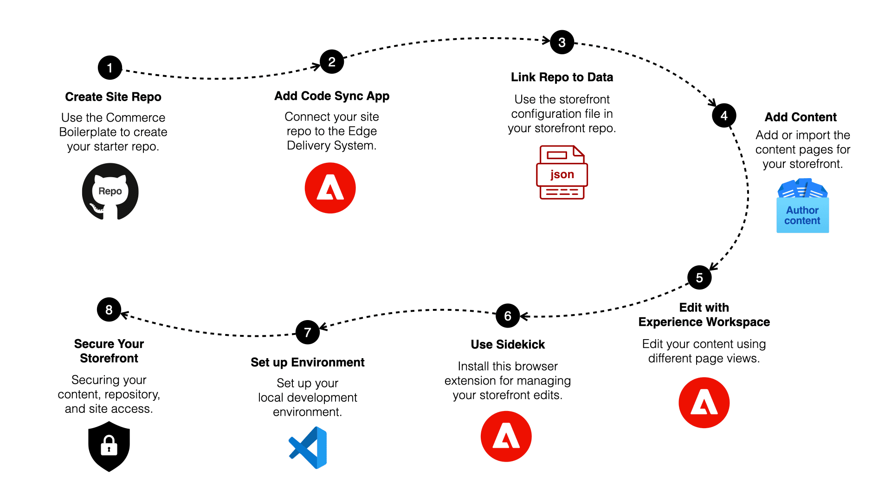
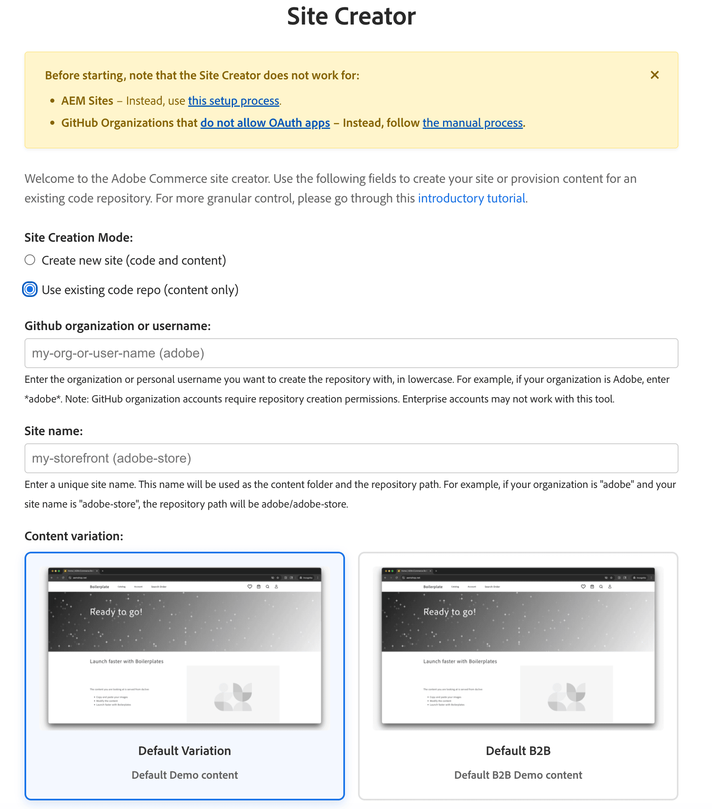

import { Tabs, TabItem, Steps } from '@astrojs/starlight/components';
import Tasks from '@components/Tasks.astro';
import Task from '@components/Task.astro';
import LinkCard from '@components/LinkCard.astro';
import Screenshot from '@components/Screenshot.astro';
import Callouts from '@components/Callouts.astro';
import OptionsTable from '@components/OptionsTable.astro';
import { Image } from 'astro:assets';
import BoilerplateHomePage from 'images/default-storefront.webp';
import Diagram from '@components/Diagram.astro';
import CardGrid from '@components/CardGrid.astro';
import Card from '@components/Card.astro';
import Aside from '@components/Aside.astro';
import { Icon } from '@astrojs/starlight/components';
import Link from '@components/Link.astro';
import Vocabulary from '@components/Vocabulary.astro';
import Embed from '@components/Embed.astro';
import TableWrapper from '@components/TableWrapper.astro';
import SecurityNotice from 'src/content/fragments/security-notice.mdx';
import ProseFlow from '@components/ProseFlow.astro';

<ProseFlow variant="article">

This tutorial walks you through creating a new Edge Delivery Services storefront step by step. The setup is the same whether you're building a B2C or B2B storefront — the paths diverge only when choosing your storefront theme and, for B2B, installing the additional B2B drop-in packages.

<Aside type="tip" title="B2C or B2B?">
Steps 1-5 are identical for both storefront types. In **Add content** (step 4), choose the **B2B** theme if you're building a B2B storefront — the Site Creator configures your content folder with B2B-specific pages and navigation. A final step walks through the six B2B drop-in packages that layer on top of the B2C foundation.
</Aside>

## Tutorial overview

The tutorial helps you quickly create a new Edge Delivery Services storefront using the <Link href="https://github.com/hlxsites/aem-boilerplate-commerce" text="Commerce boilerplate template" />. The boilerplate provides a starter storefront that uses a pre-configured Adobe Commerce environment.

After completing this tutorial, you have a new GitHub repository with a storefront pre-configured with the necessary components and services. You also have a local development environment where you can explore the boilerplate and start customizing it for your production storefront.

The following diagram shows the steps you'll take to create and configure your starter storefront:

<Diagram caption="Steps to create and configure your starter storefront.">
  
</Diagram>

<Callouts>

1. **Create Site Repo** by generating a storefront repository from the <Link href="https://github.com/hlxsites/aem-boilerplate-commerce" text="boilerplate template" />.
2. **Add Code Sync App** to your newly created repo. This app automatically redeploys your storefront when you push changes to the main branch. It also provides the Edge Delivery system (Helix Admin) with access to your repo so it can coordinate code changes with content changes. Installing it on your repo automatically configures the content pointer in your site's helix configuration.
3. **Link Repo to Data** using the values in your storefront configuration in your GitHub repo.
4. **Add Content** to the Document Author environment hosted at `https://da.live/` using the [Site Creator tool](https://da.live/app/adobe-commerce/storefront-tools/tools/site-creator/site-creator).
5. **(Optional) Use Universal Editor for content editing** to edit content on your storefront.
6. **(Optional) Use Sidekick** and configure it to preview, publish, and edit content on your storefront.
7. **Set up Local Environment** to enable the development of the boilerplate into your own storefront.
8. **Secure your storefront** to protect your content, repository, and site access before deploying to production or sharing with external users.

</Callouts>

## Which backend do you have?

Storefront supports three distinct customer scenarios. Each has different prerequisites and setup steps. Follow only the guidance for your backend. See the [Backend options](/get-started/backends/) page for details.

<TableWrapper nowrap={[0]}>

| Scenario | Description | Prerequisites |
|----------|-------------|---------------|
| **Commerce PaaS** | Existing Adobe Commerce Platform-as-a-Service customers who previously accessed Storefront without Adobe Commerce as a Cloud Service or Adobe Commerce Optimizer licenses | Manual installation: Storefront Compatibility package, Storefront services (Data Connection, Services Connector, Catalog Service, Live Search, Product Recommendations). See [PaaS prerequisites](/get-started/backends/#commerce-platform-as-a-service-paas). |
| **Adobe Commerce as a Cloud Service** | New Adobe Commerce as a Cloud Service customers whose license includes Storefront | All requirements and services are automatically managed. See [Adobe Commerce as a Cloud Service prerequisites](/get-started/backends/#adobe-commerce-as-a-cloud-service). |
| **Adobe Commerce Optimizer** | New Adobe Commerce Optimizer customers whose license includes Storefront, or existing Commerce customers who add Adobe Commerce Optimizer | Fully managed SaaS. See [Adobe Commerce Optimizer prerequisites](/get-started/backends/#adobe-commerce-optimizer) for supported backend combinations. |

</TableWrapper>

<Aside type="note" title="Before you start">
- **Commerce PaaS**: Complete the [PaaS prerequisites](/get-started/backends/#commerce-platform-as-a-service-paas) before starting. Setup requires manual installation.
- **Adobe Commerce as a Cloud Service**: No additional prerequisites. All backend requirements and services are automatically managed by Adobe.
- **Adobe Commerce Optimizer**: No additional prerequisites. All backend requirements and services are automatically managed.
</Aside>

Confirm your backend's prerequisites before continuing. Unless a step says otherwise, it applies to all backend types; only **Link repo to commerce data** is backend-specific.

:::note[Import an existing EDS site]
If you have an existing Edge Delivery Services site for your Commerce project, you can skip the store creation process and import both the code and the content into the Document Author environment using the <Link href="https://da.live/docs/operations/import" text="Site importer tool" />.
:::

## Vocabulary

Before we dive into the step-by-step guide, let's review some key vocabulary that will help you understand the process of creating and configuring your storefront.

<Vocabulary>

### Boilerplate template

Pre-configured storefront with the components and services you need to get started.

### Code Sync app

Syncs your repo with the Edge Delivery code bus and purges CDN caches when you push. It is installed on a repository—global installation on a user or org space is not allowed. Installing it on a repo configures your site's content pointer in the helix configuration to your DA (Document Authoring) folder.

### Content folder

Folder for your storefront content (images, text, assets). Edge Delivery Services uses it for document-based authoring: editing, previewing, and publishing.

### Sidekick

A browser extension that allows creators to edit, preview, and publish content from a content folder. It pushes content to the Edge Delivery content bus for previews and publishing. It also helps developers open the source document from a published page. For example, on yoursite.net/apparel, clicking the **Edit** button from Sidekick opens another browser tab showing the source document from your content folder.

### Site Creator

An app in Document Author (DA.live) that creates and initializes your storefront. Choose content only or code and content and pick a base theme for B2C (default) or B2B. The app generates the [storefront configuration](/setup/configuration/commerce-configuration/) and fills in values from the API where possible.

</Vocabulary>

## Example

Our CitiSignal demo site was built from the same boilerplate you will set up to develop your own storefront. You can access the full demo site here: <Link href="https://main--citisignal-one--adobedevxsc.aem.live/" text="main--citisignal-one--adobedevxsc.aem.live" />.

<Embed src="https://main--citisignal-one--adobedevxsc.aem.live" height="520" />

## Step-by-step

The centerpiece of this **20-minute storefront** is our Commerce boilerplate template.

### Prerequisites

Before you begin, take a moment to set up these required tools and accounts as needed.

<CardGrid>
<LinkCard
  noborder
  icon="commerce"
  title="Adobe Commerce backend"
  description="Verify prerequisites for your backend type."
  link="/get-started/prerequisites/"
  rightIcon="right-arrow"
/>
<LinkCard
  noborder
  icon="github"
  title="GitHub"
  description="Sign into your GitHub account (personal or Enterprise)."
  link="https://github.com/login"
  rightIcon="external"
  target="_blank"
  rel="noopener noreferrer"
  aria-label="Link (opens in a new tab)"
/>
<LinkCard
  noborder
  icon="node"
  title="Node.js"
  description="Set your Node version (22.13.1 LTS)."
  link="https://nodejs.org/en"
  rightIcon="external"
  target="_blank"
  rel="noopener noreferrer"
  aria-label="Link (opens in a new tab)"
/>
<LinkCard
  noborder
  icon="aemcli"
  title="AEM Command Line Tool"
  description="Install the AEM CLI tool."
  link="https://www.aem.live/developer/cli-reference"
  rightIcon="external"
  target="_blank"
  rel="noopener noreferrer"
  aria-label="Link (opens in a new tab)"
/>
</CardGrid>

<Tasks>

<Task>

### Create site repo

This task requires you to have a GitHub account with access to the organization or owner where you want to create your new repo. All three backends use the same boilerplate template.

<Tabs>

<TabItem label="Personal GitHub account">

Create the repo under your personal account. When you select **Owner**, choose your username. Install the Code Sync app on the repository in the next step.

</TabItem>

<TabItem label="GitHub Enterprise (organization)">

Create the repo under your organization. When you select **Owner**, choose the organization. You may need organization admin approval to install the Code Sync app on a repository. Ensure you have permission to create repositories and install GitHub Apps in the organization.

<Aside type="note" title="Org access troubling?">
If you have trouble with your org access, you can create your repo from a personal account first; then migrate that repo to a <Link href="https://www.aem.live/docs/repoless" text="repoless" /> EDS site after you learn more about EDS and repoless.
</Aside>

</TabItem>

</Tabs>

<Diagram caption="Create your storefront repo.">
  
</Diagram>

:::note[Sign into GitHub]
Make sure you are signed into your GitHub account before you start. Otherwise, you will not see the **Use this template** button.
:::

<Callouts columnCount="1">

1. Navigate to <Link href="https://github.com/hlxsites/aem-boilerplate-commerce" text="aem-boilerplate-commerce" />, select the **Use this template** button, then select the **Create a new repository** option to open the form.
1. Complete the form with the following details:

   - **Repository template**: `hlxsites/aem-boilerplate-commerce` (default).
   - **Include all branches**: Do not include all branches (default).
   - **Owner**: Your organization or account (required).
   - **Repository name**: A unique name for your new repo (required). Must be lowercase and can only contain letters, numbers, and hyphens (no underscores or periods).
   - **Description**: A brief description of your repo (optional).
   - **Public or Private**: We recommend public (default).

1. Select the **Create repository** button and watch GitHub create your new storefront repo.
1. After a few seconds, you should be redirected to the home page of your new repo.

</Callouts>

<Aside type="tip" title="Managed backends (ACCS / Adobe Commerce Optimizer)">
Adobe Commerce as a Cloud Service and Adobe Commerce Optimizer use the same repo creation steps above. The only difference is in the next step when you configure the storefront to point to your managed environment.
</Aside>

</Task>

<Task>

### Add the Code Sync app

Install the Code Sync app on your repository (it cannot be installed globally on a user or org). It redeploys your storefront site whenever you push or merge changes to the `main` branch. Same for all backends.

<Diagram caption="Add AEM Code Sync to your repository.">
  
</Diagram>

<Aside type="note" title="Slightly different UIs">
  A gray background on an organization or account indicates that at least one repository within it
  has the Code Sync app installed. In such cases, you are redirected to the **Code Sync configuration page** for that org or account, where you choose which repositories have the app. There are no differences in the steps, but the UI differs slightly from the one shown in the diagram (**Install** vs **Save** buttons), which shows the Code Sync page when installing on a repository for the first time.
</Aside>

<Tabs>

<TabItem label="Personal GitHub account">

Select your username when choosing where to install. You'll see your personal repositories in the selector.

</TabItem>

<TabItem label="GitHub Enterprise (organization)">

Select your organization. You may need admin approval to install the Code Sync app on repositories. If your organization uses SAML SSO, you may need to authorize the app for SAML SSO access.

</TabItem>

</Tabs>

<Callouts>

1. Navigate to the <Link text="AEM Code Sync app" href="https://github.com/apps/aem-code-sync" /> and select the **Configure** button (top right) to open the page where you choose which repository to install it on.

1. Select the **organization** or **account** that owns the repo you just created.

1. From the form, choose **Only select repositories**, open the **Select repositories** selector, and choose your repo from the list.

1. Select **Install** (or **Save**, see note above) to install Code Sync on your repository.

1. You should see a **success screen** if the installation completed without errors. Your repo is now connected to the Edge Delivery Services code bus.

1. (_Optional_) If you return to the <Link text="account selection page" href="https://github.com/apps/aem-code-sync/installations/select_target" />, your repo's organization or account will now be gray with "Configure" added. Select your org or account again to access the **Code Sync configuration page**, where you can see which repositories have Code Sync installed and add it to more repositories.

</Callouts>

</Task>

<Task>

### Link repo to commerce data

To link your storefront repo to your commerce backend, use the <Link href="https://da.live/app/adobe-commerce/storefront-tools/tools/config-generator/config-generator" text="config generator tool" /> to automatically generate a [storefront configuration](/setup/configuration/commerce-configuration/) file for your site based on your Commerce backend. The configuration differs significantly by backend — follow only the tab for your backend.

Update the storefront configuration for your project:

<Steps>

1. Open the <Link href="https://da.live/app/adobe-commerce/storefront-tools/tools/config-generator/config-generator" text="config generator tool" /> and select your backend type to generate the correct storefront configuration structure.
2. Enter the values for your project. See the [Storefront configuration reference](/setup/configuration/commerce-configuration/) for field descriptions (select the tab for your backend).
3. Replace the storefront configuration file in your repo with the generated file.
4. Commit and push the updated file to the repo.

</Steps>

</Task>

<Task>

### Add content

Now let's create and initialize the content side of your storefront. We'll create a new folder within the Document Author environment. Same for all backends.

<Aside type="note" title="Demo Content">
If you do not want demo content, you can create a file in <Link href="https://da.live/" text="https://da.live/#/{org}/{site}/" /> replacing `{org}` and `{site}` with your own. This reserves the org and site for you to add your own content.
</Aside>

<Steps>
1. Open the <Link href="https://da.live/app/adobe-commerce/storefront-tools/tools/site-creator/site-creator" text="Site Creator app" /> in DA, and select **Use existing repository**.
1. Copy the GitHub owner and site values to the input fields and click **Create site**.
1. Follow the prompts. When asked to select a base theme, choose your storefront type:

    <Tabs>

    <TabItem label="B2C storefront">

    Keep the default **B2C** theme selection. The Site Creator populates your content folder with a standard catalog and checkout page structure.

    </TabItem>

    <TabItem label="B2B storefront">

    Select the **B2B** theme. The Site Creator configures your content folder with B2B-specific pages, navigation, and layout structure — including company management, purchase orders, and requisition list pages. After completing the remaining setup steps, proceed to **Install B2B drop-ins** to wire the B2B commerce functionality.

    </TabItem>

    </Tabs>

4. You may have to manually preview or publish the content, depending on whether you followed the prerequisites.
</Steps>

<Diagram caption="Initialize your storefront content">
  
</Diagram>

</Task>

<Task>

### (Optional) Use Universal Editor for content editing

See [Using the Universal Editor](/merchants/quick-start/universal-editor/) for workflow and documentation links.
</Task>

<Task>

### (Optional) Use Sidekick for content editing

<Aside type="note" title="Detailed Sidekick information">
Sidekick is automatically installed on new EDS sites. Configuration of Sidekick is now managed via the site config. Visit the <Link href="https://www.aem.live/docs/sidekick" text="Sidekick documentation" /> for more information on how to use Sidekick to manage your storefront content.
</Aside>

</Task>

<Task>

### Set up local environment

<Steps>
1. Go to your GitHub repo and select the **Code** button to copy the repo's git URL for cloning (HTTPS or SSH).
1. Open a terminal on your local machine and clone your storefront repo:

    ```bash frame="none"
    git clone [HTTPS or SSH URL]
    ```

1. Navigate to the root of your local repo and install the dependencies.

   ```bash frame="none"
   npm install
   ```
1. Install the AEM client.

   ```bash frame="none"
   npm install -g @adobe/aem-cli
   ```

1. Start the development server to view the boilerplate storefront.

   ```bash frame="none"
   npm start
   ```

   The first page of your boilerplate storefront should be visible in your browser at `http://localhost:3000`.

   <Screenshot src={BoilerplateHomePage} alt="Boilerplate Home Page" width="740px" />

1. Open the project in your favorite code editor. You're now ready to explore the boilerplate and start customizing your storefront!

</Steps>

</Task>

<Task>

### (B2B) Install B2B drop-ins

If you selected the **B2B** theme when adding content, your storefront pages and navigation are already configured for B2B. This task adds the commerce functionality through six drop-in packages that layer on top of the B2C foundation.

<Aside type="note" title="Already in the boilerplate">
The B2B packages and their initializers ship with the boilerplate and are pre-registered when you use the B2B theme. The initializers live in `scripts/initializers/`. This task is a reference to what each package provides and where to find detailed configuration guidance.
</Aside>

<TableWrapper nowrap={[0,1]}>

| Drop-in | Package | What it adds |
|---|---|---|
| [Company Management](/dropins-b2b/company-management/) | `@dropins/storefront-company-management` | Company profiles, role-based permissions, and user invitations |
| [Company Switcher](/dropins-b2b/company-switcher/) | `@dropins/storefront-company-switcher` | UI for users associated with multiple companies |
| [Purchase Order](/dropins-b2b/purchase-order/) | `@dropins/storefront-purchase-order` | Purchase order workflows and approval rules |
| [Quote Management](/dropins-b2b/quote-management/) | `@dropins/storefront-quote-management` | Negotiable quotes and quote templates |
| [Quick Order](/dropins-b2b/quick-order/) | `@dropins/storefront-quick-order` | Bulk ordering by SKU, search, and CSV upload |
| [Requisition List](/dropins-b2b/requisition-list/) | `@dropins/storefront-requisition-list` | Reusable product lists for repeat ordering |

</TableWrapper>

Each drop-in's reference documentation covers initialization options, containers, events, slots, and styling. See the [B2B drop-ins overview](/dropins-b2b/) for the full reference.

</Task>

<Task>

### (Optional) Secure your storefront
While your storefront is now functional, it's important to understand that **your site is not protected by default**. We recommend securing your content, repository, and site access before deploying to production or sharing with external users. See [Security and access](/setup/launch/#security-and-access) in the Launch checklist for step-by-step instructions.

<SecurityNotice />

</Task>

<Aside type="tip" title="Well done">
  You now have a Commerce storefront project on GitHub and a local development environment to
  customize drop-in components and develop the boilerplate into a production storefront.
</Aside>

</Tasks>

</ProseFlow>
