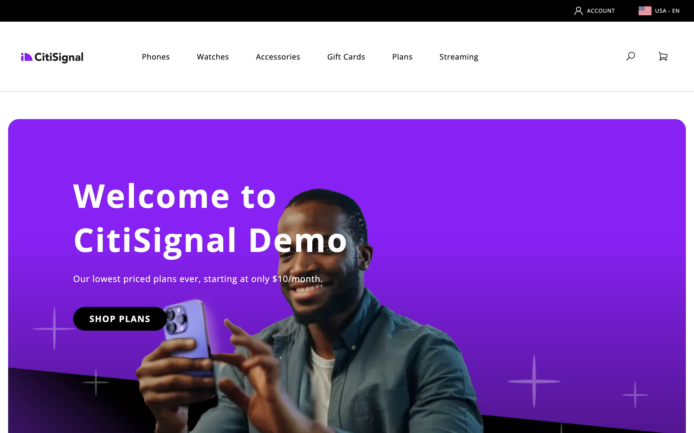

import { Tabs, TabItem, Steps } from '@astrojs/starlight/components';
import Tasks from '@components/Tasks.astro';
import Task from '@components/Task.astro';
import Callouts from '@components/Callouts.astro';
import Diagram from '@components/Diagram.astro';
import Aside from '@components/Aside.astro';
import Link from '@components/Link.astro';
import Term from '@components/Term.astro';
import TableWrapper from '@components/TableWrapper.astro';
import SecurityNotice from 'src/content/fragments/security-notice.mdx';

By the end of this page, you will have a new GitHub repository from the Commerce boilerplate, the Code Sync app on that repo, a storefront configuration for your Commerce backend, starter content in Document Authoring on DA.live, a local clone, and a local preview showing your own Commerce data.

Use the [Which backend do you have?](#which-backend-do-you-have) table and finish prerequisites before the tasks below. When Commerce data or services are missing, the fix is usually the backend checklist, not a broken repository.

For `npm install`, `npm start`, and local preview, use [Boilerplate getting started](/boilerplate/getting-started/). If accounts and tools are not ready, read [Before you start](/get-started/before-you-start/) first.

You can return later for optional steps such as <Term>Sidekick</Term> or the Universal Editor.

## Site Creator or this walkthrough

This page walks through repository creation, Code Sync, configuration, content, and local setup in order. When your organization allows it, use <Link href="https://da.live/app/adobe-commerce/storefront-tools/tools/site-creator/site-creator" text="Site Creator" /> in <Link href="https://da.live/" text="DA.live" /> so one flow can create the GitHub repo, add starter content, and fill most storefront configuration. If you cannot use Site Creator, follow GitHub, Code Sync, and the DA.live config generator as separate tasks below.

### Which should you use?

Use Site Creator first when you want the fastest path and your organization allows it.

Stay on this page when you need to see how the pieces connect, or when Site Creator is not an option. Typical cases include the following:

- You are new to the stack and want to see what each step does before you run it in a live project.
- Your organization limits who can create repositories or install GitHub Apps, so you follow an approved process step by step.
- You are fixing a store that is only partly configured, or you must run steps in a fixed order for automation.
- You already have a repository and you use Site Creator only to connect content. You may still run some tasks by hand, and the sections below explain what each part is for.

## Big picture

This tutorial uses <Term>Edge Delivery Services</Term> (EDS) to host the storefront, the Commerce boilerplate for code, and Document Authoring (DA.live) for page content. You create a new EDS storefront from the <Link href="https://github.com/hlxsites/aem-boilerplate-commerce" text="Commerce boilerplate template" />. After you connect your own backend, the same repo holds local preview, demo content, and a path to production.

The diagram caption and the numbered list below describe the same flow, so you can skim either one first.

<Diagram caption="Steps to create and configure your starter storefront.">
  
</Diagram>

<Callouts columnCount={1}>

1. Create the site repository — Generate a storefront repository from the <Link href="https://github.com/hlxsites/aem-boilerplate-commerce" text="boilerplate template" />.
1. Add the Code Sync app — The app redeploys your storefront when you push to the `main` branch. It connects Edge Delivery Services to your repository so code and content stay aligned, and it sets where your site's content is registered in the Edge Delivery configuration.
1. Link the repository to Commerce data — Add a storefront `config.json` (or equivalent) in the repo with values for your backend.
1. Add content — In <Link href="https://da.live/" text="DA.live" />, use the <Link href="https://da.live/app/adobe-commerce/storefront-tools/tools/site-creator/site-creator" text="Site Creator" /> app to create or attach a content folder.
1. (Optional) Universal Editor — Edit content in context on the rendered page.
1. (Optional) Sidekick — Preview, publish, and open source documents from the live site.
1. Set up a local environment — Clone the repo onto your computer.
1. Run your storefront and confirm your data — Install dependencies, start the local server, and check that your own Commerce data appears.
1. Secure the storefront — Tighten access to content, the repository, and the site before production or a wide audience.

</Callouts>

<Aside type="note" title="Document Authoring content source">
This walkthrough uses <Term>Document Authoring</Term> on <Link href="https://da.live/" text="DA.live" />, the default for new EDS storefronts. For AEM Sites content (for example, Commerce drop-ins on an existing AEM as a Cloud Service site), content setup and Universal Editor steps differ. See the <Link href="https://github.com/adobe-rnd/aem-boilerplate-xcom" text="XCOM boilerplate" /> and <Link href="https://experienceleague.adobe.com/en/docs/experience-manager-cloud-service/content/edge-delivery/overview" text="Edge Delivery Services with AEM Sites" />.
</Aside>

## Which backend do you have?

<TableWrapper nowrap={[0]}>

| Scenario | Description | Prerequisites |
|----------|-------------|---------------|
| [Commerce PaaS](/get-started/backends/#commerce-platform-as-a-service-paas) | Existing Adobe Commerce on cloud or on-premises without an Adobe Commerce as a Cloud Service or Adobe Commerce Optimizer license (see [Backend options](/get-started/backends/)) | Manual installation: Storefront Compatibility package, Services Connector, Catalog Service, and other storefront services your project needs. See [PaaS: required packages and services](/get-started/backends/#paas-required-packages-and-services). |
| [Adobe Commerce as a Cloud Service](/get-started/backends/#adobe-commerce-as-a-cloud-service) | Fully managed Commerce SaaS. License includes Storefront. | Skip the Commerce PaaS storefront install checklist. Adobe runs the Commerce backend and storefront services for your license. See [Adobe Commerce as a Cloud Service](/get-started/backends/#adobe-commerce-as-a-cloud-service) for details. |
| [Adobe Commerce Optimizer](/get-started/backends/#adobe-commerce-optimizer) | Fully managed Optimizer SaaS for catalog and merchandising. License includes Storefront. | Skip the Commerce PaaS storefront install checklist. Adobe runs the Optimizer services your license includes. See [Adobe Commerce Optimizer](/get-started/backends/#adobe-commerce-optimizer) for details. |

</TableWrapper>

Before you continue, confirm prerequisites on [Backend options](/get-started/backends/) for whichever scenario in the table above matches your Commerce backend.

On Commerce PaaS, finish [PaaS: required packages and services](/get-started/backends/#paas-required-packages-and-services) on the Commerce instance first. On Adobe Commerce as a Cloud Service or Adobe Commerce Optimizer, skip the Commerce PaaS storefront install checklist because your licensed environment already includes the services the storefront expects.

The steps below apply to every backend unless a note says otherwise. Backend-specific detail starts at [Link your repository to Commerce data](#link-your-repository-to-commerce-data).

On Adobe Commerce as a Cloud Service or Adobe Commerce Optimizer, run [Link your repository to Commerce data](#link-your-repository-to-commerce-data) only after [Commerce services and integrations](/get-started/architecture/commerce-services-and-backends/#commerce-services) shows catalog data in sync. If you are unsure, use [Data export validation](/setup/discovery/data-export-validation/) first.

If you already have an Edge Delivery site for this Commerce project, skip creating a brand-new site and use the <Link href="https://da.live/docs/operations/import" text="Site importer tool" /> for code and content.

## Example site

The CitiSignal demo site was built from the same boilerplate you will set up to develop your own storefront. You can open the full demo site at <Link href="https://main--citisignal-one--adobedevxsc.aem.live/" text="main--citisignal-one--adobedevxsc.aem.live" />.

[](https://main--citisignal-one--adobedevxsc.aem.live/us/en/)

## Manual setup without Site Creator

The [Site Creator or this walkthrough](#site-creator-or-this-walkthrough) section explains when to use this long-form path. The tasks below assume you create the GitHub repository from the <Link href="https://github.com/hlxsites/aem-boilerplate-commerce" text="Commerce boilerplate template" />, install the <Link href="https://github.com/apps/aem-code-sync" text="AEM Code Sync app" />, and use Site Creator for content (including attaching an existing repository), as in [Before you start](/get-started/before-you-start/). If your organization only allows Site Creator for brand-new sites, work with your administrator, then pick up at the Add content task with the repo Site Creator already created.

## Step-by-step

The tasks below follow the same order most teams use: GitHub repository, Code Sync, Commerce data, Document Authoring content, optional tooling, local clone, then security. Run them in order unless a note tells you to wait or skip. Open [How the storefront works](/get-started/architecture/) or [Before you start](/get-started/before-you-start/) when a label or step does not make sense.

<Tasks>

<Task>

### Create the site repository

This task requires a GitHub account with access to the organization or account where you want to create the new repository. All three backends use the same boilerplate template.

<Tabs>

<TabItem label="Personal GitHub account">

Create the repo under your personal account. When you select Owner, choose your username. Install the Code Sync app on the repository in the next step.

</TabItem>

<TabItem label="GitHub Enterprise (organization)">

Create the repo under your organization. When you select Owner, choose the organization. You may need organization admin approval to install the Code Sync app on a repository. Ensure you have permission to create repositories and install GitHub Apps in the organization.

<Aside type="note" title="Trouble with organization access?">
If you have trouble with your organization access, you can create your repo from a personal account first, then migrate that repo to a <Link href="https://www.aem.live/docs/repoless" text="repoless" /> Edge Delivery Services site after you learn more about EDS and repoless.
</Aside>

</TabItem>

</Tabs>

<Diagram caption="Create your storefront repo.">
  
</Diagram>

<Aside type="note" title="Sign in to GitHub first">
  Sign in to your GitHub account before you open the repository's **Use this template** control. If you are not signed in, that control does not appear.
</Aside>

<Steps>

1. Navigate to <Link href="https://github.com/hlxsites/aem-boilerplate-commerce" text="aem-boilerplate-commerce" />.

1. Select the **Use this template** button.

1. Select **Create a new repository** when GitHub shows that option. The repository creation form opens.

1. Complete the form with the following details:

   - Repository template: `hlxsites/aem-boilerplate-commerce` (default).
   - Include all branches: Do not include all branches (default).
   - Owner: Your organization or account (required).
   - Repository name: A unique name for your new repo (required). GitHub allows letters, numbers, hyphens, and underscores. For Commerce on Edge Delivery Services, use lowercase letters, numbers, and hyphens only so preview and live URLs match the usual `main--your-repo--your-org` pattern.
   - Description: A brief description of your repo (optional).
   - Public or Private: We recommend public (default).

1. Select the Create repository button and watch GitHub create your new storefront repo.

1. After a few seconds, you should be redirected to the home page of your new repo.

</Steps>

<Aside type="tip" title="Managed backends">
Adobe Commerce as a Cloud Service and Adobe Commerce Optimizer use the same repo creation steps above. The only difference is in the next step when you configure the storefront to point to your managed environment.
</Aside>

</Task>

<Task>

### Add the Code Sync app

Install the Code Sync app on your repository (it cannot be installed globally on a user or org). It redeploys your storefront site whenever you push or merge changes to the `main` branch. That behavior is the same for every backend in the table above.

<Diagram caption="Add AEM Code Sync to your repository.">
  
</Diagram>

<Aside type="note" title="Slightly different UIs">
  A gray background on an organization or account indicates that at least one repository within it
  has the Code Sync app installed. In such cases, you are redirected to the Code Sync configuration page for that org or account, where you choose which repositories have the app. There are no differences in the steps, but the UI differs slightly from the one shown in the diagram (Install versus Save buttons), which shows the Code Sync page when installing on a repository for the first time.
</Aside>

<Tabs>

<TabItem label="Personal GitHub account">

Select your username when choosing where to install. You will see your personal repositories in the selector.

</TabItem>

<TabItem label="GitHub Enterprise (organization)">

Select your organization. You may need admin approval to install the Code Sync app on repositories. If your organization uses SAML SSO, you may need to authorize the app for SAML SSO access.

</TabItem>

</Tabs>

<Steps>

1. Navigate to the <Link href="https://github.com/apps/aem-code-sync" text="AEM Code Sync app" />.

1. Select the **Configure** button (top right). GitHub opens the page where you choose which repository receives the app.

1. Select the organization or account that owns the repo you just created.

1. In the form, choose **Only select repositories**.

1. Open the **Select repositories** selector and choose your repo from the list.

1. Select **Install** (or **Save**; see the note above) to install Code Sync on your repository.

1. You should see a success screen if the installation completed without errors. Your repo is now connected to the Edge Delivery Services code bus.

1. (_Optional_) If you return to the <Link href="https://github.com/apps/aem-code-sync/installations/select_target" text="account selection page" />, your repo's organization or account will now be gray with **Configure** added. Select your organization or account again to access the Code Sync configuration page, where you can see which repositories have Code Sync installed and add it to more repositories.

</Steps>

</Task>

<Task>

### Link your repository to Commerce data

To connect your Commerce backend to the storefront repository, use the <Link href="https://da.live/app/adobe-commerce/storefront-tools/tools/config-generator/config-generator" text="config generator tool" />. It generates a [storefront configuration](/setup/configuration/commerce-configuration/) file for your site. The file differs by backend type. Follow only the tab for your backend in the config generator and in the reference.

Add or update the storefront configuration for your project:

<Steps>

1. Open the <Link href="https://da.live/app/adobe-commerce/storefront-tools/tools/config-generator/config-generator" text="config generator tool" />.

1. Select your backend type so the tool generates the correct storefront configuration structure.

1. Enter the values for your project. See the [Storefront configuration reference](/setup/configuration/commerce-configuration/) for field descriptions (select the tab for your backend).

1. Save the generated JSON as `config.json` at the repository root. The storefront runtime requests `/config.json` from your site.

1. The template includes `demo-config.json` as a sample, not a committed `config.json`. After your root `config.json` matches your backend, remove `demo-config.json` or leave it unused so one file stays authoritative.

1. Commit and push the new or updated `config.json` to the repo.

</Steps>

</Task>

<Task>

### Add content

In this task, you create and initialize the content side of your storefront in the Document Authoring environment. The steps are the same for all backends.

<Aside type="note" title="Demo Content">
If you do not want demo content, you can create a file in <Link href="https://da.live/" text="https://da.live/#/{org}/{site}/" /> replacing `{org}` and `{site}` with your own. This reserves the org and site for you to add your own content.
</Aside>

<Steps>

1. Open the <Link href="https://da.live/app/adobe-commerce/storefront-tools/tools/site-creator/site-creator" text="Site Creator app" /> in DA.live.

1. Select **Use existing repository**.

1. Copy the GitHub owner and site values into the input fields.

1. Select **Create site**.

1. Follow the prompts until Site Creator finishes copying starter content into your content folder.

1. If prerequisites were incomplete, you may need to preview or publish the content manually.

</Steps>

<Diagram caption="Initialize your storefront content">
  
</Diagram>

</Task>

<Task>

### (Optional) Use Universal Editor for content editing

Use this path when authors need in-context editing beyond what Site Creator sets up by default. For workflows and documentation links, see [Using the Universal Editor](/merchants/quick-start/universal-editor/).
</Task>

<Task>

<a id="optional-sidekick-content-editing"></a>

### (Optional) Use Sidekick for content editing

<Aside type="note" title="Sidekick setup">
Site Creator wires your project for Sidekick so the toolbar can recognize preview and live URLs. Authors install the browser extension from the Chrome Web Store, or follow Edge steps on <Link href="https://www.aem.live/docs/sidekick" text="Using AEM Sidekick" />, when they are ready. That page covers install steps, site config, preview, and publish. For prerequisites that line up with this page, see [Before you start](/get-started/before-you-start/#sidekick-browser-extension).
</Aside>

</Task>

<Task>

### Set up local environment

Clone the repository to your computer so you can work on the code and run a local preview. On GitHub, open your storefront repository, select the Code button, and copy the clone URL (HTTPS or SSH). In a terminal, run `git clone` with that URL, then `cd` into the folder GitHub created. For example, if the clone URL is `https://github.com/my-org/my-storefront.git`, you would run:

```bash frame="none"
git clone https://github.com/my-org/my-storefront.git
cd my-storefront
```

Use your own organization, repository, and folder names from GitHub.

</Task>

<Task>

### Run your storefront and confirm your data

Start the boilerplate locally so you can see your own Commerce data before you move on. From inside the repository folder:

```bash frame="none"
npm install
npm start
```

`npm start` runs the AEM CLI's `aem up` command and opens a local preview in your browser, usually at `http://localhost:3000`.

Open a page that loads live data, such as a product page. If your `config.json` values are correct, you see your own catalog instead of sample content or an error. If data does not load, revisit [Link your repository to Commerce data](#link-your-repository-to-commerce-data) and confirm your backend prerequisites on [Backend options](/get-started/backends/).

For the full command reference and troubleshooting, such as a failed install or port `3000` already in use, see [Running locally](/boilerplate/getting-started/#running-locally) in Boilerplate getting started.

</Task>

<Task>

### (Optional) Secure your storefront

The storefront works at this point, but the site is not protected by default. We recommend securing your content, repository, and site access before you deploy to production or share the site with external users. See [Security and access](/setup/launch/#security-and-access) in the Launch checklist for step-by-step instructions.

<SecurityNotice />

</Task>

<Aside type="tip" title="What you have now">
  You have a Commerce storefront project on GitHub, starter content in Document Authoring, a local clone, and a working local preview showing your own Commerce data. Next, use [Boilerplate getting started](/boilerplate/getting-started/) to explore the code, then customize the boilerplate and <Term term="Drop-in components">drop-in components</Term> to match your project.
</Aside>

</Tasks>

## What's next

- [Boilerplate getting started](/boilerplate/getting-started/) — Install paths, `npm` scripts, and a typical local loop after your repository exists.
- [Storefront configuration](/setup/configuration/commerce-configuration/) — Storefront configuration, `headers.xlsx`, and paths for preview versus production.
- [Introduction to drop-ins](/dropins/all/introduction/) and [Using drop-ins](/dropins/all/quick-start/) — Initializer flow, slots, and styling when you are ready to change Commerce UI.
- [Launch checklist](/setup/launch/) — Security, performance, and go-live items when you move past learning.
