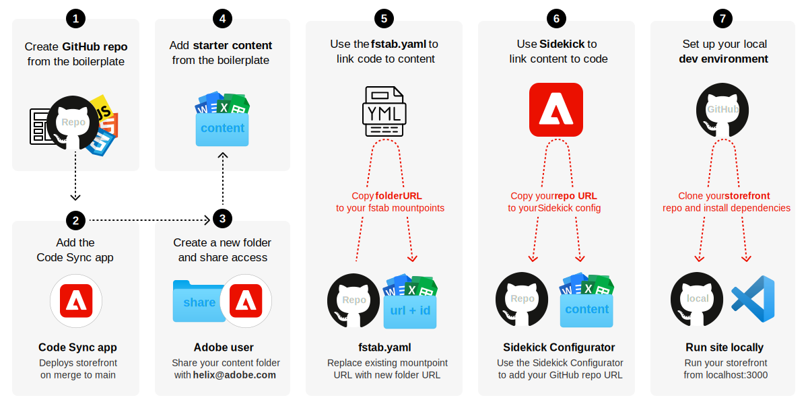
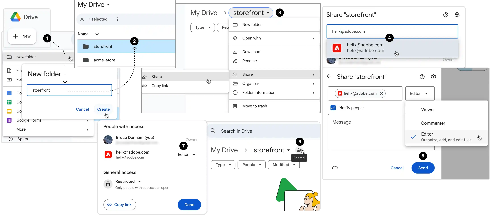
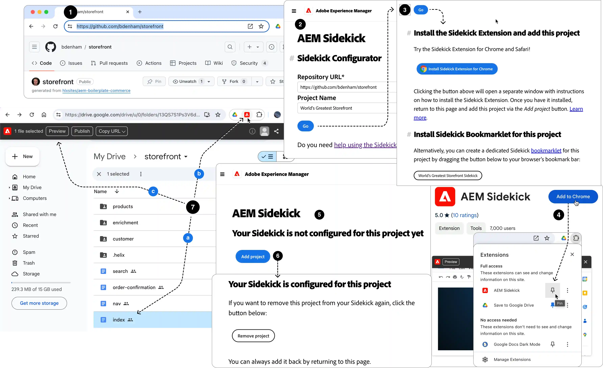

import { Tabs, TabItem, Steps } from '@astrojs/starlight/components';
import Tasks from '@components/Tasks.astro';
import Task from '@components/Task.astro';
import LinkCard from '@components/LinkCard.astro';
import Screenshot from '@components/Screenshot.astro';
import Callouts from '@components/Callouts.astro';
import OptionsTable from '@components/OptionsTable.astro';
import { Image } from 'astro:assets';
import BoilerplateHomePage from 'images/boilerplate.webp';
import Diagram from '@components/Diagram.astro';
import CardGrid from '@components/CardGrid.astro';
import Card from '@components/Card.astro';
import Aside from '@components/Aside.astro';
import { Icon } from '@astrojs/starlight/components';
import Link from '@components/Link.astro';
import Vocabulary from '@components/Vocabulary.astro';
import Embed from '@components/Embed.astro';

Welcome to your Commerce Storefront journey. Our goal is to make the journey fun and informative. We start every topic with big-picture overviews and relevant vocabulary. We then walk you through the details step-by-step. And finally, we provide a sandbox for practice when possible. Let's get started.

## Big picture

The following diagram shows the steps you'll take to create and configure your storefront:

<Diagram caption="Steps to create and configure your storefront.">
  
</Diagram>

The full details are slightly more involved. Let's break it down.

<Diagram caption="Details to create and configure your Commerce storefront.">
  
</Diagram>

<Callouts>

1. **Use the boilerplate** template to create a storefront repository.
1. **Add the Code Sync app** to your newly created repo. This app automatically redeploys your storefront when you push changes to the main branch. It also provides the Edge Delivery system (Helix Admin) with access to your repo so it can coordinate code changes with content changes.
1. **Create a folder** on Google Drive or SharePoint for your content and _Share_ it with the `helix@adobe.com` user. This gives the Edge Delivery system (Helix Admin) with read/write access to your folder's content.
1. **Add sample content** from the boilerplate to your new folder on Google Drive or SharePoint.
1. **Connect your repo to your content** using the `mountpoint` in your **`fstab.yaml`** URL in your GitHub repo.
1. **Install and configure Sidekick** so it can preview, publish, and edit content on your storefront.
1. **Set up your local development environment** and install the dependencies. Start the development server and explore your new storefront.

</Callouts>

## Vocabulary

Before we dive into the step-by-step guide, let's review some key Vocabulary that will help you understand the process of creating and configuring your storefront.

<Vocabulary>

### Boilerplate template

The boilerplate template is a pre-configured storefront that includes all the necessary components and services to get you started. It's a great way to quickly create a new storefront with all the necessary components and services already in place.

### Code Sync app

The Code Sync app listens to changes in your code repositories (commits and merges to the `main` branch) and publishes code to the Edge Delivery code bus. It also intelligently purges CDN caches when changes have been made. This app is essential for keeping your storefront up-to-date with the latest changes.

### Content folder

The content folder is where you store all the content for your storefront. This includes images, text, and other assets that make up your site. By sharing read/write access to your content folder with Edge Delivery Services, you enable it to provide all the features of document-based authoring, such as editing, previewing, and publishing.

### Sidekick

Sidekick is an extension that makes it easy for creators to connect, edit, preview, and publish content directly from documents and spreadsheets in Google Drive and SharePoint. It's also responsible for pushing content to the Edge Delivery content bus so it can be previewed and published.

### mountpoint

The `mountpoint` is the URL that points to your content folder on Google Drive or SharePoint. By specifying the `mountpoint` in the **`fstab.yaml`** file on the `main` branch of your remote GitHub repo, Edge Delivery Services can link your code to the content for your storefront.

</Vocabulary>

## Example

Our WKND demo site was built from the same boilerplate you will set up to develop your own storefront. You can access the full WKND demo site here: https://main--xsc-wknd-commerce--hlxsites.hlx.live/.

<Embed src="https://main--xsc-wknd-commerce--hlxsites.hlx.live/" height="520" />

## Step-by-step

The centerpiece of this **20-minute storefront** is our Commerce boilerplate template. It provides a starter storefront that is pre-configured with our Commerce components and services and pre-connected to our Commerce boilerplate backend.

### Prerequisites

Before you begin, take a moment to set up these required tools and accounts as needed.

<CardGrid>
<LinkCard
  noborder
  icon="commerce"
  title="Adobe Commerce 2.4.7+"
  description="Adobe Commerce system requirements."
  href="https://experienceleague.adobe.com/en/docs/commerce-operations/installation-guide/system-requirements"
  rightIcon="external"
  target="_blank"
  rel="noopener noreferrer"
  aria-label="Link (opens in a new tab)"
/>
<LinkCard
  noborder
  icon="github"
  title="GitHub"
  description="Sign into your GitHub account."
  href="https://github.com/login"
  rightIcon="external"
  target="_blank"
  rel="noopener noreferrer"
  aria-label="Link (opens in a new tab)"
/>
<LinkCard
  noborder
  icon="node"
  title="Node.js"
  description="Verify your Node version (LTS)."
  href="https://nodejs.org/en"
  rightIcon="external"
  target="_blank"
  rel="noopener noreferrer"
  aria-label="Link (opens in a new tab)"
/>
<LinkCard
  noborder
  icon="googledrive"
  title="Google Drive**"
  description="Create a Google Drive account."
  href="https://www.google.com/drive/"
  rightIcon="external"
  target="_blank"
  rel="noopener noreferrer"
  aria-label="Link (opens in a new tab)"
/>
<LinkCard
  noborder
  icon="sharepoint"
  title="SharePoint**"
  description="Create a SharePoint account."
  href="https://www.microsoft.com/en-us/microsoft-365/sharepoint/collaboration/"
  rightIcon="external"
  target="_blank"
  rel="noopener noreferrer"
  aria-label="Link (opens in a new tab)"
/>

</CardGrid>

<Aside type="choose" title="Choose One">
  Choose between **Google Drive** and **SharePoint OneDrive**. By default, the Commerce boilerplate
  uses SharePoint, but you can use Google Drive if you prefer. This tutorial provides instructions
  for both.
</Aside>

<Tasks>

<Task>

### Create code repository

This task requires you to have a GitHub account with access to the organization or owner where you want to create your new repo.

<Diagram caption="Create your storefront repo.">
  
</Diagram>

:::note[Sign into GitHub]
Make sure you are signed into your GitHub account before you start. Otherwise, you will not see the **Use this template** button.
:::

<Callouts columnCount="1">

1. Navigate to <Link href="https://github.com/hlxsites/boilerplate-commerce-dropins" text="boilerplate-commerce-dropins" />, select the **Use this template** button, then select the **Create a new repository** option to open the form.
1. Complete the form with the following details:

   - **Repository template**: `hlxsites/boilerplate-commerce-dropins` (default).
   - **Include all branches**: Do not include all branches (default).
   - **Owner**: Your organization or account (required).
   - **Repository name**: A unique name for your new repo (required).
   - **Description**: A brief description of your repo (optional).
   - **Public or Private**: We recommend public (default).

1. Select the **Create repository** button and watch GitHub create your new storefront repo.
1. After a few seconds, you should be redirected to the home page of your new repo.

</Callouts>

</Task>

<Task>

### Add Code Sync GitHub app

The Code Sync app redeploys your storefront site whenever you push or merge changes to the `main` branch of your repo.

<Diagram caption="Add AEM Code Sync to your repository.">
  
</Diagram>

<Aside type="note" title="Slightly different UIs">
  A gray background on an organization or account indicates that at least one repository within it
  has the Code Sync app installed. In such cases, you are redirected to your organization's or
  account's **Code Sync configuration page**. There are no differences in the steps, but the UI
  differs slightly from the one shown in the diagram (**Install** vs **Save** buttons), which shows
  the Code Sync page for new installations.
</Aside>

<Callouts>

1. Navigate to the <Link text="AEM Code Sync app" href="https://github.com/apps/aem-code-sync" /> and select the **Configure** button (top right) to open the repo selection page.

1. Select the **organization** or **account** for the repo you just created.

1. From the form, choose **Only select repositories**, open the **Select repositories** selector, and choose your repo from the list.

1. Select **Install** (or **Save**, see note above) to complete the Code Sync installation.

1. You should see a **success screen** if the installation completed without errors. Your repo is now connected to the Edge Delivery Services code bus.

1. (_Optional_) If you return to the <Link text="account selection page" href="https://github.com/apps/aem-code-sync/installations/select_target" />, your repo's organization or account will now be gray with "Configure" added. Select your org or account again to access the **Code Sync configuration page**. This page shows when the app was added to your organization (highlighted) and allows you to connect the Code Sync app to additional repositories.

</Callouts>

</Task>

<Task>

### Create and share folder

Now let's create and set up the content side of your storefront. We'll create a new folder and share it with Edge Delivery Services. Choose the tab below that matches your chosen storage service, Google Drive or SharePoint.

<Tabs>
  <TabItem label="Google Drive">

    Follow these steps to create and share your **Google Drive folder**.

    <Diagram caption="Create and Share your Google Drive folder.">
      
    </Diagram>

    <Callouts>

      1. Open your Google Drive <Link text="My Drive" href="https://drive.google.com/drive/u/0/my-drive" /> page, select the ✚ **New** button (top-left), create a new folder, and give it a name that identifies your storefront.
      1. Open your new folder (double-click).
      1. Open your folder's menu, and select the **Share > Share** menu item.
      1. Type **helix** and select `helix@adobe.com` as the recipient.
      1. Ensure the **Editor** option (default) is selected to give read/write access, then select the **Send** button.
      1. You can verify your folder is now shared if you see a new **Shared icon** (👥) to the right of your folder.
      1. Additionally, you can select the icon and verify that `helix@adobe.com` is listed as an **Editor**. If it is, your content folder is now connected to the Edge Delivery Services content bus.

    </Callouts>

  </TabItem>
  
  <TabItem label="SharePoint">

    Follow these steps to create and share your **SharePoint folder**.

    <Aside type="note" title="Site templates don't matter">
      During the process of creating your storefront folder on SharePoint, you will need to first set up a SharePoint Site. We don't use the SharePoint Site templates as part of our Edge Delivery Commerce storefronts, so in step 3 below, you can select any site template you want. It won't affect your storefront.
    </Aside>

    <Diagram caption="Create and Share your SharePoint folder.">
      
    </Diagram>

    <Callouts>

    1. Open your **SharePoint Home** page, select the  **Create** button, then select **Site** from the menu.
    1. Select the **Communication site**. You can choose the **Team site** if you prefer, but it's harder to set up.
    1. Select a site template, **Standard communication** is the simplest, then select **Use template**. Follow the additional instructions: Give your site a name, click **Next**, sensitivity is always private, default language is English, select **Create site**. When the site is created, you will be redirected to the Home page of your site.
    1. Select the **Documents** tab from your Home page.
    1. Create a **New folder** and give it a name that identifies your storefront.
    1. Open the folder and select the **Share** button.
    1. Type **helix** and select **AEM Content Integration** from the list.
    1. Select **Can edit** to provide read/write access to your folder.
    1. **Send** the invitation to give Edge Delivery Services (Helix Admin) read/write access to your folder. Your content folder is now connected to the Edge Delivery Services system.

    </Callouts>

  </TabItem>

</Tabs>

</Task>

<Task>

### Add sample content

Now let's add the boilerplate sample files to your content folder. Choose the tab below that matches your chosen storage service, Google Drive or SharePoint.

<Tabs>
  <TabItem label="Google Drive">
    <Aside type="tip" title="Google Drive auto-conversions">
      The "secret" to converting Word and Excel sample files to Google Docs and Sheets is to enable Uploads in Google Drive's settings. Here's how.
    </Aside>

    <Diagram caption="Add sample Google Drive content.">
      
    </Diagram>

    <Callouts>
    1. Open your Google Drive folder.
    1. Select the ⚙️ **Settings icon** (top-right of the page) and choose **Settings** from the menu.
    1. Enable the **Uploads** checkbox to convert uploads to Google Docs editor format. Return to your storefront folder.
    1. Download the boilerplate's [starter-content-commerce.zip](https://github.com/hlxsites/aem-boilerplate-commerce/releases/download/starter-content/starter-content-commerce.zip) file.
    1. Unzip the file and drag the contents into your folder. This will convert the Word and Excel files to Google Docs and Sheets.
    </Callouts>

  </TabItem>

  <TabItem label="SharePoint">

    <Callouts>
      1. Download the boilerplate's [starter-content-commerce.zip](https://github.com/hlxsites/aem-boilerplate-commerce/releases/download/starter-content/starter-content-commerce.zip) file.
      1. Unzip the file and drag the contents into your SharePoint folder.
    </Callouts>

  </TabItem>
</Tabs>

</Task>

<Task>

### Connect repo to folder content

Now we need to link your GitHub storefront repo (the code) to your storefront folder (the content). Linking your code to your content enables Edge Delivery to coordinate code changes in the repo with content changes in your Google Drive or SharePoint folder. After step 1 below, all steps are the same for Google Drive and SharePoint.

<Diagram caption="Replace the default boilerplate's folder URL with your content folder URL.">
  
</Diagram>

<Callouts>
1. Copy the URL to your content folder:

    - **For Google Drive**: Open your folder and copy the URL from the browser's address bar.
    - **For SharePoint**: Open your folder and select the **Copy link** button.

1. Go to your GitHub repo and open the `fstab.yaml` file from the project root.
1. Edit the `fstab.yaml` file in place.
1. Replace the default `mountpoints` URL (which points to the boilerplate's SharePoint folder) with your Google
   Drive or SharePoint folder URL.
1. Select the **Commit changes...** button.
1. Commit the changes directly to `main`. Now the Edge Delivery system knows where to find the content for this repository.

</Callouts>

</Task>

<Task>

### Set up Sidekick for content

For this task, we'll use the **Sidekick Configurator** to install Sidekick and configure it for our storefront.

<Diagram caption="Set up Sidekick."></Diagram>

<Callouts>

1. Open your **GitHub repo** and copy it's URL from the browser's address bar.
1. Open the [Sidekick Configurator](https://www.aem.live/tools/sidekick/) tool and complete the fields as follows:

   - **Repository URL**: Paste the URL to your repo (required).
   - **Project Name**: Add name that identifies your storefront (optional).

1. Select the **Go** button. If you don't already have Sidekick installed, you should see links to install Sidekick or add the bookmarklet.
1. Install Sidekick from the Chrome Web Store or use the bookmarklet. If you're using the bookmarklet, drag it to your browser's bookmarks bar. If installing the extension, Pin the Sidekick extension to your browser's toolbar.
1. Select the browser's back button to return to the Sidekick Configurator page. You should now see a message stating "Your Sidekick is not configured for this project yet" and an **Add project** button.
1. Select the **Add project** button to complete your Sidekick setup. You should see a message stating: "Your Sidekick is configured for this project."
1. Return to your folder, select all your Google docs or Word.docx files, select the **Sidekick** extension, and click the **Preview** button. Repeat this for all files in each folder. Select all the files again, but select the **Publish** button for each docs/docx file. These actions add your content to the internal (preview) and production (publish) Edge Delivery CDNs, where it can be downloaded and displayed on your browser for local development.

</Callouts>

<Aside type="note" title="Step 7 Details">
  **Step 7 is only required for initial Sidekick and content set up**. Without previewing and then
  publishing your content, the Edge Delivery CDNs remain empty, causing **404 errors** when you try
  to run your storefront from your local development environment (our final task).
</Aside>

You can now use Sidekick to **Preview**, **Publish**, and **Edit** all your files directly from your Google Drive or SharePoint folder. Take a moment to select any file in your folder, select the Sidekick extension, and choose the Sidekick options to get familiar with how Sidekick works. Visit the [Sidekick documentation](https://www.aem.live/docs/sidekick) for more information on how to use Sidekick to manage your storefront content.

</Task>

<Task>

### Set up local dev environment

<Steps>
1. Go to your GitHub repo and select the **Code** button to copy the repo's git URL for cloning (HTTPS or SSH).
1. Open a terminal on your local machine and clone your storefront repo:

    ```bash frame="none"
    git clone [HTTPS or SSH URL]
    ```

1. Navigate to the root of your local repo and install the dependencies.

   ```bash frame="none"
   npm install
   ```

1. Start the development server to view the boilerplate storefront.

   ```bash frame="none"
   npm start
   ```

   The first page of your boilerplate storefront should be visible in your browser at `http://localhost:3000`.

   <Screenshot src={BoilerplateHomePage} alt="Boilerplate Home Page" width="740px" />

1. Open the project in your favorite code editor. You're now ready to explore the boilerplate and start customizing your storefront!

</Steps>

</Task>
</Tasks>

<Aside type="tip" title="Congrats!">
  You now have a Commerce storefront project on GitHub and a local development environment to learn
  how to customize dropins to develop the boilerplate into a production storefront.
</Aside>
