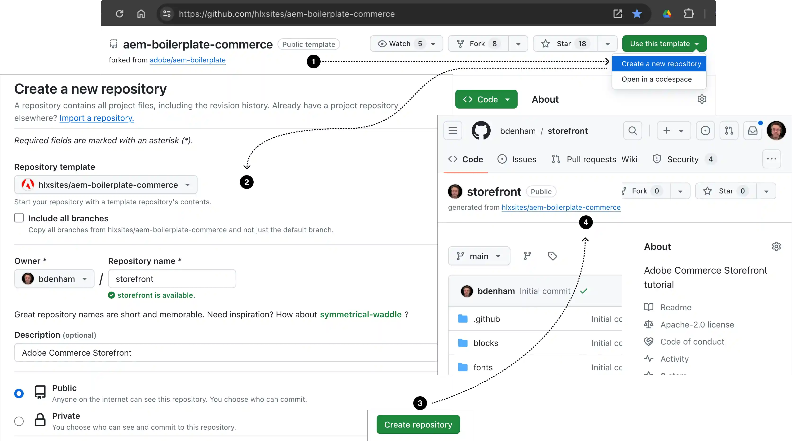
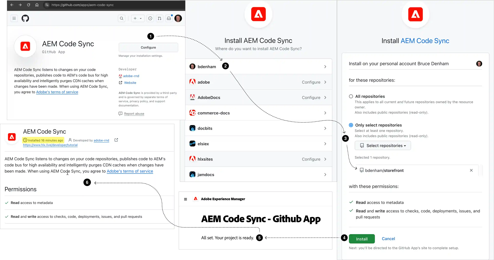
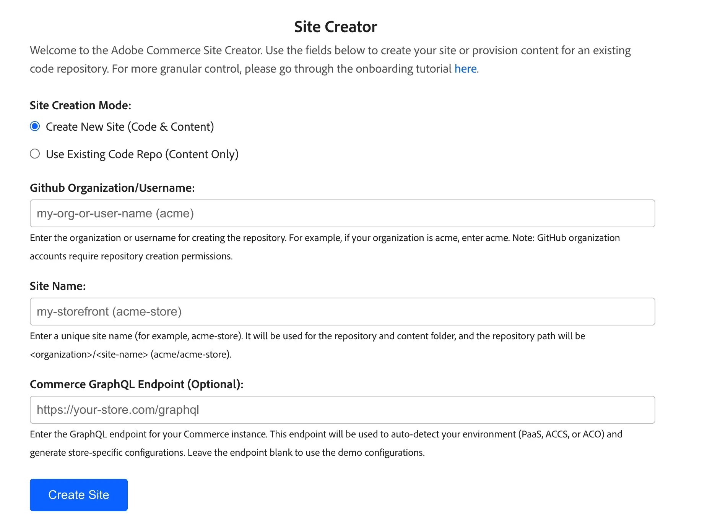
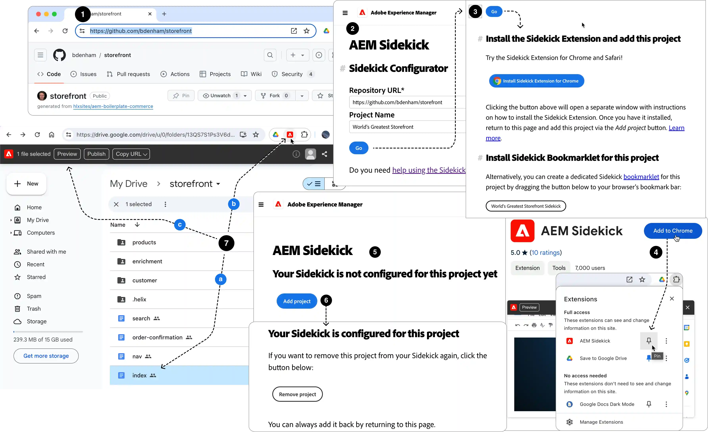

import CardGrid from '@components/CardGrid.astro';
import LinkCard from '@components/LinkCard.astro';

Quick Start provides everything you need to begin building with Adobe Commerce Storefronts, from understanding the architecture to creating your first storefront and optimizing performance.

<CardGrid>
  <LinkCard
    noborder
    icon='document'
    title="Learn the Storefront architecture"
    description="Understand the underlying architecture and design patterns of Adobe Commerce Storefronts."
    link="/setup/discovery/architecture/"
    rightIcon="right-arrow"
  />
  <LinkCard
    noborder
    icon='document'
    title="Scaffold your storefront"
    description="Get started by creating your first Adobe Commerce Storefront with our step-by-step guide."
    link="/get-started/create-content/"
    rightIcon="right-arrow"
  />
  <LinkCard
    noborder
    icon='document'
    title="Explore the boilerplate"
    description="Learn about the boilerplate project structure and components to understand how everything works together."
    link="/get-started/boilerplate-project/"
    rightIcon="right-arrow"
  />
  <LinkCard
    noborder
    icon='document'
    title="Run Lighthouse audits"
    description="Learn how to run performance audits to ensure your storefront meets high-performance standards."
    link="/get-started/run-lighthouse/"
    rightIcon="right-arrow"
  />
</CardGrid>

<Tasks>

<Task>

### Create site repo

This task requires you to have a GitHub account with access to the organization or owner where you want to create your new repo.

<Diagram caption="Create your storefront repo.">
  
</Diagram>

:::note[Sign into GitHub]
Make sure you are signed into your GitHub account before you start. Otherwise, you will not see the **Use this template** button.
:::

<Callouts columnCount="1">

1. Navigate to <Link href="https://github.com/hlxsites/aem-boilerplate-commerce" text="aem-boilerplate-commerce" />, select the **Use this template** button, then select the **Create a new repository** option to open the form.
1. Complete the form with the following details:

   - **Repository template**: `hlxsites/aem-boilerplate-commerce` (default).
   - **Include all branches**: Do not include all branches (default).
   - **Owner**: Your organization or account (required).
   - **Repository name**: A unique name for your new repo (required).
   - **Description**: A brief description of your repo (optional).
   - **Public or Private**: We recommend public (default).

1. Select the **Create repository** button and watch GitHub create your new storefront repo.
1. After a few seconds, you should be redirected to the home page of your new repo.

</Callouts>

</Task>

<Task>

### Link repo to content

Edge Delivery Services requires site configuration details to know what to render. These include at minimum a content reference and a code reference. The simplest approach is to create those references in the `fstab.yaml` configuration file.

<Steps>

1. Rename [default-fstab.yaml](https://github.com/hlxsites/aem-boilerplate-commerce/blob/main/default-fstab.yaml) to `fstab.yaml`.
1. Replace `{org}` and `{site}` in `fstab.yaml` using the GitHub url to determine the correct values: `https://github.com/{org}/{site}`.
1. Commit and push this change to the `main` branch of your repository.

</Steps>

<Aside type="note" title="Migrate to the Storefront Configuration Service">
After you have created your storefront, you can migrate the configuration to use the Configuration Service which supports advanced use cases like repoless configuration and overlays. For more information, see the [Configuration Service](https://www.aem.live/docs/config-service-setup) documentation.
</Aside>

</Task>

<Task>

### Add the Code Sync app

The Code Sync app redeploys your storefront site whenever you push or merge changes to the `main` branch of your repo.

<Diagram caption="Add AEM Code Sync to your repository.">
  
</Diagram>

<Aside type="note" title="Slightly different UIs">
  A gray background on an organization or account indicates that at least one repository within it
  has the Code Sync app installed. In such cases, you are redirected to your organization's or
  account's **Code Sync configuration page**. There are no differences in the steps, but the UI
  differs slightly from the one shown in the diagram (**Install** vs **Save** buttons), which shows
  the Code Sync page for new installations.
</Aside>

<Callouts>

1. Navigate to the <Link text="AEM Code Sync app" href="https://github.com/apps/aem-code-sync" /> and select the **Configure** button (top right) to open the repo selection page.

1. Select the **organization** or **account** for the repo you just created.

1. From the form, choose **Only select repositories**, open the **Select repositories** selector, and choose your repo from the list.

1. Select **Install** (or **Save**, see note above) to complete the Code Sync installation.

1. You should see a **success screen** if the installation completed without errors. Your repo is now connected to the Edge Delivery Services code bus.

1. (_Optional_) If you return to the <Link text="account selection page" href="https://github.com/apps/aem-code-sync/installations/select_target" />, your repo's organization or account will now be gray with "Configure" added. Select your org or account again to access the **Code Sync configuration page**. This page shows when the app was added to your organization (highlighted) and allows you to connect the Code Sync app to additional repositories.

</Callouts>

</Task>

<Task>

### Link repo to commerce data

To link your storefront repo to your commerce backend, you can use the [config generator tool](https://da.live/app/adobe-commerce/storefront-tools/tools/config-generator/config-generator) to automatically generate a `config.json` file for your site based on your Commerce backend—Adobe Commerce, Adobe Commerce as a Cloud Service, or Adobe Commerce Optimizer.

Update the storefront configuration for your project:

<Steps>

1. Get information about the values required for your project from the [Storefront configuration reference](/setup/configuration/commerce-configuration) to get information about the values required for your project.
2. Update the `config.json` file with the values for your project.
3. Commit and push the updated file to the repo.

</Steps>

</Task>

<Task>

### Add content

Now let's create and initialize the content side of your storefront. We'll create a new folder and share it with Edge Delivery Services.
Follow these steps to create your https://da.live content folder.

<Aside type="note" title="Demo Content">
If you do not want demo content, you can create a file in https://da.live/#/{org}/{site}/ replacing `{org}` and `{site}` with your own. This reserves the org and site for you to add your own content.
</Aside>

<Callouts>
1. Open the [Site Creator tool](https://da.live/app/adobe-commerce/storefront-tools/tools/site-creator/site-creator), and select **Use existing repository**.
1. Copy the GitHub owner and site values to the input fields and click **Create site**.
1. Follow the prompts, and by the end the content will have been copied to your content folder.
1. You may have to manually preview or publish the content, depending on whether you followed the prerequisites.
</Callouts>

<Diagram caption="Initialize your storefront content">
  
</Diagram>

</Task>

<Task>

### Install and configure Sidekick

{/* <Diagram caption="Set up Sidekick."></Diagram> */}

<Steps>

1. Review documentation about using and installing [the AEM Sidekick](https://www.aem.live/docs/sidekick).

1. In your GitHub repository, edit the sidekick configuration file `tools/sidekick/config.json`.

   ```json
   {
     "project": "My Project",
     "editUrlLabel": "Document Authoring",
     "editUrlPattern": "https://da.live/edit#/{{org}}/{{site}}{{pathname}}"
   }
   ```

1. In the `editUrlPattern` field, replace the key values with the values for your GitHub repository.

   * Replace the `{{ORG}}` string with the organization or username for your repository.

   * Replace the `{{SITE}}` string with the repository name.

   * The `pathname` variable is populated by the system.

   +++Example of updated configuration file

   If your GitHub repository is named `aco-storefront` and your organization is `early-adopter`, the updated URL should look like this:

   ```json
   {
     "project": "My Project",
     "editUrlLabel": "Document Authoring",
     "editUrlPattern": "https://da.live/edit#/aco-storefront/early-adopter{{pathname}}"
   }
   ```

1. Save the file and commit the changes.


</Steps>

<Aside type="note" title="Detailed Sidekick information">
Visit the [Sidekick documentation](https://www.aem.live/docs/sidekick) for more information on how to use Sidekick to manage your storefront content.
</Aside>

</Task>

<Task>

### Set up local environment

<Steps>
1. Go to your GitHub repo and select the **Code** button to copy the repo's git URL for cloning (HTTPS or SSH).
1. Open a terminal on your local machine and clone your storefront repo:

    ```bash frame="none"
    git clone [HTTPS or SSH URL]
    ```

1. Navigate to the root of your local repo and install the dependencies.

   ```bash frame="none"
   npm install
   ```

1. Start the development server to view the boilerplate storefront.

   ```bash frame="none"
   npm start
   ```

   The first page of your boilerplate storefront should be visible in your browser at `http://localhost:3000`.

   <Screenshot src={BoilerplateHomePage} alt="Boilerplate Home Page" width="740px" />

1. Open the project in your favorite code editor. You're now ready to explore the boilerplate and start customizing your storefront!

</Steps>

</Task>

<Task>

### (Optional) Secure your storefront
While your storefront is now functional, it's important to understand that **your site is not protected by default**. We recommend securing your content, repository, and site access before deploying to production or sharing with external users.

<SecurityNotice />

</Task>

<Aside type="tip" title="Congrats!">
  You now have a Commerce storefront project on GitHub and a local development environment to learn
  how to customize drop-in components to develop the boilerplate into a production storefront.
</Aside>

</Tasks>
