import { Tabs, TabItem, Code } from '@astrojs/starlight/components';
import Prerequisites from '@components/Prerequisites.astro';
import Summary from '@components/Summary.astro';
import Diagram from '@components/Diagram.astro';
import CodeImport from '@components/CodeImport.astro';
import CodeExample from '@components/CodeExample.astro';
import base from './base.css?raw';
import Steps from '@components/Steps.astro';

How to override the Base design tokens to match your brand.

<Diagram
  caption="How to override the Base design tokens."
  headings={[2, 'big-picture', 'Big Picture']}
  options={(2, 2, 'Big Picture')}
>
  
</Diagram>

<Steps>

## Base design tokens

The drop-in design tokens are built-in to all drop-in components so they can be easily overridden to match your brand. Here are all the Base design tokens you can override:

<CodeImport code={base} title="Base design tokens" lang="css" frame="none" />

## Merchant brand overrides

Override the Base design tokens to match your brand...

## Branding applied

Design token override results...

</Steps>

## Code example

The code example below shows how to override the Base design tokens to match your brand.

## Steps

The steps below will guide you through the process of overriding the Base design tokens to match your brand.

## Try it

Insert the following code into your project and replace the values with your brand's colors.
