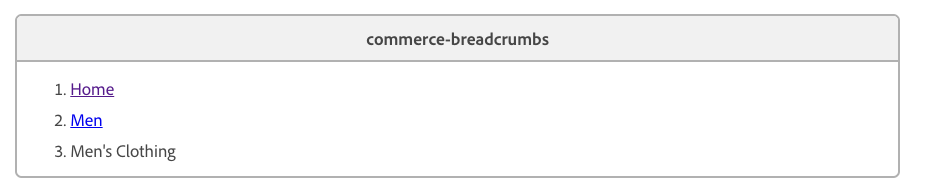

import { Aside, Code } from '@astrojs/starlight/components';
import Tasks from '@components/Tasks.astro';
import Task from '@components/Task.astro';
import Link from '@components/Link.astro';
import TableWrapper from '@components/TableWrapper.astro';

Breadcrumbs help shoppers understand where they are in your catalog and how to get back. On a product listing page (PLP), the breadcrumb should reflect the category hierarchy. On a product details page (PDP), it should reflect the path the shopper actually took to get there — not a single canonical trail picked at random.

This tutorial walks you through a small `commerce-breadcrumbs` block that reads its trail from the page HTML and renders it through the SDK `Breadcrumbs` component. The same block also acts as a producer of navigation context: when a shopper clicks a product on a PLP, it persists the current trail to `sessionStorage` keyed by the destination path so the PDP can render the trail the shopper just walked.

## What you'll build

By the end of this tutorial, you'll have:

- A `commerce-breadcrumbs` block (`blocks/commerce-breadcrumbs/`) that renders an authored `<ol>` of crumbs through the SDK `Breadcrumbs` component
- A click listener on `main .product-list-page` that propagates the current trail into `sessionStorage` when the shopper clicks a product link
- A session override on the PDP that swaps the authored ancestors for the propagated trail when the stored path matches the current URL
- The breadcrumb `<ol>` on each PLP and PDP, authored in DA or optionally emitted by the prerender

## Prerequisites

Before starting this tutorial, make sure you have:

- A working [Commerce storefront](/get-started/create-storefront/) on Edge Delivery Services
- A product listing page powered by the [Product Discovery drop-in](/dropins/product-discovery/) (rendered inside `main .product-list-page`)
- A product details page powered by the [Product Details drop-in](/dropins/product-details/)
- Familiarity with [customizing blocks](/boilerplate/customizing-blocks/) in your code repository
- Optionally, an [AEM Commerce Prerender](/setup/configuration/aem-prerender/) deployment that can emit the breadcrumb HTML on direct page loads

## Overview

The block is intentionally thin. It does two things:

1. **Render** — Parse the authored `<ol>` (or `<ul>`) into a flat list of crumbs, then render it through the SDK `Breadcrumbs` component. Ancestors render as links; the last item is always the leaf (current page) and renders as plain text.
2. **Propagate** — On any page that contains a PLP, listen for clicks inside `main .product-list-page` and persist the full trail (`[...ancestors, current]`) to `sessionStorage` keyed by the click destination. On the PDP, if a stored entry matches the current pathname, its trail replaces the authored ancestors.

The leaf is determined by position, not by the absence of a link. The last `<li>` is always rendered as plain text.

<Aside type="tip" title="Where this block can live">
  Drop `commerce-breadcrumbs` on any page that should show a breadcrumb. The PLP → PDP trail
  propagation is the only "smart" commerce feature; everywhere else the block gracefully degrades to
  rendering exactly what the author wrote.
</Aside>

<Tasks>

<Task>

### Step 1: Create the block files

Create a new directory `blocks/commerce-breadcrumbs/` in your repository, and add the two files below.

```js title="blocks/commerce-breadcrumbs/commerce-breadcrumbs.js" {17} {58} {30} {35} {7}
import { Breadcrumbs, provider as UI } from '@dropins/tools/components.js';
import { events } from '@dropins/tools/event-bus.js';
import { h } from '@dropins/tools/preact.js';

import { rootLink } from '../../scripts/commerce.js';

const SESSION_KEY = 'commerce.breadcrumbs';

/**
 * Parses the authored `<ol>` / `<ul>` into a flat list of `{ label, url }`.
 * `url` is the `<a>` pathname when present, otherwise `null`.
 *
 * Position determines the leaf: the last `<li>` is always rendered as the
 * current page (plain text). The author provides every crumb (including
 * `Home`).
 */
function parseCrumbs(block) {
  const list = block.querySelector('ol, ul');
  if (!list) return [];
  return [...list.querySelectorAll(':scope > li')].map((li) => {
    const anchor = li.querySelector('a');
    return {
      label: (anchor || li).textContent.trim(),
      url: anchor ? new URL(anchor.href).pathname : null,
    };
  });
}

export default function decorate(block) {
  const crumbs = parseCrumbs(block);
  block.innerHTML = '';
  if (crumbs.length === 0) return;

  const currentPath = window.location.pathname;
  const leaf = crumbs[crumbs.length - 1];
  let ancestors = crumbs.slice(0, -1);

  // Session override: when arriving from a PLP, use the propagated trail
  // instead of whatever the author put in the HTML.
  const raw = sessionStorage.getItem(SESSION_KEY);
  if (raw) {
    try {
      const session = JSON.parse(raw);
      if (session.path === currentPath) ancestors = session.trail;
    } catch (error) {
      sessionStorage.removeItem(SESSION_KEY);
      throw new Error(`Malformed ${SESSION_KEY} in sessionStorage: ${error.message}`);
    }
  }

  // Resolve display trail (ancestors may come from session; leaf may come from catalog)
  let leafLabel = leaf.label;
  if (document.querySelector('main .product-details')) {
    const product = events.lastPayload('pdp/data');
    if (product?.name) leafLabel = product.name;
  }

  UI.render(Breadcrumbs, {
    categories: [
      ...ancestors.map((item) => (
        item.url ? h('a', { href: rootLink(item.url) }, item.label) : h('span', null, item.label)
      )),
      h('span', null, leafLabel),
    ],
  })(block);

  // Propagate the full breadcrumb (ancestors + current page) on product link
  // clicks so the destination PDP can render the user's actual path.
  const propagatedTrail = [...ancestors, { label: leaf.label, url: currentPath }];

  document.querySelector('main .product-list-page')?.addEventListener('click', (event) => {
    const anchor = event.target.closest('a');
    if (!anchor) return;
    const targetPath = new URL(anchor.href).pathname;
    sessionStorage.setItem(
      SESSION_KEY,
      JSON.stringify({ path: targetPath, trail: propagatedTrail }),
    );
  });
}

```

```css title="blocks/commerce-breadcrumbs/commerce-breadcrumbs.css"
.commerce-breadcrumbs {
  padding: var(--spacing-small) 0;
}
```

#### Key design decisions

- **Authored content is the source of truth** — `parseCrumbs()` reads a flat `<ol>` (or `<ul>`) and never invents crumbs. Authors provide every entry.
- **Leaf is positional** — The last `<li>` is the current page. This keeps the contract simple and matches how authors think about breadcrumbs.
- **SDK component for rendering** — `UI.render(Breadcrumbs, …)` keeps the breadcrumb visually consistent with the rest of the storefront and lets you re-theme it through the SDK.
- **Single, well-known session key** — `commerce.breadcrumbs` is overwritten on each PLP link click, so there is no stale data accumulating.

**TODO**: Add a README.md file to the blocks/commerce-breadcrumbs directory with the following content:

```md wrap title="blocks/commerce-breadcrumbs/README.md"
# Commerce Breadcrumbs Block

This block is used to render breadcrumbs on product listing and product detail pages. It is a simple block that renders the breadcrumbs from the page HTML. It does not use any external data and is not dependent on any other blocks.

## Usage

```
</Task>

<Task>

### Step 2: Provide the breadcrumb on a PLP and a PDP

The block renders whatever `<ol>` is in the page HTML when it decorates. You can provide that markup two ways — author it by hand in DA, or emit it automatically from the AEM Commerce Prerender. Both produce the same HTML; choose based on whether the page is authored or generated.

#### Author it in DA

You author the breadcrumb in the document, not in code. In your content tool (for example, [DA.live](/merchants/quick-start/document-authoring/)), add a `commerce-breadcrumbs` block and fill it with an ordered (or unordered) list — one item per crumb, in order:



What the author provides:

- **One list item per crumb**, top to bottom (the rendered order).
- **A link on each crumb that should navigate.** Leave the last item as plain text — it is the current page.
- **A `Home` crumb if you want one.** The block adds nothing on its own; include every crumb you want shown.

The block has no key/value config — it reads this list straight from the published HTML. For example, the `/men/clothing` block above publishes as:

```html
<div class="commerce-breadcrumbs">
  <div>
    <div>
      <ol>
        <li><a href="/">Home</a></li>
        <li><a href="/men">Men</a></li>
        <li>Men's Clothing</li>
      </ol>
    </div>
  </div>
</div>
```

Renders as:

```
Home / Men / Men's Clothing
```

And on the product page `/products/sprite-yoga-strap`:

```html
<div class="commerce-breadcrumbs">
  <div>
    <div>
      <ol>
        <li><a href="/">Home</a></li>
        <li>Sprite Yoga Strap</li>
      </ol>
    </div>
  </div>
</div>
```

Renders, on a direct load, as:

```
Home / Sprite Yoga Strap
```

When the shopper arrives from `/men/clothing`, the session override (Step 3) replaces the authored ancestors with the propagated trail, so the PDP renders:

```
Home / Men / Men's Clothing / Sprite Yoga Strap
```

The leaf (`Sprite Yoga Strap`) still comes from the PDP's own authored HTML — only the ancestors are replaced.

<Aside type="note" title="Authoring tips">
  - Position is what matters. The last item is always the leaf (current page), even if it is a link.
  - Empty blocks render nothing.
</Aside>

#### Optional: emit it from the AEM Commerce Prerender

Instead of authoring each breadcrumb by hand, you can generate them automatically for category and product pages from the [AEM Commerce Prerender](/setup/configuration/aem-prerender/). Have your prerender templates emit the same `<ol>`. The prerender needs the ancestor data, so fetch it from the Commerce GraphQL API, then render:

- `Home` as the first `<li>` (linked to `/`)
- Each ancestor category as a linked `<li>`
- The current page label as the last `<li>` (plain text, no link)

For example, the prerender output for `/products/sprite-yoga-strap` would include:

```html
<div class="commerce-breadcrumbs">
  <div>
    <div>
      <ol>
        <li><a href="/">Home</a></li>
        <li><a href="/men">Men</a></li>
        <li><a href="/men/clothing">Men's Clothing</a></li>
        <li>Sprite Yoga Strap</li>
      </ol>
    </div>
  </div>
</div>
```

Either way, delivering the full breadcrumb on direct load gives you:

- **Deterministic direct loads.** A shopper landing on the PDP from a search engine sees a canonical breadcrumb without waiting for any client-side category resolution.
- **Working session override.** Because the PDP already renders crumbs through the block, the session override (Step 3) can replace the ancestors with the trail the shopper actually walked.

</Task>

<Task>

### Step 3: Understand the PLP → PDP propagation

The PLP → PDP context propagation is what makes the block "commerce-aware". Conceptually, it works like this:

1. On a PLP, the block builds `propagatedTrail = [...ancestors, { label: leaf.label, url: currentPath }]` — its own breadcrumb, but with the leaf turned into a **link** to the PLP. This is the trail the PDP will use as its ancestors.
2. The block attaches a `click` listener to `main .product-list-page`. The selector is intentionally narrow — it only matches the PLP drop-in's mount point.
3. On any anchor click inside that subtree, the block writes the trail to `sessionStorage` under the key `commerce.breadcrumbs`, keyed by the destination pathname.
4. On the next page load, the breadcrumb block on the destination page reads `sessionStorage`. If the stored `path` equals `window.location.pathname`, it replaces the authored ancestors with the stored trail. The leaf is always taken from the destination's own authored HTML.

#### SessionStorage shape

```json
{
  "path": "/products/sprite-yoga-strap",
  "trail": [
    { "label": "Home", "url": "/" },
    { "label": "Men", "url": "/men" },
    { "label": "Men's Clothing", "url": "/men/clothing" }
  ]
}
```

#### Why this design

- **No coupling to the PLP drop-in** — The block does not import from the PLP or subscribe to events. It just listens for DOM clicks on the PLP's container, which makes it resilient to drop-in updates.
- **Keyed by destination path** — The breadcrumb is only restored when the stored `path` matches the current page. Visiting any other URL ignores the stored trail.
- **Graceful degradation** — If `sessionStorage` is unavailable, malformed, or empty, the block falls back to the authored trail.
- **No external state** — There are no events, no globals, no cross-block dependencies. Two `commerce-breadcrumbs` blocks on different pages cooperate purely through `sessionStorage`.

<Aside type="caution" title="Anchors inside the PLP subtree">
The click listener fires on any `<a>` inside `main .product-list-page`. In practice, the PLP drop-in uses buttons for filters and pagination, so only product links match. If you customize the PLP to add navigation links inside the same subtree, expect the trail to be written for those destinations as well — those destinations will simply not consume it unless they host the breadcrumb block. If that becomes a problem in your storefront, narrow the selector to a class you control (for example, an `a.product-card-link` added by your PLP customization).
</Aside>

</Task>

<Task>

### Step 4: Commit, push, and verify

Commit the new `blocks/commerce-breadcrumbs/` directory and push to your branch. Once Code Sync deploys the change to your preview URL, walk through these scenarios:

- **Direct PLP load** — Open `/men/clothing` (or any PLP that authors the breadcrumb). Confirm the rendered breadcrumb matches the authored `<ol>`.
- **Direct PDP load** — Open a product URL directly (for example, from an incognito window). Confirm the breadcrumb is the authored trail, with the product as the leaf.
- **PLP → PDP navigation** — On the PLP, open DevTools → Application → Session Storage, click a product card, and confirm `commerce.breadcrumbs` is written with the destination pathname and the current trail. On the PDP, confirm the ancestors now match the PLP path, while the leaf is still the PDP's authored label.
- **PLP → PDP, different PDP** — From the same PLP, click product A, then in a new tab open product B directly. Confirm that product B's breadcrumb is the authored trail (the stored entry only matches product A's path).

</Task>

</Tasks>

## User journey walkthrough

A shopper opens the homepage, clicks **Men → Clothing**, and lands on `/men/clothing`. The PLP renders the authored breadcrumb `Home / Men / Men's Clothing` through the block. As soon as the breadcrumb is on screen, the block attaches a click listener to `main .product-list-page`.

The shopper clicks **Sprite Yoga Strap** on the PLP. Before the navigation completes, the block writes the following to `sessionStorage`:

```json
{
  "path": "/products/sprite-yoga-strap",
  "trail": [
    { "label": "Home", "url": "/" },
    { "label": "Men", "url": "/men" },
    { "label": "Men's Clothing", "url": "/men/clothing" }
  ]
}
```

The PDP loads with its own authored breadcrumb `Home / Sprite Yoga Strap`. The breadcrumb block runs, finds the stored entry, and — because `path` matches `window.location.pathname` — replaces the authored ancestors with the propagated trail. The rendered breadcrumb becomes:

```
Home / Men / Men's Clothing / Sprite Yoga Strap
```

The leaf still comes from the PDP's own authored HTML, so it always reflects the product's canonical name, not whatever label the PLP used on its card.

If the same shopper later opens a bookmarked PDP URL in a new tab, the stored entry no longer matches the new URL, so the PDP renders the authored trail unchanged.

## Troubleshooting

### The breadcrumb is empty

The block clears itself and exits when `parseCrumbs()` returns an empty array. Confirm the page HTML contains an `<ol>` (or `<ul>`) inside the `commerce-breadcrumbs` block with at least one `<li>`. On prerendered pages, check the rendered output.

### PDP shows the authored trail instead of the PLP trail

Open DevTools → Application → Session Storage and check the entry for `commerce.breadcrumbs`. The `path` field must match `window.location.pathname` exactly (including or excluding any trailing slash). If the storefront is mounted at a non-root base path, also confirm that the destination URL on the PLP card is correct — the block stores `new URL(anchor.href).pathname`, so a mismatched base path stores a mismatched key.

### Errors about malformed session storage

The block intentionally throws when it finds a non-JSON value under its key. The bad value is removed first, so the next reload renders correctly. Investigate where the bad write came from — only this block should ever write to `commerce.breadcrumbs`.

### Trail is written for non-product links on the PLP

The click listener fires on every `<a>` inside `main .product-list-page`. If you customized the PLP to include non-product links inside that subtree, narrow the selector to a class you control (see the caution in Step 3). The worst case is benign: an extra entry is written to `sessionStorage` and ignored because the destination does not host the breadcrumb block.

## What you built

<TableWrapper nowrap={[0]}>

| File                                                   | Purpose                                                                                                    |
| ------------------------------------------------------ | ---------------------------------------------------------------------------------------------------------- |
| `blocks/commerce-breadcrumbs/commerce-breadcrumbs.js`  | Parses the authored `<ol>`, renders through the SDK `Breadcrumbs`, and manages the PLP → PDP session trail |
| `blocks/commerce-breadcrumbs/commerce-breadcrumbs.css` | Block-level spacing                                                                                        |
| Prerender PLP / PDP templates _(optional)_             | Emit a deterministic breadcrumb `<ol>` for every category and product page                                 |
| PLP / PDP authored content                             | Hosts the `commerce-breadcrumbs` block (and the `<ol>` if no prerender is in place)                        |

</TableWrapper>
