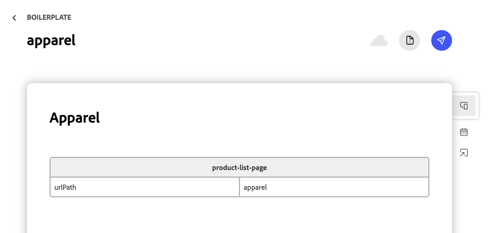
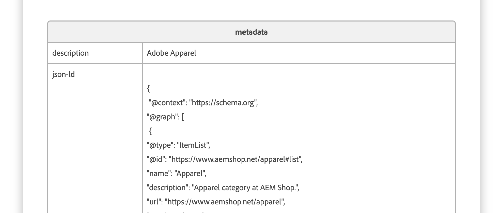

import { Aside, Steps } from '@astrojs/starlight/components';
import Tasks from '@components/Tasks.astro';
import Task from '@components/Task.astro';
import Link from '@components/Link.astro';
import TableWrapper from '@components/TableWrapper.astro';

The [AEM Commerce Prerender](/setup/configuration/aem-prerender/) solution generates category (product listing) pages automatically. It fits most catalogs, but it has [documented limits](/setup/configuration/aem-prerender/#limitations): category changes are picked up on a fixed cadence rather than reactively, each category path prerenders a maximum of approximately 10,000 products, and it can't merge per-category content overrides. When one of those limits gets in your way — an unusually large category, a need for near-real-time updates, or custom content on a single category — you can author that category page by hand instead.

This tutorial covers the manual path: create a page that represents one category, give it SEO metadata, and keep existing links working when you change the page's URL. You author everything in Document Authoring (DA.live), so no code changes are required. To produce many category pages with a script instead of by hand, see [Generate category pages programmatically](/how-tos/automatic-category-page/).

## What you'll build

By the end of this tutorial, you'll have:

- A category page authored as a single document, published at a URL you choose (for example, `/apparel`)
- A `product-list-page` block on that document, bound to a Commerce category through its `urlPath`
- SEO metadata on the page (title, description, structured data, and more), applied per page or in bulk
- A plan for changing a category page's URL without breaking existing links

## Prerequisites

Before starting this tutorial, make sure you have:

- A working [Commerce storefront](/get-started/create-storefront/) on Edge Delivery Services
- Category pages powered by the [Product Discovery drop-in](/dropins/product-discovery/) `product-list-page` block (the default in the storefront)
- Access to author and publish content in [Document Authoring (DA.live)](/merchants/quick-start/document-authoring/)
- The **URL key** (also called the URL path) of the Commerce category you want to display

<Aside type="note" title="When to prefer automation">
  Author category pages by hand only if your requirements will exceed the automated limits. For
  everything else, the [prerender solution](/setup/configuration/aem-prerender/) keeps category
  pages in sync with your catalog without per-page maintenance. A hand-authored page does not update
  itself when the catalog changes.
</Aside>

## How a category page works

A category page is a document with two tables:

- A **`product-list-page`** block that renders the category's product grid. Its `urlPath` value tells the block which Commerce category to load; the block fetches that category's products in the browser using the URL key.
- A **`metadata`** block that sets the page's SEO fields — title, description, structured data, and the `plp` template.

The document's location in your content tree becomes the page URL. A document at `/apparel` is served at `https://<your-storefront>/apparel`. That path is independent of the `urlPath` value inside the block: the path is where shoppers go, and `urlPath` is which category loads there.

<Tasks>

<Task>

### Step 1: Create the document at your chosen path

In Document Authoring, create a document at the path where you want the category to live — for example, `apparel` for a page served at `/apparel`. The document's path in the content tree becomes the page URL, so choose it to match the URL you want shoppers to use.

</Task>

<Task>

### Step 2: Add the product-list-page block

Add a table whose header row (both cells merged) reads `product-list-page`. In the next row, add a `urlPath` cell in the first column and the category's URL key in the second column — for example, `apparel`.

This single value binds the page to the Commerce category. When the page loads, the `product-list-page` block reads `urlPath` and fetches that category's products. This is the same block the storefront uses for its automatically generated category pages, so the layout, filters, and pagination match the rest of your site.

<Aside type="note" title="Find the category URL key">
  The `urlPath` value must match the category's URL key in Commerce. If you're unsure of the exact
  value, check the category in the Commerce Admin, or open an existing (prerendered) category page
  and note the path segment it uses.
</Aside>

</Task>

<Task>

### Step 3: Add SEO metadata to the page

Add a `metadata` table to the document to set the page's title, description, structured data, and template. At minimum, set `template` to `plp` so the page uses the category listing layout, and add a `title` and `description` for search results.

The example above sets `breadcrumb` to `auto`, `template` to `plp`, a `description`, and a `json-ld` value carrying `ItemList` structured data for the category. For the full list of supported properties — `Title`, `Description`, `Keywords`, `Robots`, `og:` tags, `json-ld`, and more — and how the table is structured, see [Page metadata](/merchants/blocks/page-metadata/). For catalog SEO guidance specific to product and category pages, see [SEO metadata](/setup/seo/metadata/).

<Aside type="tip" title="Add breadcrumbs and structured data">
  Set `breadcrumb` to `auto` to generate breadcrumbs from the page path, and add `BreadcrumbList`
  and `ItemList` (or `CollectionPage`) JSON-LD so search engines and AI crawlers can read the
  category. See [Breadcrumbs for PLP and PDP](/how-tos/breadcrumbs-plp-pdp/) for the breadcrumb
  block, and validate structured data with the <Link href="https://search.google.com/test/rich-results" text="Rich Results Test" />.
</Aside>

</Task>

<Task>

### Step 4: Apply metadata in bulk (optional)

If you're authoring several category pages, or want to keep SEO values in one place, define them in a bulk metadata sheet instead of on each document. A `metadata` sheet matches pages by URL pattern (for example, a row for `/apparel` or a wildcard such as `/categories/**`) and applies properties to every matching page. Per-page metadata still takes precedence where both are set.

See <Link href="https://www.aem.live/docs/bulk-metadata" text="Bulk Metadata on AEM.live" /> for the sheet format and matching rules, and [SEO metadata](/setup/seo/metadata/#generate-metadata) for a tool that generates a bulk metadata sheet from your catalog.

</Task>

<Task>

### Step 5: Preview and publish

Preview the document with the [AEM Sidekick](/merchants/quick-start/), confirm the product grid and metadata render as expected, then publish. The category page is now live at the path you chose in Step 1.

<Aside type="tip">
  Verify the page loads the right category by checking that the expected products appear, and
  confirm the metadata by viewing the page source for your `title`, `description`, and JSON-LD.
</Aside>

</Task>

</Tasks>

## Change a category page's URL

When a category's URL changes — you're moving the page from one path to another, for example `/apparel` to `/clothing` — you can't just rename it in place. Create the page at the new path, remove the old one, and redirect so existing links and search rankings follow to the new URL.

<Steps>

1. Create the category document at the new path, following Steps 1–5 above, and publish it.
2. Unpublish and delete the old category document so it's no longer served at the old URL.
3. Add a redirect from the old path to the new one in your `redirects` sheet (for example, `/apparel` → `/clothing`), so shoppers and crawlers that hit the old URL land on the new page.

</Steps>

Add the redirect rather than only deleting the old page: a redirect preserves inbound links and search equity, while a deleted page with no redirect returns a 404, and the old URL is orphaned. Edge Delivery Services redirects are permanent (301) redirects managed in a spreadsheet — see [Redirects](/merchants/edge-delivery-services/redirects/) for how the sheet works in this storefront, and <Link href="https://www.aem.live/docs/redirects" text="Redirects on AEM.live" /> for the sheet columns and behavior. After the redirect is live, update your [sitemap](/merchants/edge-delivery-services/sitemaps/) so search engines discover the new URL.

<Aside type="note" title="Redirects override pages">
  A redirect for a URL takes precedence over any published page at that URL. Add the old-to-new
  redirect only after the new page is live, and don't add a redirect that points at a path you still
  serve a page from.
</Aside>

## What you built

<TableWrapper nowrap={[0]}>

| Artifact                                    | Purpose                                                                  |
| ------------------------------------------- | ------------------------------------------------------------------------ |
| Category document (for example, `/apparel`) | The page shoppers visit; its path is the page URL                        |
| `product-list-page` block with `urlPath`    | Binds the page to a Commerce category and renders its product grid       |
| `metadata` block (or bulk metadata sheet)   | Sets the page's SEO: title, description, structured data, `plp` template |
| `redirects` sheet entry                     | Keeps old links working after a page URL change                          |

</TableWrapper>
