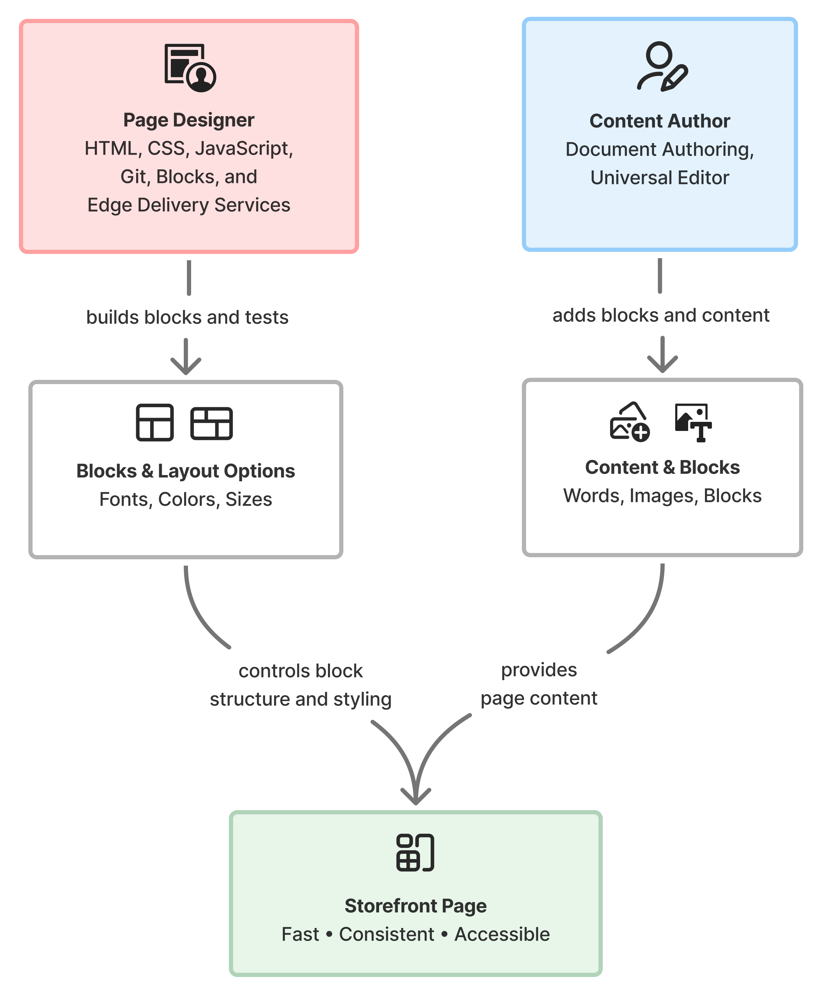

import CardGrid from '@components/CardGrid.astro';
import Card from '@components/Card.astro';
import Diagram from '@components/Diagram.astro';

Building a page on your storefront takes two roles working together: a content author and a page designer. A content author works in Document Authoring or the Universal Editor, choosing the words, images, and blocks a page needs. A page designer works in the storefront's code, defining block appearance, including layouts and styles.

<Diagram caption="How the Page Designer's presentation and the Content Author's content combine to create a storefront page.">
  
</Diagram>

## Why this split exists

This split lets a content author choose a page's content, while a page designer builds its presentation. Pre-built, tested layouts keep pages fast, consistent, and accessible in ways that page-by-page styling can't guarantee. The consistent markup they produce is also easier to optimize for search engines.

## Page Designer and Content Author

Here's what each one does:

<CardGrid>
  <Card icon="puzzle" title="Page Designer">
    Builds new blocks and their layout options, including a block's styling, spacing, and behavior across devices. This role requires HTML, CSS, Git, and JavaScript skills, and a working knowledge of Edge Delivery Services component design. It works directly in the storefront's code, but not on drop-ins or their underlying behavior. See [Blocks Reference](/boilerplate/blocks-reference/) for the blocks already available to extend, or [Customizing Blocks](/boilerplate/customizing-blocks/) to build a new one.
  </Card>
  <Card icon="pencil" title="Content Author">
    Starts from the template closest to their needs, then adds text, images, and the right pre-built blocks to assemble the page, in Document Authoring or the Universal Editor. Content authors choose from the layout options that a page designer has already built. They also own block settings, placeholders, metadata, publishing, and scheduling. This role maps to the "author" role described in [Author and developer tasks](/merchants/blocks/author-and-developer-tasks/).
  </Card>
</CardGrid>

## How the roles work together

A layout option must exist before a content author can pick it.

A hero banner, for example, offers a two-column layout and a full-width layout, each built and tested ahead of time.

{/* TODO: replace with a concrete, publishable example of a variation set (for example, a hero banner). Pending: access to genericized OPTP/eLuscious walkthroughs (blocked on clearance for public use), or an example built from this boilerplate's own blocks/section metadata instead. */}

When a content author needs a layout option that doesn't exist yet, or an entirely new kind of block, the request goes to the page designer. If that need is a new drop-in, live catalog data, or a change to existing behavior, it becomes a developer task outside the page designer's scope. See [Author and developer tasks](/merchants/blocks/author-and-developer-tasks/) for how to file that request.

## Templates for content pages

Page designers create templates for common content pages, such as a landing page or a category page, so content authors can start from the right baseline instead of starting from an empty page. A content author selects the template that most closely matches their needs and builds from there.

## Get started

If you're a content author ready to build a page, start with [Create your first commerce page](/merchants/quick-start/your-first-page/). It walks through assembling a page from an existing template in Document Authoring.

To see what already exists, start with [Blocks Reference](/boilerplate/blocks-reference/). To build something new, start with [Customizing Blocks](/boilerplate/customizing-blocks/).

{/* TODO: add reference implementation examples built from this boilerplate's own blocks and section metadata. Access was restricted for public use; this page stays in the Commerce storefront docs, not Adobe Experience League, per the same thread. */}
