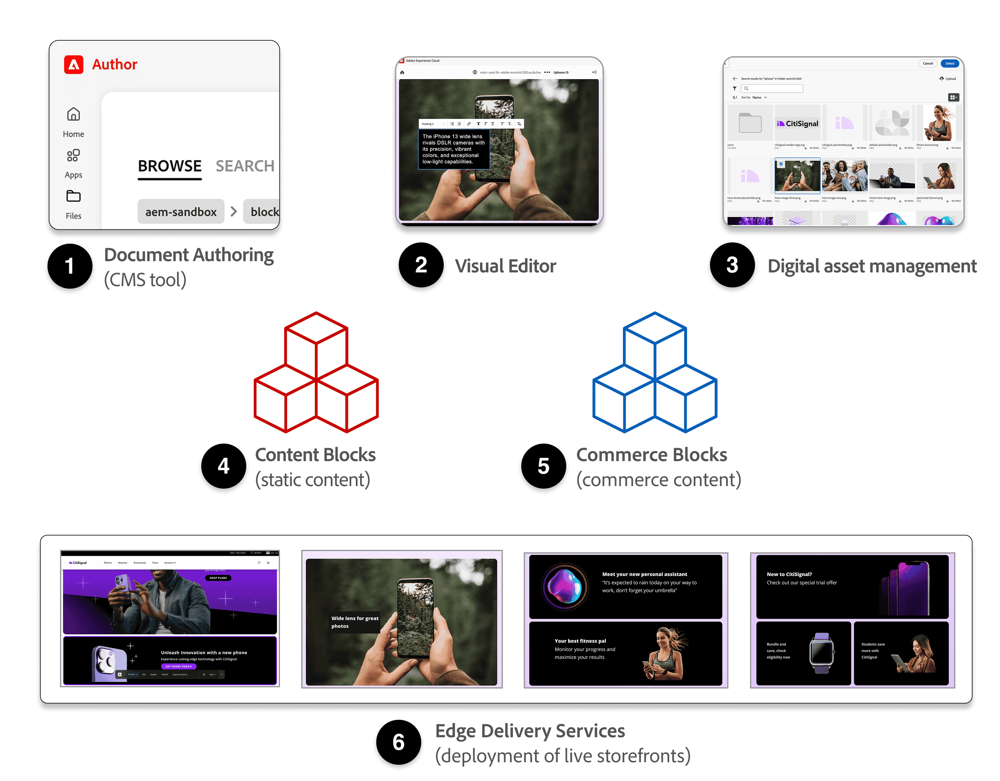

import { Steps } from '@astrojs/starlight/components';
import Diagram from '@components/Diagram.astro';
import PDFViewer from '@components/PDFViewer.astro';
import Callouts from '@components/Callouts.astro';
import Link from '@components/Link.astro';

**Commerce Storefront** is included with Adobe Commerce as a Cloud Service and Adobe Commerce Optimizer. It is designed to streamline both the technical and editorial workflows for creating and maintaining the content for your commerce storefronts. 

## What is the Commerce Storefront?

The **Commerce Storefront** is a collection of tools and technologies from Adobe designed to make it easy to create, manage, and customize modern, high-performance storefronts. It brings together the following tools—the building blocks of a commerce storefront:

<Diagram caption="What is the Commerce Storefront?">
  
</Diagram>

<Callouts columnCount="1">

1. [**Document Authoring (DA.live)**](#dalive-document-authoring): The content management app (CMS) where your storefront's pages, blocks, and assets are authored and managed.

2. [**Universal Editor**](#universal-editor): A WYSIWYG editor that enables business users and content authors to update content directly on the rendered page of the storefront.

3. [**Digital Assets Management**](#digital-assets-management): Tools for storing and managing images and other media used on your storefront.

4. [**Content Blocks**](#content-and-commerce-blocks): Pre-built content components used to build the static storefront content, such as buttons, images, lists, links, and more.

5. [**Commerce Blocks**](#content-and-commerce-blocks): Pre-built commerce components that use drop-ins to add commerce features to your storefront, such as product details, cart, checkout, product lists, and more.

6. [**Edge Delivery Services**](#edge-delivery-services): A fast, scalable delivery platform for your storefront and its assets.

</Callouts>

### DA.live (Document Authoring)

DA.live (Document Authoring) is the content management system (CMS) you use to build your storefront site. It is where you create and manage your storefront's pages, blocks, and assets. DA.live provides a collaborative environment for content teams to create and structure site content, manage translations, and control publishing workflows. It can integrate with the Universal Editor for in-context editing and with Edge Delivery Services for fast, reliable content delivery. DA.live supports versioning, localization, and the features required to manage multiple commerce storefronts.

Learn more about DA.live in the <Link href="https://www.aem.live/developer/da-tutorial" text="DA.live tutorial" />.

### Universal Editor

The Universal Editor enables visual editing of content directly on the rendered page. Learn more about the Universal Editor by visiting the [Using the Universal Editor](/merchants/quick-start/universal-editor/) topic.

### Digital Assets Management

The digital assets management (DAM) tool, powered by Adobe Experience Manager Assets, provides access to editorial assets like images, videos, and other media used on content pages and product enrichments. The DAM tools integrate with DA.live and the Universal Editor for seamless media content management and asset selection. It works with Edge Delivery Services to deliver optimized assets globally.

For more information about AEM Assets, see <Link href="https://www.aem.live/docs/universal-editor-assets" text="Publishing pages with AEM Assets" /> and <Link href="https://www.aem.live/docs/media" text="AEM Assets overview" />.

### Content and Commerce blocks

Blocks are a foundational concept for adding form and function to page sections. They are defined using tables in the content and rendered on-screen using content properties and style sheets. Commerce blocks are content blocks that use drop-ins to add commerce features to your storefront, such as product details, cart, checkout, product lists, and more.

Learn how to use the Content and Commerce blocks in the [Content and Commerce blocks](/merchants/blocks/content-commerce-blocks/) topic.

For more information about content blocks, see the <Link href="https://www.aem.live/developer/block-collection" text="Block Collection" /> topic.

### Edge Delivery Services

Edge Delivery Services is a fast, scalable platform for delivering your storefront's content and assets to customers. It leverages a global content delivery network (CDN) to ensure that pages, images, and other resources load quickly, no matter where your customers are located. By serving content from the edge (geographically distributed servers closer to your customers), we reduce latency and improve site performance, which is critical for both user experience and SEO. Edge Delivery Services is tightly integrated with the Commerce Storefront ecosystem, ensuring seamless deployment and updates to your customer's storefront experience.

Learn more about Edge Delivery Services in the <Link href="https://experienceleague.adobe.com/en/docs/experience-manager-cloud-service/content/edge-delivery/overview" text="Edge Delivery Services Overview" /> topic.

## Summary

The Commerce Storefront is Adobe's comprehensive solution for creating and managing modern, high-performance storefronts. It combines six essential tools into a unified ecosystem:

- **DA.live** serves as your content management system for authoring and organizing storefront content
- **Universal Editor** provides real-time, in-context editing capabilities for business users and content authors
- **Digital Assets Management** offers digital asset management for storing and optimizing editorial media
- **Content Blocks** and **Commerce Blocks** provide pre-built components for both static content and dynamic commerce functionality
- **Edge Delivery Services** ensures fast, global content delivery through a scalable CDN platform

Together, these tools streamline both technical and editorial workflows, enabling teams to efficiently create, customize, and maintain commerce storefronts that deliver exceptional user experiences and optimal performance.
