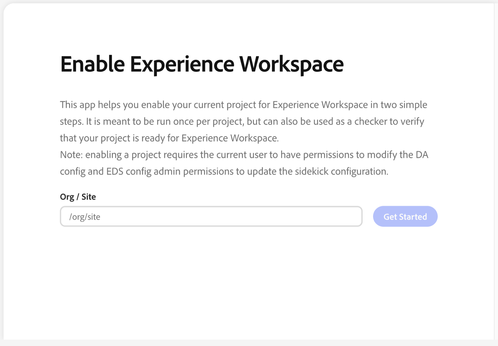
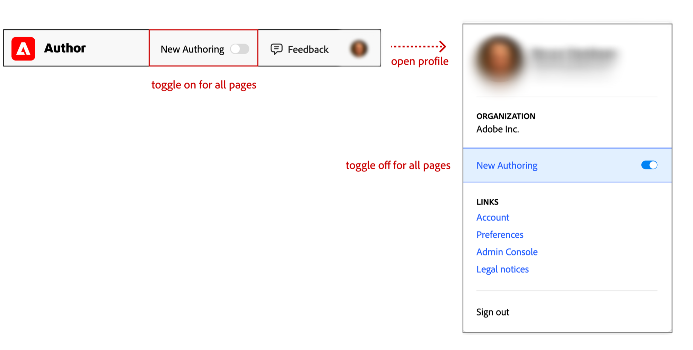
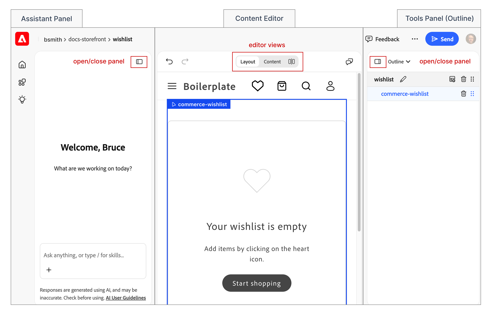

import { Badge } from '@astrojs/starlight/components';
import Link from '@components/Link.astro';
import Aside from '@components/Aside.astro';
import Term from '@components/Term.astro';

<Badge text="Early access" variant="caution" size="medium" />

<Term>Experience Workspace</Term> is a visual editor for storefront pages that use Document Authoring
(DA.live) as their content source. Unlike the plain document editor, it shows the page as shoppers
see it, so you edit content directly on the rendered page in Layout mode. You can also work
with the underlying document structure in Content mode, or use Split view to see both at once.

The same storefront content and Commerce block tables are available in each view. Experience Workspace changes how you work with that content, not how the page's Commerce features work.

<Aside type="note" title="Early access">
  Experience Workspace is in early access and continues to evolve. Interface labels, configuration
  options, and behavior can still change, so use the linked AEM documentation as the source of
  truth and try it on non-critical pages first.
</Aside>

## Before you begin

Your storefront must use Document Authoring as its content source (see [Create a storefront](/get-started/create-storefront/)), and you should already be able to open, preview, and publish a page in the document editor. If you're not sure, check with your development team before you enable another editor.

## Enable Experience Workspace for your project

Experience Workspace is off by default. An administrator or developer enables it once for your organization or site by setting the `ew.enabled` configuration flag. This project-level setup is separate from each author's own New Authoring toggle (see the next section), and it may require a developer to update your storefront's code first.

Open <Link href="https://da.live/app/adobe-rnd/ew-extensions/tools/ew-setup/ew-setup" text="Enable Experience Workspace" /> for guided setup. If you don't have access to enable it yourself, ask an administrator or your development team to complete setup. See <Link href="https://www.aem.live/docs/ew/about#setup" text="Experience Workspace setup" /> for the manual walkthrough they can follow. If setup doesn't work as described, ask in the <Link href="https://discord.gg/aem-live" text="AEM Discord community" />.

## Open a page in Experience Workspace

Open a page in your Document Authoring project edit view, not the folder view. Enabling the project doesn't turn on Experience Workspace for you automatically. Each author still turns on **New Authoring** individually in the document editor header to open their own pages in it, and turning it on doesn't affect other authors. To return to the document editor, open your profile menu and turn off **New Authoring**.

## The Experience Workspace interface

Open a page in Experience Workspace to see the content editor in the center, with the AI Assistant panel on the left and the tools panel on the right. If those panels are closed, you can open them from the header. An administrator might disable the assistant, so it might not appear in every project.

## How to use Experience Workspace

Open the page you want to edit in Experience Workspace, then choose the view that fits your task.

**Layout** shows the rendered page. Select a block to reveal a contextual toolbar, then use it to format the content directly on the page. Use this view for most content edits.

**Content** shows the page's document structure, including any Commerce block tables. Use this view when you need to edit a block table or work with the underlying document instead of the rendered page.

**Split view** shows Layout and Content side by side, so you can see how a change to the document affects the rendered page as you make it.

When your edit is ready, preview and publish it the same way you do in the document editor.

For detailed editing options, block insertion, collaboration, and sheets, see <Link href="https://www.aem.live/docs/ew/authoring/editing-docs" text="Authoring pages" />.

## Find detailed help

The AEM documentation contains the complete Experience Workspace instructions. Choose the section that matches your task:

- <Link href="https://www.aem.live/docs/ew/orientation" text="Experience Workspace orientation" />
  covers the content editor, AI assistant panel, tools panel, and menu bar.
- <Link href="https://www.aem.live/docs/ew/authoring" text="Authoring with Experience Workspace" />
  covers pages, sheets, media, navigation, versions, and publishing.
- <Link
    href="https://www.aem.live/docs/ew/administering"
    text="Administering Experience Workspace"
  />
  covers permissions, libraries, publishing workflows, translation, and integrations.
- <Link href="https://www.aem.live/docs/ew/developing" text="Developing for Experience Workspace" />
  covers developer-specific customization and upgrades.
- <Link href="https://www.aem.live/docs/ew/about" text="About Experience Workspace" /> covers
  prerequisites, setup, configuration flags, and Sidekick configuration.
- <Link
    href="https://www.aem.live/docs/ew/da-is-ew"
    text="Document Authoring is now Experience Workspace"
  /> — new capabilities and common questions about switching from the document editor.
