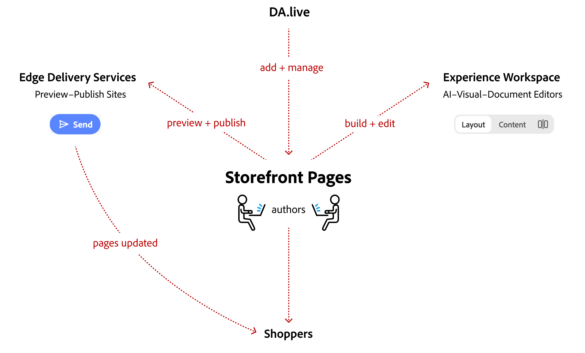

import Callouts from '@components/Callouts.astro';
import Diagram from '@components/Diagram.astro';

Your experience as a Commerce storefront author begins with a web application called **DA.live**. Do yourself a favor and become an early expert. Learn what a **storefront page** is and how it works. Learn what you can do with the **Experience Workspace**. Then follow the steps near the bottom of the page to create your first page.

## The authoring experience

As an author, you will spend the majority of your time in **DA.live** and its **Experience Workspace**. The following diagram shows how **storefront pages** are at the center of the authoring experience. All the other tools and editors are there to help you deliver the best pages possible for your shoppers.

<Diagram caption="Storefront pages are at the center of the authoring experience in Adobe Commerce Storefront.">
  
</Diagram>

## The storefront page

Authoring starts with the storefront page. It combines content and commerce blocks to create a complete shopping experience for your customers. Authors configure the content and layout, while page designers and developers ensure that the page design and functionality meet the storefront's overall standards.

<Diagram caption="Storefront pages are at the center of the authoring experience in Adobe Commerce Storefront.">
  
</Diagram>

## The DA.live web application

Authors assemble pages with content blocks for text and media and Commerce blocks for shopping features. They choose each block's content, settings, and available layout options. Page designers and developers build and maintain those options; a new layout or a change to a block's behavior needs development work.

<Diagram caption="Storefront pages are at the center of the authoring experience in Adobe Commerce Storefront.">
  
</Diagram>

For examples of each role's responsibilities, see [How a page comes together](/merchants/quick-start/content-model/) and [Author and developer tasks](/merchants/blocks/author-and-developer-tasks/).

## The Experience Workspace

Document Authoring (DA.live) provides a document editor for text and block tables. Experience Workspace provides visual editing on the rendered page. Both editors work with the same page content, so changing editors does not change the Commerce features behind the blocks.

<Diagram caption="Storefront pages are at the center of the authoring experience in Adobe Commerce Storefront.">
  
</Diagram>

Content teams can share preview URLs for review before publishing changes to the live storefront. The [visual editing overview](/merchants/quick-start/choose-visual-editor/) explains editor support for new and existing projects.

## Create your first page

Follow this path if you are new to authoring a Commerce storefront:

<Callouts columnCount={1}>
1. [What is Commerce Storefront?](/merchants/quick-start/create-content/) — Learn which tools create, edit, and deliver your storefront.
1. [How a page comes together](/merchants/quick-start/content-model/) — Understand how authors and page designers combine content and design.
1. [Author and developer tasks](/merchants/blocks/author-and-developer-tasks/) — See what you can change yourself and when a request needs code.
1. [Document Authoring](/merchants/quick-start/document-authoring/) — Learn to edit content in documents.
1. [Create your first commerce page](/how-tos/create-commerce-page/) — Build, preview, and publish a category page with a Commerce block and metadata.
</Callouts>

You can also edit content while viewing the storefront as shoppers see it. Use these resources for your project:

- [Visual editing overview](/merchants/quick-start/choose-visual-editor/) — Understand why new storefronts use Experience Workspace and which existing Universal Editor projects remain supported.
- [Experience Workspace](/merchants/quick-start/experience-workspace/) — Enable the editor and find instructions for editing, previewing, and publishing.
- [Universal Editor (deprecated)](/merchants/quick-start/universal-editor/) — Edit content in an existing Universal Editor project.

## Find your next task

Choose an [author How-to](/how-tos/#for-authors) for a specific outcome. Use the Authors topics below for concepts, block references, and platform guidance.

<Callouts columnCount={2}>
- [Build pages](/merchants/authoring/) — Add blocks, configure metadata and layout, and change storefront labels.
- [Find a Commerce block](/merchants/blocks/) — Look up blocks for business-to-consumer (B2C) and business-to-business (B2B) storefronts by task.
- [Enhance the storefront](/merchants/content-customizations/) — Enrich product content and add experiments, personalization, recommendations, and terms and conditions.
- [Manage and publish](/merchants/edge-delivery-services/) — Schedule and migrate content, manage redirects and sitemaps, and understand platform limits.
- [Localize content](/how-tos/translate-storefront-content/) — Translate authored content and prepare localized storefront pages.
</Callouts>
