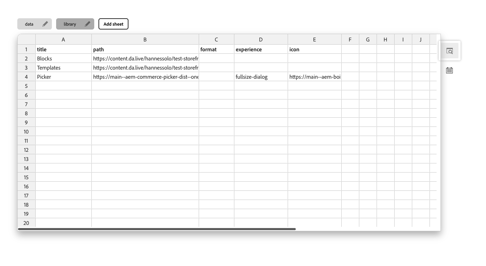

import { Steps } from '@astrojs/starlight/components';
import Aside from '@components/Aside.astro';
import Diagram from '@components/Diagram.astro';

The **Commerce Picker** is an extension that allows you to select products, categories, and product variants from your catalog and insert them into your content. It provides a visual interface for browsing and selecting commerce items within your authoring environment.

## Installing the Commerce Picker

The Commerce Picker can be installed for both the Visual Editor and Document Authoring tool. Choose the installation method based on your preferred authoring environment.

### For the Visual Editor

Go to the [Universal Editor Product Picker documentation](https://developer.adobe.com/uix/docs/extension-manager/extension-developed-by-adobe/ue-product-picker/). Complete the setup process as described in the documentation.

### For the Document Authoring Tool

<Steps>
1. **Access your storefront configuration**: Navigate to your storefront's configuration in Document Authoring by either:
   - Clicking the gear icon in the DA.live browser interface
   - Opening directly: `https://da.live/config#/<your-org>/<your-site>/`

2. **Navigate to the Library tab**: Click the "Library" tab in the configuration interface.

3. **Add the Commerce Picker configuration**: Add a new row with the following values:

   <Diagram caption="Commerce Picker Configuration">
     
   </Diagram>

   | Field | Value |
   |-------|-------|
   | **Title** | Commerce Picker |
   | **Path** | `https://main--aem-commerce-picker-dist--oneadobe.aem.page/dist/dist/document-authoring.html?configs-path=/config.json` |
   | **Experience** | fullsize-dialog |
   | **Icon** | `https://main--aem-boilerplate-commerce--hlxsites.aem.page/icons/cart.svg` |

4. **Update your project configuration**: Modify your project's `config.json` file to set your root category ID under `"plugins.picker.rootCategory"`. Refer to the [demo configuration](https://github.com/hlxsites/aem-boilerplate-commerce/blob/main/demo-config.json#L36).
</Steps>

<Aside type="tip" title="Configuration Path">
If your configurations are located at a different path than `/config.json`, you can modify the URL query parameter in the path field accordingly.
</Aside>
