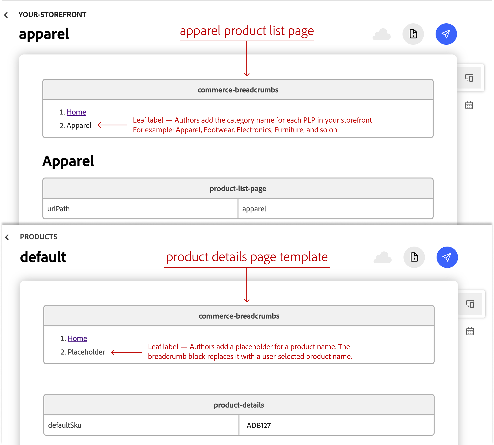

import { Aside } from '@astrojs/starlight/components';
import Link from '@components/Link.astro';
import Tasks from '@components/Tasks.astro';
import Task from '@components/Task.astro';
import TableWrapper from '@components/TableWrapper.astro';

In this how-to, you'll create a `commerce-breadcrumbs` block that helps shoppers navigate your catalog. On a product listing page (PLP), your breadcrumb block shows your catalog hierarchy. On a product details page (PDP), it reflects the path the shopper took. You'll use the `Breadcrumbs` component from the SDK.

## What you'll edit or create

- Create the breadcrumbs block — `blocks/commerce-breadcrumbs/commerce-breadcrumbs.js`
- Create the breadcrumbs styles — `blocks/commerce-breadcrumbs/commerce-breadcrumbs.css`
- Create the authored `<ol>` on the PLP and PDP

## What you'll build

By the end of this how-to, you'll have:

- A `commerce-breadcrumbs` block in `blocks/commerce-breadcrumbs/commerce-breadcrumbs.js` and `blocks/commerce-breadcrumbs/commerce-breadcrumbs.css` that renders authored breadcrumbs on PLPs and PDPs.
- An authored `<ol>` on each page type. The block stores the PLP trail in `sessionStorage` and restores it on the matching PDP.

## Prerequisites

Before you begin, make sure you have:

- A working [Commerce storefront](/get-started/create-storefront/) on Edge Delivery Services
- A product listing page (PLP) powered by the [Product Discovery drop-in](/dropins/product-discovery/)
- A product details page (PDP) powered by the [Product Details drop-in](/dropins/product-details/)
- Familiarity with [customizing blocks](/blocks/customize-blocks/) in your code repository

## The PLP-to-PDP trail

Shoppers reach a PDP via categories, but the PDP is usually authored with a fixed breadcrumb. `commerce-breadcrumbs.js` preserves the navigation path in `sessionStorage` and restores it on the matching PDP.

<TableWrapper nowrap={[0]}>

| What the shopper does | What the block should do |
|---|---|
| Browses the Apparel category, sees `Home / Apparel` | Nothing — it only acts on product-link clicks and PDP loads |
| Clicks through to the Adobe pattern hoodie product | Write `{ path, trail }` to `sessionStorage`, keyed to `/products/adobe-pattern-hoodie/ADB127` |
| Lands on the PDP, authored as `Home / Placeholder` | Check whether the stored `path` matches the URL. It matches, so swap in the stored trail and, once the drop-in loads catalog data, replace the leaf — the shopper now sees `Home / Apparel / Adobe pattern hoodie` |

</TableWrapper>

<Aside type="caution" title="Anchors inside the PLP subtree">
  The click listener matches any `<a>` inside `main .product-list-page` — the CSS selector for your storefront's PLP container — so non-product links inside it get stored too. See [Extra links appear in session storage](#extra-links-appear-in-session-storage) for why this is safe to leave as-is.
</Aside>

The stored entry:

```json
{
  "path": "/products/adobe-pattern-hoodie/ADB127",
  "trail": [
    { "label": "Home", "url": "/" },
    { "label": "Apparel", "url": "/apparel" }
  ]
}
```

If the path doesn't match a different product or a bookmarked PDP, the block leaves the authored breadcrumb alone. This approach records the path the shopper took and uses the authored breadcrumb in all other cases.

<Tasks>

<Task>

### Step 1: Create the block files

Create a `commerce-breadcrumbs` directory in the `blocks/` directory of your storefront project. Add two empty files: `commerce-breadcrumbs.js` and `commerce-breadcrumbs.css`. Add the code examples to those files. The next section explains the JavaScript.

```js title="blocks/commerce-breadcrumbs/commerce-breadcrumbs.js" {7} {17} {29} {38} {52} {71}
import { Breadcrumbs, provider as UI } from '@dropins/tools/components.js';
import { events } from '@dropins/tools/event-bus.js';
import { h } from '@dropins/tools/preact.js';

import { rootLink } from '../../scripts/commerce.js';

const SESSION_KEY = 'commerce.breadcrumbs';

/**
 * Parses the authored `<ol>` / `<ul>` into a flat list of `{ label, url }`.
 * `url` is the `<a>` pathname when present, otherwise `null`.
 *
 * Position determines the leaf: the last `<li>` is always rendered as the
 * current page (plain text). The author provides every crumb (including
 * `Home`).
 */
function parseCrumbs(block) {
  const list = block.querySelector('ol, ul');
  if (!list) return [];
  return [...list.querySelectorAll(':scope > li')].map((li) => {
    const anchor = li.querySelector('a');
    return {
      label: (anchor || li).textContent.trim(),
      url: anchor ? new URL(anchor.href).pathname : null,
    };
  });
}

export default function decorate(block) {
  const crumbs = parseCrumbs(block);
  block.innerHTML = '';
  if (crumbs.length === 0) return;

  const currentPath = window.location.pathname;
  const leaf = crumbs[crumbs.length - 1];
  let ancestors = crumbs.slice(0, -1);

  // Session override: when arriving from a PLP, use the propagated trail
  // instead of whatever the author put in the HTML.
  const raw = sessionStorage.getItem(SESSION_KEY);
  if (raw) {
    try {
      const session = JSON.parse(raw);
      if (session.path === currentPath) ancestors = session.trail;
    } catch (error) {
      sessionStorage.removeItem(SESSION_KEY);
      // Log and recover instead of breaking the page.
      console.error(`Malformed ${SESSION_KEY} in sessionStorage: ${error.message}`);
    }
  }

  const renderCrumbs = (leafLabel) =>
    UI.render(Breadcrumbs, {
      categories: [
        ...ancestors.map((item) =>
          item.url ? h('a', { href: rootLink(item.url) }, item.label) : h('span', null, item.label)
        ),
        h('span', null, leafLabel),
      ],
    })(block);

  // Update the leaf once the drop-in provides the catalog product name.
  renderCrumbs(leaf.label);
  events.on(
    'pdp/data',
    (product) => {
      if (product?.name) renderCrumbs(product.name);
    },
    { eager: true }
  );

  // Propagate the full breadcrumb (ancestors + current page) on product link
  // clicks so the destination PDP can render the user's actual path.
  const propagatedTrail = [...ancestors, { label: leaf.label, url: currentPath }];

  document.querySelector('main .product-list-page')?.addEventListener('click', (event) => {
    const anchor = event.target.closest('a');
    if (!anchor) return;
    const targetPath = new URL(anchor.href).pathname;
    sessionStorage.setItem(
      SESSION_KEY,
      JSON.stringify({ path: targetPath, trail: propagatedTrail })
    );
  });
}
```

```css title="blocks/commerce-breadcrumbs/commerce-breadcrumbs.css"
.commerce-breadcrumbs {
  padding: var(--spacing-small) 0;
}
```

#### How the code works

- **`SESSION_KEY` (line 7)** — Both the read and the write paths share this one constant, so there's only one `sessionStorage` entry to keep track of.
- **`parseCrumbs()` (line 17)** — Selects `:scope > li` rather than every `<li>` in the block, so nested lists (for example, inside a link's icon markup) don't get parsed as extra crumbs.
- **`decorate()` (line 29)** — Exits immediately when `parseCrumbs()` returns nothing, so an empty block renders nothing instead of throwing an error.
- **Session override (line 38 onward)** — This logic is the `sessionStorage` check from [The PLP-to-PDP trail](#the-plp-to-pdp-trail): it reads the stored entry and, if `session.path` matches `window.location.pathname`, replaces `ancestors` with the stored trail. The entry is never cleared after use, so revisiting the same PDP directly later in the same session can still show the propagated trail.
- **`renderCrumbs()` (line 52)** — Renders the breadcrumb once with the authored leaf label, then again whenever the `pdp/data` event fires with the product's catalog name. This function is what lets the current page breadcrumb update after the block first renders.
- **The click listener (line 71)** — Writes the `sessionStorage` entry for clicks inside `main .product-list-page`, matching the caution above about non-product links in that subtree.

</Task>

<Task>

### Step 2: Add breadcrumbs to a PLP and a PDP

Edge Delivery Services renders block tables in the order they appear, so place the breadcrumb before the page's main block: the `product-list-page` table on the PLP or the `product-details` table on the PDP. In [DA.live](/merchants/quick-start/document-authoring/), insert a new table before that block table.



Set the table's first row to `commerce-breadcrumbs`. This [block name row](/merchants/blocks/block-tables/#add-a-block-to-your-document) tells Edge Delivery Services which block to render. In the next row, add a numbered or bulleted list with one item per breadcrumb. Link each breadcrumb page except the last, which represents the current page and remains plain text.

DA.live and Edge Delivery Services generate this HTML from what you author. It's shown here so you can confirm it matches what the Step 1 code expects. For example, the published HTML for `/apparel` looks like this:

```html
<div class="commerce-breadcrumbs">
  <div>
    <div>
      <ol>
        <li><a href="/">Home</a></li>
        <li>Apparel</li>
      </ol>
    </div>
  </div>
</div>
```

The PLP breadcrumb renders as:

```text
Home / Apparel
```

Author the PDP the same way, but since `/products/default` is a shared template rendered for every product, use a generic placeholder for the leaf `<li>` instead of a real product name.

On a direct visit, it initially renders as:

```text
Home / Placeholder
```

After the Product Details drop-in loads catalog data for the selected product, such as the Adobe pattern hoodie at `/products/adobe-pattern-hoodie/ADB127`, the `commerce-breadcrumbs` block replaces the leaf with the product name:

```text
Home / Adobe pattern hoodie
```

</Task>

<Task>

### Step 3: Deploy and verify

Commit the `blocks/commerce-breadcrumbs/` directory and push the changes to your branch. After Code Sync deploys the update to your preview URL, verify the following scenarios:

- **Direct PLP load** — Open `/apparel` (or any PLP with an authored breadcrumb). Confirm the rendered breadcrumb matches the authored `<ol>`.
- **Direct PDP load** — Open a product URL directly (for example, in an incognito window). Confirm the rendered breadcrumb matches the authored trail, with the product as the final breadcrumb.
- **PLP-to-PDP navigation** — On the PLP, open **DevTools** > **Application** > **Session Storage**, then click a product card. Confirm `commerce.breadcrumbs` contains an entry for the destination pathname and the current breadcrumb trail. On the PDP, confirm the ancestor breadcrumbs match the PLP path (see [Troubleshooting](#the-pdp-shows-the-wrong-trail)) and the current page breadcrumb displays the product's catalog name.
- **PLP-to-PDP, different PDP** — From the same PLP, click product A. Then open product B directly in a new tab. Confirm product B displays the authored breadcrumb trail because `sessionStorage` is scoped to the tab and the stored entry applies only to product A's pathname.
- **Malformed session data** — On a PDP, open the console and run `sessionStorage.setItem('commerce.breadcrumbs', '{bad json}'); location.reload();`. Confirm the authored ancestor breadcrumbs render (see [The session storage value is malformed](#the-session-storage-value-is-malformed)) and the console logs an error instead of breaking the page.

</Task>

</Tasks>

## PDP breadcrumbs at scale

Manual authoring is suitable for a demo or a small number of pages, but it is not practical for a product-rich catalog. Someone has to add the correct ancestor `<ol>` to every product document and keep it synchronized as categories change. For storefronts with deep category hierarchies, generate the PDP breadcrumb in the experience layer instead of hand-authoring it.

If your storefront uses [AEM Commerce Prerender](/setup/configuration/aem-prerender/) to generate product page HTML, you still need a source for the PDP's ancestor trail. Its default product query does not return a product's category hierarchy from Catalog Service, so it cannot automatically create PDP breadcrumbs from product data alone. PLP rendering differs: the prerender can use category data to build the category's ancestor trail.

A product's assigned categories may not describe the breadcrumb path a shopper took. For example, a product assigned to `Comfort` can appear in a breadcrumb path of `Shoes / Comfort`. The assigned category alone does not provide the full path or its URLs. The experience layer that assembles the page must provide that information. This how-to does not define an automated PDP breadcrumb solution. It covers manual breadcrumb management in DA.live and a PLP-to-PDP session approach for preserving the shopper's category context.

<Aside type="note" title="PLP breadcrumbs and prerendering">
  [AEM Commerce Prerender](/setup/configuration/aem-prerender/) can also render category listing pages. The generated category HTML includes a breadcrumb `<nav>` and `BreadcrumbList` structured data built from the category's ancestors, so you don't need to author it by hand for those pages.

If your <Link href="https://www.aem.live/developer/byom" text="Bring Your Own Markup (BYOM)" /> solution doesn't render category listing pages, continue authoring the PLP's `<ol>` by hand (see [Step 2](#step-2-add-breadcrumbs-to-a-plp-and-a-pdp)), or generate it with your own tooling.

</Aside>
 
## Troubleshooting

### The breadcrumb is empty

Make sure the `commerce-breadcrumbs` block contains an `<ol>` or `<ul>` with at least one `<li>`. An empty list renders nothing.

### The PDP shows the wrong trail

Check `commerce.breadcrumbs` in DevTools > Application > Session Storage. Its `path` must match `window.location.pathname` exactly, including any trailing slash or base path.

### The session storage value is malformed

If the session key contains invalid JSON, the block logs a console error, removes the bad value, and falls back to the authored ancestor breadcrumbs so the page still renders correctly. In this example, `commerce-breadcrumbs.js` is the only code that writes to `commerce.breadcrumbs`. Check your storefront for other code that might overwrite the key.

### Extra links appear in session storage

This happens because the click listener in `commerce-breadcrumbs.js` fires on every `<a>` inside `main .product-list-page`, including non-product links in that subtree (see [The PLP-to-PDP trail](#the-plp-to-pdp-trail)). This does not affect the breadcrumb: only pages that host the block read the entry, and the path check keeps a stored trail from applying to the wrong page. To avoid storing non-product links, narrow the listener to the product-link selector used by your storefront.
